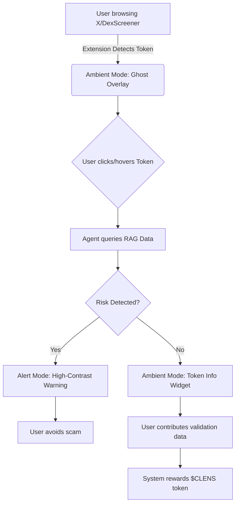
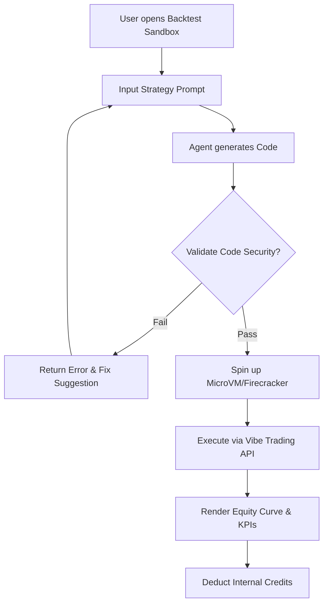
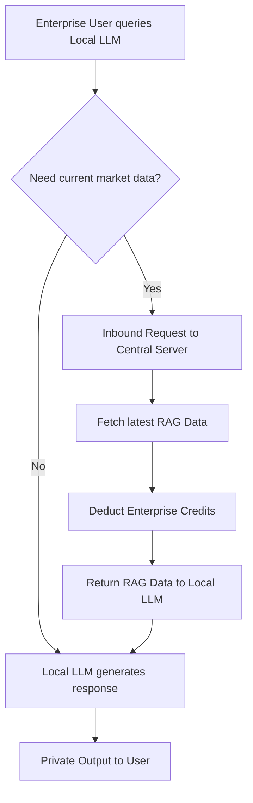
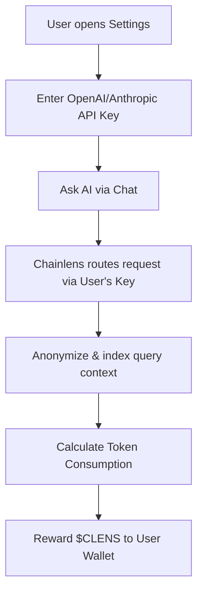
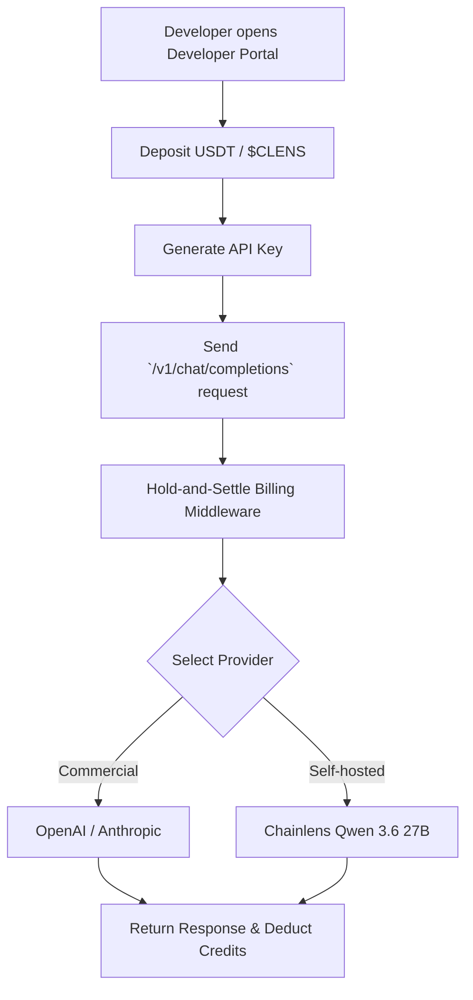
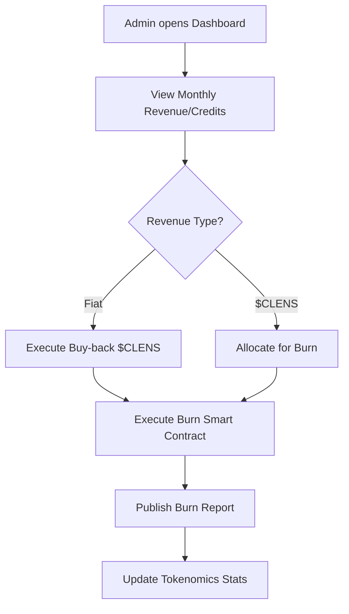

---
stepsCompleted:
  - step-09-design-directions
  - step-10-user-journeys
  - step-11-component-strategy
  - step-12-ux-patterns
  - step-13-responsive-accessibility
  - step-14-complete
---
# UX Design Specification: Chainlens

## 1. User Personas & Context
### 1.1 "The Degen Explorer" (Trader/Investor)
*   **Context:** Constantly scrolling X (Twitter), Facebook, or DexScreener looking for the next hidden gem or new pair. Speed is everything.
*   **Pain Point:** By the time they open a new tab to paste a contract address into a security scanner, the alpha is gone or they might have already bought a honeypot.
*   **Chainlens UX:** 
    *   They hover over a `$TOKEN` or `0x...` on X or DexScreener.
    *   **Vigilant Companion Extension** instantly pops up a minimal tooltip: "Trust Score: 30/100 (Red) - Unrenounced Mint, 90% Liquidity Unlocked". 
    *   They avoid the scam without leaving their feed. If they want more info, they click "Expand", opening the side-panel assistant for a quick chat ("What does the code look like?").

### 1.2 "The Crypto Researcher" (Analyst)
*   **Context:** Doing deep dives on CoinMarketCap/CoinGecko or analyzing trends. Needs macro views and verified insights.
*   **Pain Point:** Information is siloed. They want to know what the community is investigating right now and catch macro threats early.
*   **Chainlens UX:** 
    *   They visit the **Chainlens Pulse** (News Feed).
    *   They see a Perplexity-style feed of AI-generated alerts: "3 new Meme coins on Base have matching suspicious deployer patterns (analyzed by 40+ users today)".
    *   They click into an alert to see the full AI breakdown, leveraging crowdsourced, anonymized intelligence.

## 2. Core Experience
Chainlens is an evolution of the existing code structure, reimagined into a dynamic, AI-first, proactive assistant experience. The core design philosophy centers on ambient intelligence—providing the right information, at the right time, exactly where the user is looking.

### 2.1 The Proactive "AI Ghost" Tooltip (Extension)
*   **Behavior:** A lightweight, non-intrusive extension that detects token addresses (`0x...` or `$TOKEN`) across platforms like X/Twitter, Facebook, DexScreener, CoinMarketCap, and CoinGecko.
*   **Visuals:** A sleek, glassmorphic tooltip that appears smoothly upon hovering over a detected token.
*   **Content:**
    *   **Trust Score:** A prominent, color-coded score (e.g., Red/Orange/Green).
    *   **Quick Insights:** 1-2 bullet points highlighting critical risks or positive signals.
    *   **Actionable:** A "Quick Chat" side-panel expander, and an "Analyze Deeply" button linking to the main Web App.
*   **Sync:** Synced with the user's logged-in Chainlens account, bringing their context, portfolio, and past queries into the extension.

### 2.2 The Chainlens Pulse (Global AI News Feed)
*   **Concept:** A live, AI-generated news feed reminiscent of Perplexity, strictly focused on Web3 security and token intelligence.
*   **Data Source:** Aggregated from global security alerts, on-chain anomalies, and *anonymized insights derived from user interactions with the AI assistant*.
*   **Visibility:** Available to all users (including free tier) to build community trust and showcase the AI's capability.
*   **Features:**
    *   **Trending Threats:** Real-time alerts on honeypots, rug pulls, or trending tokens with hidden risks.
    *   **Smart Summaries:** "Why is $XYZ trending?" explained through the lens of contract safety.

### 2.3 The Interactive Audit Panel (Web App & Extension Side-Panel)
*   **Layout:** A clean, terminal-inspired (yet modern) interface for deep token analysis.
*   **Components:**
    *   **Chat Interface:** The primary interaction mode. Users can converse natively with the AI.
    *   **Data Visualizations:** Dynamic charts for holder distribution, rendered *as the AI explains them*.
    *   **Code Sandbox (Premium):** A safe execution environment for advanced users to simulate transactions alongside the AI's explanation.

## 3. Integration with Existing Architecture
This UX design is a direct extension of the established architectural decisions:
*   **Vercel AI SDK:** Powers the streaming chat and dynamic tooltips (using generated UI).
*   **REST API:** `apps/api` (Epsilon API) provides fast data delivery to both the web app and the extension.
*   **Fault Isolation:** The resource-intensive AI orchestration and sandbox execution happen in `apps/api` with async workers, ensuring the web UI and extension remain perfectly smooth and responsive.

## 4. Visual Design Foundation: "Epsilon Cyber-Glass"

### 4.1 Aesthetic Philosophy
The visual direction fuses a **"Cyberpunk Terminal"** aesthetic with modern **"Glassmorphism"**. It is designed to look serious and trustworthy for deep on-chain analysis, yet highly polished and accessible for consumer Web3 products. The primary philosophy is **"Invisible Security"**: the UI remains ambient and unobtrusive until a risk or insight is detected, at which point it uses high-contrast, glowing indicators to draw attention.

### 4.2 Unified Color System
*   **Base Backgrounds:** Deep Space Black (`hsl(240, 10%, 4%)`) layered with frosted Glass panels (`hsla(240, 10%, 10%, 0.6)`). This creates a "shadow-based" hierarchy that avoids harsh lines and makes the interface feel floating.
*   **Brand & AI Accents:** A dynamic AI Gradient transitioning from Electric Purple to Neon Cyan, used to denote AI-generated insights and generative UI elements.
*   **Security States (Highest Priority):** High-saturation status colors designed to override brand elements when necessary:
    *   **Critical Risk:** Neon Red with a subtle outer glow.
    *   **Warning/Caution:** Amber.
    *   **Safe/Verified:** Emerald Green.

### 4.3 Typography
*   **UI & Reading:** `Inter` (or `Geist Sans`) for clean, legible interface text and conversational outputs.
*   **Data & Code:** `JetBrains Mono` (or `Geist Mono`) exclusively for contract addresses, wallet hashes, code blocks, and numerical data to ensure tabular alignment and technical precision.

### 4.4 Extension Visual Strategy
*   **Shared Foundation:** The browser extension strictly shares the same component library and Tailwind v4 CSS variables as the Web App to ensure 100% brand consistency.
*   **Responsive Compact Mode:** Components adapt seamlessly to the extension's side-panel constraints.
*   **Ghost Overlay:** The in-page injection (e.g., on X or DexScreener) acts as a "Ghost" overlay. It uses context-aware borders and shadow-based elevation to integrate naturally with the host site while remaining distinct and easily recognizable as a Chainlens security prompt.

## 5. Design Direction Decision

### 5.1 Design Directions Explored
Explored 6 "Epsilon Cyber-Glass" variations: Minimalist Terminal, High-Contrast Alert, Frosted Analytics, AI-First Conversational, Ghost Overlay (Extension), and Data-Dense Compact.

### 5.2 Chosen Direction
A hybrid, state-based system prioritizing context. The UI consists of two main states:
- **Ambient Mode:** Uses "Frosted Analytics" and "Minimalist Terminal" for a lightweight, transparent default interface.
- **Alert Mode:** Actives "High-Contrast Alert" instantly when risk is detected, overriding ambient styling.
- **Extension Implementation:** Uses "Ghost Overlay" for unobtrusive injection and "Data-Dense Compact" when expanded.

### 5.3 Design Rationale
"Invisible Security" means the interface should not distract traders (Degen Explorer) unless critical. Meanwhile, the AI conversational elements (AI-First Conversational) support the Analyst persona. A state-based design using unified Tailwind v4 tokens allows both environments (Web and Extension) to share components efficiently without bloat.

### 5.4 Implementation Approach
Establish Tailwind v4 Design Tokens defining core Glassmorphism and Status variables. Build components that dynamically switch styling based on the active state (Ambient vs. Alert). The same component library is packaged for both the Web app and Extension.

## 6. User Journey Flows

### 6.1 Token Discovery & Risk Warning Flow (Minh - Tier 1)
Luồng này mô tả cách người dùng miễn phí tương tác với Extension hoặc Discover Page để nhận cảnh báo rủi ro tức thì (Ambient to Alert Mode).



### 6.2 Strategy Creation & Automated Backtesting Flow (Alex - Tier 2)
Luồng tập trung vào "Aha moment" của Premium user khi họ có thể sinh code và backtest ngay lập tức trong môi trường Sandbox cô lập.



### 6.3 Enterprise Local LLM & RAG Sync Flow (Sarah - Tier 3)
Luồng đảm bảo Zero-Data-Leakage cho Enterprise, nơi Local LLM đồng bộ dữ liệu RAG từ Central Server mà không rò rỉ chiến lược ra ngoài.



### 6.4 BYOK & Proof of Contribution Flow (Data Contributor)
Luồng này cho phép người dùng tự dùng API Key cá nhân để được miễn phí sử dụng Chainlens và nhận thưởng token từ việc đóng góp dữ liệu.



### 6.5 LLM Proxy Gateway Flow (MaaS Developer)
Luồng cung cấp API Model-as-a-Service, user nạp tiền và mua API model thương mại hoặc model tự host (Qwen) qua interface chuẩn OpenRouter.



### 6.6 Local Compute Privacy Flow (Ollama User)
Luồng Zero-Data-Leakage tuyệt đối khi user dùng thẳng Local LLM để xử lý câu hỏi.

```mermaid
graph TD
    A[User opens Compute Settings] --> B[Select "Local Ollama"]
    B --> C[Test connection to `localhost:11434`]
    C --> D[User asks AI about contract code]
    D --> E[Browser sends request directly to localhost]
    E --> F[Ollama streams response to UI]
    F --> G[Zero data sent to Chainlens server]
```

### 6.7 Admin Ops & Token Burn Flow (Đạt - Internal)
Luồng vận hành hệ thống Tokenomics, đảm bảo sự minh bạch và tạo động lực tăng giá trị cho $CLENS token.



### 6.8 Journey Patterns
Xuyên suốt các luồng trên, chúng ta chuẩn hóa các UX pattern sau:
- **State-based UI Transition:** Tự động chuyển đổi giữa Ambient Mode (nhẹ nhàng, trong suốt) sang Alert Mode (cảnh báo cao, viền sáng) khi có rủi ro, áp dụng mạnh ở Flow 1.
- **Progressive Disclosure:** Ở Flow 2, chỉ hiển thị UI cơ bản khi prompt, sau đó mới mở rộng ra Monaco Editor và các biểu đồ KPI sau khi backtest thành công.
- **Atomic Feedback:** Cung cấp thông báo trừ Credit minh bạch và tức thì (Flow 2 & 3) ngay sau khi tác vụ hoàn thành để quản lý kỳ vọng chi phí.

### 6.6 Flow Optimization Principles
- **Minimizing steps to value:** Sandbox (Flow 2) khởi tạo tự động, không yêu cầu user setup server.
- **Reducing cognitive load:** Extension (Flow 1) chạy ngầm (Ghost Overlay) và chỉ đòi hỏi sự chú ý khi thực sự cần thiết (Invisible Security).
- **Graceful Error Handling:** Luồng sinh code có bước tự động validate và đề xuất sửa lỗi trước khi chạy Sandbox, giúp tiết kiệm Credit cho user nếu prompt sai.

## 7. Component Strategy

### 7.1 Design System Components
Dựa trên nền tảng kỹ thuật và định hướng thiết kế, chúng ta sẽ sử dụng **Radix UI** (thường được gọi thông qua shadcn/ui) kết hợp với **Tailwind v4 CSS variables** làm nền tảng (Foundation).
- **Các component có sẵn:** Button, Dialog (Modal), Dropdown Menu, Tooltip, Tabs, ScrollArea, Avatar, Input.
- **Lý do:** Radix UI cung cấp các primitive không có style (unstyled) và hỗ trợ Accessibility (a11y) cực tốt, cho phép chúng ta dễ dàng áp dụng theme "Epsilon Cyber-Glass" lên trên mà không bị giới hạn bởi các style mặc định (như Material hay Ant Design).

### 7.2 Custom Components
Dựa trên các user journeys đã thiết kế, đây là các component đặc thù chúng ta cần xây dựng riêng cho Chainlens:

#### Ghost Overlay Widget (Extension)
*   **Purpose:** Cung cấp cảnh báo bảo mật tức thì (Invisible Security) ngay trên web host (X, DexScreener).
*   **Usage:** Tiêm (inject) vào DOM của trang web khi phát hiện token address.
*   **Anatomy:** Icon trạng thái (pulsing), Trust Score text, nút "Expand" mờ ảo.
*   **States:** Ambient (transparent/frosted), Alert (Solid Red/Amber outline).
*   **Accessibility:** `role="alert"` khi chuyển sang trạng thái Alert để screen reader đọc ngay lập tức.

#### Trust Score Badge
*   **Purpose:** Hiển thị nhanh mức độ an toàn của một contract/token.
*   **Usage:** Dùng trong Pulse Feed, Chat Messages, và Extension Overlay.
*   **Anatomy:** Vòng tròn màu (Neon Red/Amber/Emerald) + Điểm số (Typography JetBrains Mono).
*   **States:** Critical (<40), Warning (40-70), Safe (>70).

#### Generative Terminal Message (Vercel AI SDK)
*   **Purpose:** Hiển thị kết quả trả về từ AI dưới dạng UI tương tác thay vì text thông thường (Generative UI).
*   **Usage:** Dùng trong Chat Interface của Web App và Side-panel.
*   **Anatomy:** Container kính mờ (glassmorphism), Header (thể hiện tool đang chạy), Body (render dynamic component như TokenCard, TransactionSimulation).
*   **States:** Loading (Skeleton/Terminal typing effect), Streaming (hiển thị dần từng chunk), Done.

#### Vibe Sandbox Editor (Premium)
*   **Purpose:** Môi trường gõ code và config chiến lược backtest cho Quant Trader.
*   **Usage:** Dùng riêng cho Tier 2 (Premium) trong màn hình Backtest.
*   **Anatomy:** Vùng soạn thảo Monaco Editor, Control Bar (Run, Stop, Reset), Output Console (Terminal logs).
*   **States:** Idle, Executing (disable editor), Success, Error (highlight dòng code lỗi).

#### Dynamic Equity Curve Chart
*   **Purpose:** Biểu đồ thể hiện kết quả sinh lời của chiến lược backtest hoặc token metrics.
*   **Usage:** Đi kèm sau khi Vibe Sandbox thực thi xong hoặc trong báo cáo phân tích sâu.
*   **Anatomy:** Biểu đồ đường (Line chart), Overlay Benchmark (để so sánh), Tooltip khi hover (hiển thị PnL tại thời điểm).

#### Compute Settings Panel
*   **Purpose:** Nơi người dùng cấu hình hạ tầng tính toán họ muốn dùng (Cloud, BYOK, Local).
*   **Usage:** Nằm trong màn hình Profile / Settings.
*   **Anatomy:** 
    *   **Tab BYOK:** Input field ẩn API Key, thống kê lượng Token đã dùng và $CLENS token đã claim được.
    *   **Tab Local Ollama:** Input cho localhost endpoint, nút "Test Connection" kèm trạng thái Ping (Green/Red).
*   **States:** Disconnected, Connected (Active), Syncing Rewards.

#### Proxy Developer Dashboard
*   **Purpose:** Giao diện OpenRouter-style cho Developer quản lý API key dùng proxy của Chainlens.
*   **Usage:** Nằm trong portal riêng `/developers`.
*   **Anatomy:** Biểu đồ Bar chart (mức tiêu thụ theo Model), Data table quản lý API Keys (Create/Revoke), Nút "Top-up Credits" (Web3 Payment Modal).
*   **States:** Active, Depleted Balance (khoá API).

### 7.3 Component Implementation Strategy
- **Headless + Tailwind v4:** Xây dựng component logic bằng Radix UI và dùng Tailwind v4 `@theme` để tiêm các biến CSS (Deep Space Black, Frosted Glass, Neon Colors).
- **Isomorphic Components:** Đóng gói các UI component thành một thư viện nội bộ (ví dụ: `@chainlens/ui` trong monorepo) để dùng chung cho cả Next.js (Web App) và React/Vite (Browser Extension), đảm bảo 100% tính nhất quán về code và giao diện.
- **State-Driven Styling:** Sử dụng các utility như `clsx` hoặc `tailwind-merge` để switch class dựa trên state (Ambient/Alert) một cách liền mạch.

### 7.4 Implementation Roadmap

*   **Phase 1 - Core Foundation:** (Hỗ trợ luồng khám phá của Minh)
    *   Setup Radix UI + Tailwind v4 theme.
    *   Build Trust Score Badge, Button, Input, Modal.
    *   Build Ghost Overlay Widget (cốt lõi cho Extension).
*   **Phase 2 - AI & Chat Elements:** (Hỗ trợ luồng doanh nghiệp của Sarah)
    *   Build Generative Terminal Message.
    *   Tích hợp Skeleton loading states và Markdown parser.
*   **Phase 3 - Premium Data Visuals:** (Hỗ trợ luồng Quant Trader của Alex)
    *   Tích hợp Monaco Editor thành Vibe Sandbox Editor component.
    *   Build Dynamic Equity Curve Chart (sử dụng thư viện Recharts hoặc Lightweight Charts).

## 8. UX Consistency Patterns

### 8.1 Button & Action Hierarchy
- **Primary Action:** Nút bấm mang tính quyết định (ví dụ: Connect Wallet, Upgrade Plan, Execute Sandbox). Thiết kế solid với hiệu ứng glow nhẹ (Neon Cyan hoặc Purple).
- **Secondary Action:** Nút bấm thường xuyên (ví dụ: Retry, Copy Address). Thiết kế viền (Outline) hoặc Glass (nền mờ 20%).
- **Destructive/Critical Action:** Nút bấm rủi ro cao (ví dụ: Reject Malicious Contract, Burn Token). Thiết kế Neon Red, yêu cầu double-click hoặc confirm prompt để tránh ấn nhầm.

### 8.2 Feedback & States
- **Success:** Dấu tick Emerald Green, xuất hiện tức thì kèm theo viền mờ màu xanh lá.
- **Warning/Critical:** Cảnh báo Amber/Neon Red, trạng thái Alert Mode kích hoạt, viền màn hình (hoặc viền Extension) chuyển sang màu cảnh báo để user không thể bỏ qua.
- **Loading:** Không dùng spinner nhàm chán. Sử dụng hiệu ứng "Generative Terminal" (chữ gõ từng ký tự, hoặc skeleton code chạy dọc) để phù hợp concept hacker/quant.
- **Error:** Thông báo lỗi cụ thể, giải thích nguyên nhân và luôn đi kèm nút "Retry" hoặc gợi ý cách sửa.

### 8.3 Form & Input Behavior
- Thiết kế Input có viền mỏng (1px border `hsla(0, 0%, 100%, 0.1)`), nền đen trong suốt.
- Khi focus: Viền sáng lên màu Neon Cyan, kèm theo box-shadow mờ.
- Tự động format địa chỉ ví (hiển thị `0x123...abcd`) nhưng khi click copy sẽ lấy full địa chỉ.

### 8.4 Navigation Patterns
- **Web App:** Sidebar mỏng, có thể thu gọn thành icon để nhường chỗ tối đa cho Data Grid.
- **Extension:** Điều hướng Tab ở dưới cùng (Bottom Navigation) hoặc Collapsible Menu để tiết kiệm diện tích chiều dọc.

## 9. Responsive Design & Accessibility

### 9.1 Responsive Strategy
Kiến trúc của Chainlens đòi hỏi sự thích ứng hoàn hảo giữa Web App (Dashboard) và Browser Extension (Ghost Overlay).
*   **Web App (Dashboard):** 
    *   Sử dụng toàn bộ không gian màn hình Desktop để hiển thị Data Grid (Phân tích Token, Risk Assessment).
    *   Trên Tablet và Mobile, các Grid sẽ chuyển thành dạng Card Stack (xếp chồng), Sidebar sẽ collapse thành Bottom Navigation hoặc Hamburger Menu.
*   **Browser Extension:** 
    *   Thiết kế theo dạng Mobile-first (kích thước tiêu chuẩn 375x600px).
    *   UI phải gọn nhẹ, hiển thị dưới dạng Side-panel hoặc Floating Overlay khi inject vào các trang web (như X, DexScreener). Không che khuất nội dung chính của trang web chủ.

### 9.2 Breakpoint Strategy
Sử dụng các breakpoint tiêu chuẩn của Tailwind CSS v4, tối ưu hóa cho cấu trúc Glassmorphism:
*   `sm`: 640px (Mobile Landscape / Large Phones)
*   `md`: 768px (Tablets) - Sidebar chuyển sang dạng thu gọn.
*   `lg`: 1024px (Laptops) - Layout chia cột đầy đủ.
*   `xl`: 1280px (Desktops) - Hiển thị thêm các Widget phụ trợ.
*   **Extension Spec:** Chiều rộng cố định/tối đa khoảng 375px - 400px, chiều cao linh hoạt (tối đa 600px, overflow-y auto).

### 9.3 Accessibility Strategy
Chainlens hướng tới chuẩn **WCAG 2.1 Mức AA**, cực kỳ quan trọng vì hệ thống liên quan đến cảnh báo bảo mật tài chính:
*   **Contrast (Độ tương phản):** Trong Alert Mode (Neon Red/Yellow), đảm bảo text trên nền glass có độ tương phản tối thiểu 4.5:1. Ambient Mode sử dụng hiệu ứng mờ (backdrop-blur) nhưng text phải dùng màu Solid rõ ràng (white/slate-200).
*   **Keyboard Navigation:** Hỗ trợ điều hướng 100% bằng bàn phím. Tận dụng Radix UI primitives để tự động xử lý Focus Management và Focus Traps (rất cần thiết cho các Modal cảnh báo rủi ro chiếm quyền điều khiển màn hình).
*   **Screen Readers:** Bổ sung ARIA labels đầy đủ cho các thành phần trực quan (như biểu đồ nhiệt độ rủi ro, icon cảnh báo).
*   **Motion Control:** Hỗ trợ CSS media query `prefers-reduced-motion` để tắt các hiệu ứng generative terminal và animation phức tạp cho những người dùng nhạy cảm.

### 9.4 Testing Strategy
*   **Responsive:** Kiểm tra trên các màn hình thực tế. Đặc biệt test khả năng inject/hiển thị Ghost Overlay trên các cấu trúc DOM phức tạp (như Twitter/X, DexScreener).
*   **Accessibility:** Audit định kỳ với Lighthouse a11y, axe-core, và test với VoiceOver/NVDA.
*   **Keyboard Test:** Đảm bảo người dùng có thể đọc cảnh báo và Approve/Reject một transaction hoặc contract chỉ bằng phím Tab và Enter/Space.

### 9.5 Implementation Guidelines
*   Tận dụng thư viện `@chainlens/ui` (Radix UI + Tailwind) để tự động tuân thủ a11y mà không tốn nhiều công sức viết lại.
*   Sử dụng các đơn vị tương đối (`rem`, `vh`, `vw`) để hỗ trợ trình duyệt phóng to text.
*   **Quan trọng:** CSS của Extension phải được cô lập hoàn toàn (isolate) bằng cách sử dụng **Shadow DOM** hoặc CSS module prefixing, để đảm bảo style "Epsilon Cyber-Glass" không bị xung đột, ghi đè hoặc làm hỏng layout của trang web gốc (host website).
