# 📚 Documentation Maintenance & Ownership Matrix

## 📖 Table of Contents

- [Overview](#overview)
- [Maintenance Philosophy](#maintenance-philosophy)
- [Update Cycles & Schedule](#update-cycles--schedule)
- [Ownership Matrix (RACI)](#ownership-matrix-raci)
- [Version Control & Branching](#version-control--branching)
- [Review Process & Quality Gates](#review-process--quality-gates)
- [Metrics & KPI Tracking](#metrics--kpi-tracking)
- [Automation & Tooling](#automation--tooling)
- [Training & Onboarding](#training--onboarding)
- [Success Metrics & Goals](#success-metrics--goals)
- [Maintenance Workflows](#maintenance-workflows)

---

## 🎯 Overview

This document establishes the comprehensive maintenance framework for the ChainLens AI Agent Platform documentation ecosystem. It defines ownership, processes, metrics, and automation to ensure our documentation remains accurate, current, and valuable.

### **🔍 Documentation Scope**

| Category | Files | Ownership | Update Frequency |
|----------|-------|-----------|------------------|
| **Core Documentation** | README.md, CONTRIBUTING.md | Product Team | Monthly |
| **API Documentation** | OpenAPI specs, SDK guides | Backend Team | Per release |
| **Architecture** | System diagrams, design docs | Architecture Team | Quarterly |
| **Security** | SECURITY.md, compliance docs | Security Team | Bi-annually |
| **Deployment** | Production guides, runbooks | DevOps Team | Monthly |
| **Community** | CODE_OF_CONDUCT.md, FAQ.md | Community Team | Quarterly |

---

## 🧠 Maintenance Philosophy

### **📋 Core Principles**

1. **👥 Living Documentation**: Documentation evolves with the codebase and is maintained by those who write the code
2. **🤖 Automation First**: Automated validation, generation, and deployment reduce manual overhead
3. **📊 Data-Driven**: Metrics and user feedback guide maintenance priorities
4. **🔄 Continuous Improvement**: Regular audits and updates prevent documentation debt
5. **👂 Community-Centric**: User feedback and community contributions are actively encouraged

### **🎯 Quality Standards**

| Standard | Requirement | Validation |
|----------|-------------|------------|
| **Accuracy** | Information matches current implementation | Automated testing + manual review |
| **Completeness** | All features and APIs documented | Coverage analysis + gap identification |
| **Clarity** | Content understandable by target audience | User feedback + readability metrics |
| **Consistency** | Uniform style, tone, and structure | Linting + style guide enforcement |
| **Currency** | Information reflects latest version | Automated freshness checks |

---

## 📅 Update Cycles & Schedule

### **🔄 Maintenance Rhythms**

```mermaid
gantt
    title Documentation Maintenance Schedule
    dateFormat  YYYY-MM-DD
    
    section Daily
    Automated Validation    :active, daily, 2025-01-01, 365d
    Link Checking          :active, daily, 2025-01-01, 365d
    
    section Weekly  
    Spell Check Review     :weekly, 2025-01-01, 52w
    Code Sample Testing    :weekly, 2025-01-01, 52w
    
    section Monthly
    Content Review         :monthly, 2025-01-01, 12M
    API Spec Updates       :monthly, 2025-01-01, 12M
    Metrics Analysis       :monthly, 2025-01-01, 12M
    
    section Quarterly
    Architecture Review    :quarterly, 2025-01-01, 4q
    User Feedback Analysis :quarterly, 2025-01-01, 4q
    Documentation Audit    :quarterly, 2025-01-01, 4q
    
    section Bi-Annually
    Security Review        :critical, biannual, 2025-01-01, 2
    Compliance Update      :critical, biannual, 2025-07-01, 2
```

### **📋 Maintenance Tasks by Frequency**

#### **🔄 Daily (Automated)**
- Link validation and health checks
- Spelling and grammar verification
- Code sample syntax validation  
- Diagram rendering verification
- OpenAPI specification validation

#### **📊 Weekly (Semi-Automated)**
- Documentation coverage analysis
- Performance metrics review
- User feedback triage
- Broken link remediation
- Style guide compliance check

#### **📝 Monthly (Manual)**
- Content freshness audit
- API documentation updates
- Community contribution review
- FAQ updates based on support tickets
- Search analytics and optimization

#### **🔍 Quarterly (Strategic)**  
- Comprehensive documentation audit
- User experience research and feedback analysis
- Architecture document updates
- Accessibility compliance review
- Training material updates

#### **🛡️ Bi-Annually (Compliance)**
- Security documentation review
- Legal and compliance updates
- Privacy policy and terms review
- Industry standard alignment check
- Third-party integration updates

---

## 👥 Ownership Matrix (RACI)

### **🏗️ RACI Legend**
- **R** = Responsible (Does the work)
- **A** = Accountable (Owns the outcome)
- **C** = Consulted (Provides input)
- **I** = Informed (Kept updated)

### **📊 Documentation Ownership Matrix**

| Document/Area | Product Manager | Tech Lead | Backend Dev | Frontend Dev | DevOps | Security | Community |
|---------------|-----------------|-----------|-------------|--------------|--------|----------|-----------|
| **README.md** | A | C | C | C | I | I | C |
| **CONTRIBUTING.md** | A | R | C | C | C | I | C |
| **API Documentation** | C | A | R | C | I | C | I |
| **Architecture Diagrams** | C | A | R | C | R | C | I |
| **Security Documentation** | I | C | I | I | C | A/R | I |
| **Deployment Guides** | I | C | C | I | A/R | C | I |
| **User Guides & FAQ** | A | C | C | C | I | I | R |
| **Code Examples** | C | A | R | R | I | I | C |
| **Testing Documentation** | C | A | R | R | R | I | I |

### **👤 Role Responsibilities**

#### **🎯 Product Manager**
- **Accountable for**: Overall documentation strategy and user experience
- **Responsible for**: Requirements, prioritization, user feedback integration
- **Key Activities**: Quarterly strategy reviews, user research, content planning

#### **🔧 Technical Lead**  
- **Accountable for**: Technical accuracy and architectural consistency
- **Responsible for**: Code review of documentation changes, technical standards
- **Key Activities**: Architecture reviews, technical debt management, code sample validation

#### **💻 Backend Developer**
- **Responsible for**: API documentation, code examples, integration guides
- **Key Activities**: OpenAPI spec maintenance, SDK documentation, service documentation

#### **🎨 Frontend Developer**
- **Responsible for**: UI documentation, component guides, user interface examples  
- **Key Activities**: Component library docs, user flow documentation, accessibility guides

#### **🚀 DevOps Engineer**
- **Accountable for**: Deployment, infrastructure, and operational documentation
- **Responsible for**: CI/CD documentation, monitoring guides, troubleshooting runbooks
- **Key Activities**: Infrastructure documentation, automation guides, incident runbooks

#### **🛡️ Security Engineer**
- **Accountable for**: Security policies, compliance documentation, threat models
- **Responsible for**: Security reviews, vulnerability documentation, compliance updates
- **Key Activities**: Security audits, compliance reviews, threat documentation

#### **👥 Community Manager**
- **Responsible for**: Community guidelines, FAQ management, user-generated content
- **Key Activities**: Community feedback collection, FAQ updates, contribution guidelines

---

## 🔄 Version Control & Branching

### **🌿 Documentation Branching Strategy**

```mermaid
gitgraph:
    options:
        theme: base
        themeVariables:
            primaryColor: '#667eea'
            primaryTextColor: '#fff'
            primaryBorderColor: '#764ba2'
            lineColor: '#666'
    commit id: "Initial Docs"
    branch develop
    commit id: "API Updates"
    commit id: "Architecture Changes"
    branch feature/new-integration-docs
    commit id: "Draft Integration Guide"
    commit id: "Add Code Examples"
    checkout develop
    merge feature/new-integration-docs
    commit id: "Review & Polish"
    checkout main
    merge develop id: "Release v2.1.0"
    commit id: "Hotfix: Link Updates"
```

### **📋 Branching Rules**

| Branch Type | Purpose | Merge Requirements | Auto-Deploy |
|-------------|---------|-------------------|--------------|
| **main** | Production documentation | 2 approvals + all checks pass | ✅ GitHub Pages |
| **develop** | Integration branch | 1 approval + validation pass | ✅ Staging site |
| **feature/docs-*** | New documentation features | Validation checks pass | ❌ |
| **hotfix/docs-*** | Critical documentation fixes | 1 approval + emergency process | ✅ Production |

### **📊 Version Alignment**

```yaml
documentation_versioning:
  strategy: "semantic_versioning"
  alignment: "code_releases"
  
  version_mapping:
    major_release: 
      triggers: ["breaking_api_changes", "architecture_overhaul"]
      docs_changes: ["api_documentation", "architecture_diagrams", "migration_guides"]
    
    minor_release:
      triggers: ["new_features", "new_apis"]  
      docs_changes: ["feature_documentation", "api_additions", "examples"]
    
    patch_release:
      triggers: ["bug_fixes", "clarifications"]
      docs_changes: ["corrections", "clarifications", "example_fixes"]

  tagging_strategy:
    pattern: "docs-v{major}.{minor}.{patch}"
    auto_tag: true
    release_notes: true
```

---

## 🔍 Review Process & Quality Gates

### **📋 Documentation Review Workflow**

```mermaid
flowchart TD
    Start([📝 Documentation Change]) --> Draft[🔄 Create Draft]
    Draft --> SelfReview{🔍 Self Review}
    
    SelfReview -->|Pass| AutoValidation[🤖 Automated Validation]
    SelfReview -->|Fail| FixIssues[🔧 Fix Issues]
    FixIssues --> SelfReview
    
    AutoValidation -->|Pass| PeerReview[👥 Peer Review]
    AutoValidation -->|Fail| FixValidation[🔧 Fix Validation Issues]
    FixValidation --> AutoValidation
    
    PeerReview -->|Approved| TechReview{🔧 Technical Review Needed?}
    PeerReview -->|Changes Requested| AddressComments[📝 Address Comments]
    AddressComments --> PeerReview
    
    TechReview -->|Yes| TechnicalReview[👨‍💻 Technical Review]
    TechReview -->|No| FinalValidation[✅ Final Validation]
    
    TechnicalReview -->|Approved| FinalValidation
    TechnicalReview -->|Changes Requested| AddressTechComments[🔧 Address Tech Comments]
    AddressTechComments --> TechnicalReview
    
    FinalValidation -->|Pass| Merge[🔀 Merge & Deploy]
    FinalValidation -->|Fail| FixFinalIssues[🔧 Fix Final Issues]
    FixFinalIssues --> FinalValidation
    
    Merge --> End([✅ Documentation Updated])
```



### **✅ Quality Gates**

#### **🤖 Automated Validation (Required)**
- [ ] Markdown linting passes
- [ ] Spell check passes  
- [ ] Link validation passes
- [ ] Code sample syntax validation
- [ ] OpenAPI specification validation
- [ ] Diagram rendering successful
- [ ] No broken internal references

#### **👥 Peer Review (Required)**
- [ ] Content accuracy verified
- [ ] Style guide compliance
- [ ] Target audience appropriateness
- [ ] Completeness of information
- [ ] Examples and code samples tested

#### **🔧 Technical Review (Conditional)**

**Required for:**
- API documentation changes
- Architecture document updates  
- Security-related documentation
- Deployment and infrastructure guides
- Code examples and tutorials

**Review Criteria:**
- [ ] Technical accuracy verified
- [ ] Security implications considered
- [ ] Performance impact assessed
- [ ] Compatibility with existing systems
- [ ] Follows architectural principles

### **📊 Review SLAs**

| Review Type | Target Response Time | Maximum Response Time |
|-------------|---------------------|----------------------|
| **Peer Review** | 2 business days | 5 business days |
| **Technical Review** | 3 business days | 7 business days |
| **Security Review** | 5 business days | 10 business days |
| **Emergency Fixes** | 4 hours | 8 hours |

---

## 📊 Metrics & KPI Tracking

### **🎯 Key Performance Indicators**

#### **📈 Content Quality Metrics**

```yaml
content_quality:
  accuracy_score:
    measurement: "percentage_of_accurate_information"
    target: ">95%"
    frequency: "monthly"
    
  completeness_score:
    measurement: "percentage_of_documented_features"
    target: ">90%"
    frequency: "quarterly"
    
  freshness_score:
    measurement: "percentage_of_up_to_date_content"
    target: ">85%"
    frequency: "monthly"

user_engagement:
  page_views:
    measurement: "monthly_unique_page_views"
    target: "growth_of_10%_per_quarter"
    
  time_on_page:
    measurement: "average_time_spent_on_documentation"
    target: ">3_minutes"
    
  bounce_rate:
    measurement: "percentage_leaving_without_interaction"
    target: "<60%"

community_health:
  contribution_rate:
    measurement: "documentation_prs_per_month"
    target: ">5_per_month"
    
  issue_resolution_time:
    measurement: "average_time_to_resolve_doc_issues"
    target: "<7_days"
    
  user_satisfaction:
    measurement: "documentation_helpfulness_rating"
    target: ">4.0/5.0"
```

#### **📊 Operational Metrics**

| Metric | Target | Frequency | Owner |
|--------|--------|-----------|-------|
| **Documentation Coverage** | >90% | Monthly | Tech Lead |
| **Broken Link Count** | <5 | Weekly | DevOps |
| **Build Success Rate** | >98% | Daily | DevOps |
| **Review Response Time** | <3 days | Weekly | Team Leads |
| **Automation Coverage** | >80% | Quarterly | DevOps |

### **📈 Analytics & Reporting**

#### **🔍 Analytics Tools**
- **Google Analytics 4**: Page views, user behavior, search queries
- **GitHub Analytics**: Contribution metrics, issue resolution times
- **Documentation Site Analytics**: Search analytics, user pathways
- **Automated Quality Reports**: Coverage, freshness, broken links

#### **📊 Monthly Documentation Report**

```markdown
## 📊 Monthly Documentation Health Report

### 📈 Key Metrics
- **Coverage Score**: 92% (↑3% from last month)
- **Freshness Score**: 87% (↓2% from last month)  
- **User Satisfaction**: 4.2/5.0 (↑0.1 from last month)
- **Contribution Rate**: 8 PRs (↑60% from last month)

### 🎯 Goals Progress
- [✅] Maintain >90% documentation coverage
- [⚠️] Improve freshness score to >90%
- [✅] Keep user satisfaction >4.0
- [✅] Increase community contributions

### 🔧 Action Items
1. Update outdated API documentation (Backend Team)
2. Refresh deployment guides (DevOps Team)
3. Add missing feature documentation (Product Team)

### 📊 Analytics Highlights
- **Top Pages**: API Reference (45%), Getting Started (23%), Architecture (15%)
- **Common Search Queries**: "authentication", "deployment", "troubleshooting"
- **User Feedback**: 15 positive, 3 negative (documentation gaps)
```

---

## 🤖 Automation & Tooling

### **⚙️ Automated Maintenance Tools**

#### **🔄 CI/CD Pipeline Tools**

```yaml
automation_stack:
  validation:
    - tool: "markdownlint"
      purpose: "markdown formatting"
      frequency: "every_commit"
    - tool: "cspell"
      purpose: "spell_checking"
      frequency: "every_commit"
    - tool: "vale"
      purpose: "style_and_grammar"
      frequency: "every_commit"
    - tool: "linkchecker"
      purpose: "link_validation"
      frequency: "daily"
    
  generation:
    - tool: "swagger-codegen"
      purpose: "api_documentation"
      frequency: "every_release"
    - tool: "typedoc"
      purpose: "code_documentation"
      frequency: "every_commit"
    - tool: "mermaid-cli"
      purpose: "diagram_generation"
      frequency: "on_diagram_change"
    
  deployment:
    - tool: "github-pages"
      purpose: "documentation_hosting"
      frequency: "every_merge_to_main"
    - tool: "algolia-docsearch"
      purpose: "search_indexing"
      frequency: "daily"

  monitoring:
    - tool: "uptime-robot"
      purpose: "site_availability"
      frequency: "continuous"
    - tool: "google-analytics"
      purpose: "usage_analytics"
      frequency: "continuous"
```

#### **🔧 Maintenance Automation Scripts**

```bash
#!/bin/bash
# Daily maintenance automation script

echo "🔄 Running daily documentation maintenance..."

# Update documentation freshness metrics
python scripts/check_freshness.py

# Validate all links
npm run link-check

# Update API documentation if code changed
if git diff --name-only HEAD~1 HEAD | grep -E "(backend/|api/)"; then
  echo "🔄 API changes detected, updating documentation..."
  npm run generate-api-docs
fi

# Check for outdated dependencies in examples
python scripts/check_dependencies.py

# Update search index
curl -X POST "https://docsearch.algolia.com/api/crawl" \
  -H "Authorization: Bearer $ALGOLIA_API_KEY" \
  -d '{"sitemap": "https://docs.chainlens.ai/sitemap.xml"}'

echo "✅ Daily maintenance complete"
```

### **📊 Automated Reporting**

#### **🔍 Quality Dashboard**

```python
"""
Documentation Quality Dashboard Generator
Generates weekly quality reports and metrics
"""

import json
import requests
from datetime import datetime, timedelta

class DocumentationMetrics:
    def __init__(self):
        self.metrics = {}
    
    def collect_github_metrics(self):
        """Collect GitHub-based metrics"""
        # Documentation PRs, issues, contributions
        pass
    
    def collect_site_metrics(self):
        """Collect website analytics"""
        # Page views, user engagement, search queries
        pass
    
    def collect_quality_metrics(self):
        """Collect automated quality metrics"""
        # Coverage, freshness, broken links
        pass
    
    def generate_report(self):
        """Generate comprehensive quality report"""
        return {
            "date": datetime.now().isoformat(),
            "metrics": self.metrics,
            "recommendations": self.get_recommendations(),
            "action_items": self.get_action_items()
        }
    
    def get_recommendations(self):
        """AI-powered improvement recommendations"""
        recommendations = []
        
        if self.metrics.get('freshness_score', 0) < 0.85:
            recommendations.append({
                "priority": "high",
                "category": "freshness", 
                "suggestion": "Update outdated documentation sections",
                "impact": "Improves user trust and accuracy"
            })
        
        if self.metrics.get('coverage_score', 0) < 0.90:
            recommendations.append({
                "priority": "medium",
                "category": "coverage",
                "suggestion": "Document missing API endpoints",
                "impact": "Reduces developer friction"
            })
        
        return recommendations
```

---

## 🎓 Training & Onboarding

### **📚 Documentation Contributor Onboarding**

#### **🏁 New Team Member Checklist**

```markdown
## 📋 Documentation Onboarding Checklist

### Week 1: Foundations
- [ ] Read documentation style guide
- [ ] Set up local documentation environment
- [ ] Complete sample documentation PR
- [ ] Understand review process and quality gates
- [ ] Join #documentation Slack channel

### Week 2: Tools & Process  
- [ ] Learn Markdown authoring best practices
- [ ] Understand automated validation tools
- [ ] Practice with Mermaid diagram creation
- [ ] Review ownership matrix and responsibilities
- [ ] Shadow a documentation review

### Week 3: Contribution
- [ ] Identify and fix a documentation gap
- [ ] Create or update a code example
- [ ] Contribute to FAQ or troubleshooting section
- [ ] Participate in documentation planning meeting

### Week 4: Mastery
- [ ] Review another contributor's documentation PR
- [ ] Propose improvement to documentation process
- [ ] Share feedback on documentation tools
- [ ] Complete onboarding feedback survey
```

#### **📖 Training Materials**

| Resource | Type | Duration | Audience |
|----------|------|----------|----------|
| **Documentation Style Guide** | Written | 30 min | All contributors |
| **Markdown Mastery Workshop** | Video | 45 min | New contributors |
| **Technical Writing Principles** | Interactive | 60 min | Content creators |
| **API Documentation Best Practices** | Hands-on | 90 min | Backend developers |
| **Diagram Creation with Mermaid** | Video | 30 min | Technical writers |
| **Review Process Deep Dive** | Written | 20 min | Reviewers |

### **🎯 Skill Development Programs**

#### **📝 Technical Writing Certification**

```yaml
technical_writing_program:
  duration: "6 weeks"
  commitment: "2 hours per week"
  
  modules:
    week_1: "Audience Analysis & Information Architecture"
    week_2: "Clear and Concise Writing Techniques"  
    week_3: "Code Documentation Best Practices"
    week_4: "Visual Communication & Diagrams"
    week_5: "User Experience in Documentation"
    week_6: "Maintenance & Continuous Improvement"
  
  assessments:
    - "Documentation audit and improvement plan"
    - "Create comprehensive API documentation"
    - "Design user onboarding guide"
    
  certification:
    requirements: ["complete_all_modules", "pass_assessments", "peer_review"]
    recognition: "Technical Writing Contributor Badge"
```

---

## 🏆 Success Metrics & Goals

### **🎯 2025 Documentation Goals**

#### **📊 Quantitative Goals**

| Goal | Current | Target | Timeline | Owner |
|------|---------|--------|----------|-------|
| **Documentation Coverage** | 85% | 95% | Q2 2025 | Tech Lead |
| **User Satisfaction Score** | 3.8/5.0 | 4.5/5.0 | Q4 2025 | Product Manager |
| **Page Load Speed** | 2.3s | <1.5s | Q2 2025 | DevOps |
| **Community Contributions** | 3/month | 15/month | Q3 2025 | Community Manager |
| **Documentation Debt** | 23 items | <10 items | Q2 2025 | All Teams |

#### **🎨 Qualitative Goals**

- **📚 Comprehensive Learning Path**: Create structured learning paths for different user personas
- **🤖 AI-Enhanced Experience**: Implement intelligent documentation suggestions and personalization
- **🌍 Multilingual Support**: Add support for 3 additional languages (Spanish, French, Japanese)
- **♿ Accessibility Excellence**: Achieve WCAG 2.1 AA compliance across all documentation
- **🔄 Real-time Updates**: Implement live documentation that updates with code changes

### **🏅 Success Indicators**

#### **📈 Leading Indicators** (Predict future success)
- Documentation PR velocity
- Code coverage in documentation
- Time-to-first-contribution for new team members
- Documentation build success rate
- Community engagement rates

#### **📊 Lagging Indicators** (Measure achieved success)
- User satisfaction surveys
- Support ticket reduction
- Developer onboarding time
- Documentation-related bug reports
- Community retention rates

### **🎖️ Recognition & Incentives**

```yaml
recognition_program:
  monthly_awards:
    - name: "Documentation Champion"
      criteria: "Most impactful documentation contribution"
      reward: "$200 professional development budget"
    
    - name: "Community Builder"
      criteria: "Most helpful community documentation support"
      reward: "Conference speaking opportunity"
      
    - name: "Quality Guardian"
      criteria: "Most thorough documentation reviews"
      reward: "Team recognition + documentation swag"

  quarterly_recognition:
    - name: "Documentation Innovation Award"
      criteria: "Creative solution to documentation challenge"
      reward: "$500 innovation bonus"
      
    - name: "Accessibility Champion"
      criteria: "Outstanding contribution to documentation accessibility"
      reward: "Accessibility conference attendance"

  annual_celebration:
    - name: "Documentation Excellence Award"
      criteria: "Sustained contribution to documentation excellence"
      reward: "$1000 bonus + team celebration"
```

---

## ⚙️ Maintenance Workflows

### **🔄 Routine Maintenance Workflows**

#### **📅 Weekly Maintenance Routine**

```bash
#!/bin/bash
# Weekly documentation maintenance workflow

echo "🗓️ Starting weekly documentation maintenance..."

# 1. Comprehensive link check
echo "🔗 Checking all links..."
npm run check-links --comprehensive

# 2. Update API documentation
echo "📊 Updating API documentation..."
npm run generate-api-docs

# 3. Refresh metrics dashboard
echo "📈 Updating metrics dashboard..."
python scripts/update_metrics.py

# 4. Check for outdated content
echo "📅 Checking content freshness..."
python scripts/freshness_check.py --threshold=30

# 5. Validate all code examples
echo "🧪 Validating code examples..."
npm run validate-code-samples

# 6. Generate weekly report
echo "📊 Generating weekly report..."
python scripts/generate_report.py --type=weekly

echo "✅ Weekly maintenance complete!"
```

#### **🔍 Monthly Deep Audit Process**

```python
"""
Monthly Documentation Deep Audit
Comprehensive review of documentation health and opportunities
"""

class DocumentationAudit:
    def __init__(self):
        self.findings = []
        self.recommendations = []
    
    def audit_content_quality(self):
        """Audit content for accuracy and completeness"""
        # Check against latest codebase
        # Validate all examples and tutorials
        # Review user feedback and pain points
        pass
    
    def audit_user_experience(self):
        """Audit documentation user experience"""
        # Analyze user pathways
        # Review search analytics
        # Check mobile responsiveness
        # Validate accessibility compliance
        pass
    
    def audit_technical_debt(self):
        """Identify and prioritize technical debt"""
        # Find outdated screenshots
        # Identify broken or deprecated examples
        # Check for inconsistent terminology
        # Review deprecated API documentation
        pass
    
    def generate_action_plan(self):
        """Create prioritized action plan"""
        return {
            "critical": [],  # Must fix immediately
            "high": [],      # Fix within 1 month
            "medium": [],    # Fix within 3 months
            "low": []        # Fix when convenient
        }
```

#### **🚀 Release Preparation Workflow**

```yaml
release_preparation:
  pre_release_checklist:
    documentation_updates:
      - [ ] Update API documentation for new endpoints
      - [ ] Create migration guides for breaking changes
      - [ ] Update getting started guides
      - [ ] Refresh code examples and tutorials
      - [ ] Update changelog and release notes
      
    quality_assurance:
      - [ ] Run full documentation validation suite
      - [ ] Perform manual review of key user journeys
      - [ ] Validate all external links
      - [ ] Test all code examples
      - [ ] Check mobile responsiveness
      
    stakeholder_review:
      - [ ] Product team review of user-facing changes
      - [ ] Technical review of API documentation
      - [ ] Security review of new features
      - [ ] DevOps review of deployment changes
      
  post_release_activities:
    immediate:
      - [ ] Deploy documentation to production
      - [ ] Update search index
      - [ ] Send release announcement
      - [ ] Monitor for broken links or issues
      
    follow_up:
      - [ ] Collect user feedback on new documentation
      - [ ] Track metrics for documentation usage
      - [ ] Address any reported issues
      - [ ] Plan improvements for next release
```

### **🆘 Emergency Documentation Procedures**

#### **🚨 Critical Issue Response**

```markdown
## 🆘 Emergency Documentation Response Plan

### Severity Levels
- **P0 (Critical)**: Documentation causing security risks or major outages
- **P1 (High)**: Incorrect information preventing core functionality use
- **P2 (Medium)**: Minor inaccuracies or missing information
- **P3 (Low)**: Style, formatting, or enhancement requests

### Emergency Response Process
1. **Immediate Assessment** (Within 1 hour)
   - Verify the issue and assess impact
   - Determine severity level
   - Notify relevant stakeholders
   
2. **Emergency Fix** (Within 4 hours for P0/P1)
   - Create emergency hotfix branch
   - Implement minimal fix to resolve issue  
   - Skip normal review process for P0 issues
   - Deploy fix immediately
   
3. **Follow-up** (Within 24 hours)
   - Create comprehensive fix if emergency fix was minimal
   - Conduct post-mortem for P0/P1 issues
   - Update processes to prevent recurrence
   
### Emergency Contacts
- **Documentation Lead**: @tech-lead (Slack)
- **On-call DevOps**: @devops-oncall (Slack + PagerDuty)
- **Product Manager**: @product-manager (Slack + Email)
```

---

## 🎉 Conclusion

This maintenance framework ensures our documentation remains a **world-class developer experience** that evolves with our platform. Through clear ownership, automated quality assurance, and continuous improvement, we create documentation that truly serves our users and community.

### **🚀 Next Steps**

1. **📅 Schedule Implementation**: Roll out maintenance processes over next quarter
2. **👥 Team Alignment**: Conduct workshops to align all teams on new processes  
3. **🤖 Automation Setup**: Implement automated tools and workflows
4. **📊 Baseline Metrics**: Establish current baselines for all KPIs
5. **🎓 Training Rollout**: Begin contributor onboarding and certification programs

### **💡 Contact & Support**

- **📧 Documentation Team**: docs@chainlens.ai
- **💬 Slack Channel**: #documentation
- **🐛 Issues**: [GitHub Documentation Issues](https://github.com/chainlens/platform/issues)
- **📋 Process Questions**: [Documentation Wiki](https://docs.chainlens.ai/maintenance)

---

**Last Updated**: January 15, 2025  
**Version**: 2.1.0  
**Next Review**: April 15, 2025

**🧙 Generated by BMad Master Documentation Framework**  
*Excellence in documentation is not a destination, but a continuous journey of improvement.*
