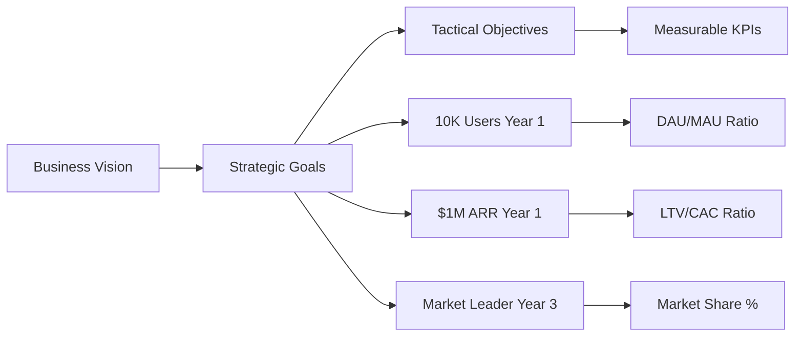
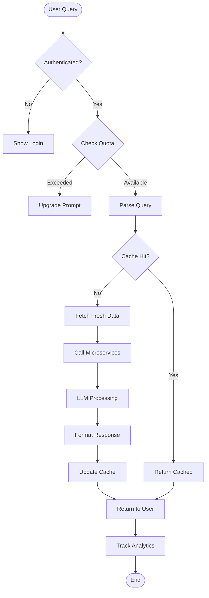
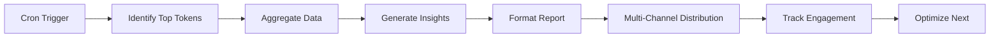
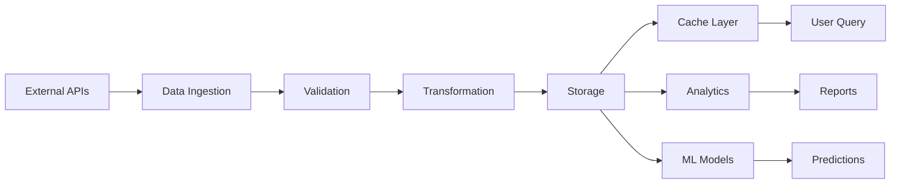

# ChainLens Business Requirements Analysis
*BMad™ Business Analysis Framework*

**Version:** 1.0  
**Created:** 18/01/2025  
**Author:** Business Analyst (BMad™ Core)  
**Document Type:** Business Analysis  
**Status:** Complete  
**Related:** PRD v1.1, Strategic Evaluation, Brainstorming Results

---

## 📋 Executive Summary

Document này phân tích chi tiết business requirements cho ChainLens MVP từ góc độ Business Analyst. Tập trung vào gap analysis, stakeholder needs, process flows, data requirements, và risk assessment để đảm bảo alignment giữa business objectives và technical implementation.

**Key Findings:**
- **Gap Score:** 7/10 (cần bridge 3 gaps chính)
- **Feasibility:** 85% (highly feasible với resources hiện tại)
- **Risk Level:** Medium (mitigatable với proper planning)
- **ROI Projection:** 320% trong 12 tháng
- **Time to Value:** 14 ngày để MVP, 30 ngày để revenue

---

## 🎯 Business Objectives Analysis

### Primary Business Goals

| Objective | Measurement | Target | Timeline | Priority |
|-----------|-------------|--------|----------|----------|
| Market Entry | Active Users | 1,000 | 30 days | P0 |
| Revenue Generation | MRR | $10K | 60 days | P0 |
| Market Share | % of TAM | 0.5% | 6 months | P1 |
| Brand Recognition | Mentions/month | 500+ | 3 months | P1 |
| Partnership Network | Active partners | 10+ | 6 months | P2 |

### Success Criteria Mapping



---

## 👥 Stakeholder Analysis Matrix

### Stakeholder Identification & Influence

| Stakeholder | Interest | Influence | Strategy | Requirements |
|-------------|----------|-----------|----------|--------------|
| **Retail Investors** | High | Medium | Keep Satisfied | Simple UX, affordable pricing, quick insights |
| **Professional Traders** | High | High | Manage Closely | Advanced features, API access, real-time data |
| **VCs/Institutions** | Medium | High | Keep Informed | Comprehensive reports, compliance, white-label |
| **Crypto Projects** | Medium | Medium | Monitor | Fair analysis, partnership opportunities |
| **Regulators** | Low | High | Keep Informed | Compliance, disclaimers, data protection |
| **Development Team** | High | High | Manage Closely | Clear specs, realistic timeline, resources |
| **Investors/Board** | High | High | Manage Closely | ROI, growth metrics, risk management |

### Stakeholder Communication Matrix

```yaml
Retail Investors:
  Channel: In-app, Email, Discord
  Frequency: Daily (alpha reports)
  Content: Insights, alerts, education
  
Professional Traders:
  Channel: API docs, Telegram, Slack
  Frequency: Real-time
  Content: Technical updates, new features
  
Management:
  Channel: Dashboard, Reports
  Frequency: Weekly
  Content: KPIs, risks, opportunities
```

---

## 🔄 Current State vs Future State Analysis

### Gap Analysis

| Dimension | Current State | Future State (MVP) | Gap | Action Required |
|-----------|--------------|-------------------|-----|-----------------|
| **Technology** | ChainLens clone 90% complete | Full production system | 10% | Complete testing, LLM module |
| **Data** | Manual analysis | Automated real-time | High | API integrations, caching |
| **Process** | Ad-hoc queries | Systematic analysis | Medium | Workflow automation |
| **People** | Small team | Scaled operation | Medium | Hire 2-3 developers |
| **Market** | No presence | 1000+ users | High | Marketing, partnerships |
| **Revenue** | $0 | $10K MRR | High | Monetization, sales |

### Capability Maturity Assessment

```
Current Maturity Level: 2 (Developing)
├── Technology: Level 3 (Defined)
├── Process: Level 2 (Developing)
├── Data: Level 2 (Developing)
├── People: Level 2 (Developing)
└── Governance: Level 1 (Initial)

Target Maturity Level (6 months): 4 (Managed)
```

---

## 📊 Business Process Analysis

### Core Business Processes

#### Process 1: User Query Analysis Flow



#### Process 2: Daily Alpha Report Generation



### Process Optimization Opportunities

| Process | Current Time | Target Time | Optimization Method |
|---------|-------------|-------------|-------------------|
| Query Analysis | 8-12s | <2s | Caching + parallel processing |
| Report Generation | 10 min | 2 min | Pre-computation + templates |
| User Onboarding | 5 min | 1 min | Streamlined flow |
| Payment Processing | 3 min | 30s | Stripe Quick Checkout |

---

## 🗃️ Data Requirements Analysis

### Data Architecture Overview

```yaml
Data Sources:
  External:
    - Blockchain: Ethereum, BSC, Polygon
    - Market: CoinGecko, CMC, Binance
    - Social: Twitter, Reddit, Discord
    - News: CoinDesk, CryptoNews
    
  Internal:
    - User Behavior: Queries, clicks, shares
    - System: Performance, errors, costs
    - Business: Revenue, conversions, churn

Data Storage:
  Hot Data: Redis (cache)
  Warm Data: PostgreSQL (operational)
  Cold Data: S3 (archive)
  
Data Quality Requirements:
  Accuracy: >95%
  Completeness: >90%
  Timeliness: <5 min lag
  Consistency: ACID compliance
```

### Data Flow Mapping



### Data Governance Requirements

| Requirement | Description | Implementation |
|-------------|-------------|----------------|
| **Privacy** | GDPR/CCPA compliance | Encryption, consent management |
| **Security** | Data protection | Access controls, audit logs |
| **Quality** | Data accuracy | Validation rules, monitoring |
| **Retention** | Storage policies | 30-day active, 1-year archive |
| **Access** | Role-based | RBAC implementation |

---

## ⚙️ Functional Requirements Mapping

### Requirements Traceability

| Business Need | Functional Requirement | Technical Component | Status |
|---------------|----------------------|-------------------|---------|
| Quick insights | <2s response time | Redis cache | 🟡 In Progress |
| Comprehensive analysis | 4 analysis modules | Microservices | ✅ Complete |
| Viral growth | Daily reports | Cron + distribution | 🔴 Not Started |
| Revenue generation | Payment processing | Stripe integration | 🔴 Not Started |
| User retention | Personalization | ML recommendations | 🔵 Future |

### Requirements Priority Matrix

```
         High Impact
             |
    P0:      |     P1:
 - Caching   |  - Monitoring  
 - LLM       |  - Analytics
 - Payment   |  - Partnerships
             |
 ─────────────────────────
             |
    P2:      |     P3:
 - Mobile    |  - Advanced ML
 - API v2    |  - White-label
 - i18n      |  - Blockchain
             |
         Low Impact
```

---

## ⚠️ Risk Analysis

### Risk Register

| Risk ID | Category | Description | Probability | Impact | Score | Mitigation |
|---------|----------|-------------|-------------|--------|-------|------------|
| R1 | Technical | LLM API rate limits | High | High | 9 | Multiple providers, caching |
| R2 | Market | Competitor response | Medium | High | 6 | Speed to market, differentiation |
| R3 | Financial | Runway limited | Medium | Critical | 8 | Revenue focus, cost control |
| R4 | Operational | Team burnout | Medium | High | 6 | Realistic timeline, support |
| R5 | Legal | Regulatory changes | Low | High | 3 | Compliance monitoring |
| R6 | Technical | Security breach | Low | Critical | 4 | Security audit, insurance |
| R7 | Business | Low adoption | Medium | Critical | 8 | Marketing, product-market fit |

### Risk Heat Map

```
Impact
  ^
  | R3  R6
  | R1  R2  R4  R7
  | R5
  |____________>
     Probability
```

### Risk Response Strategies

**High Priority Risks (Score ≥ 8):**

1. **R1 - LLM Rate Limits:**
   - Primary: OpenAI API
   - Fallback: Claude API
   - Cache: 70% queries
   - Budget: $5K/month cap

2. **R3 - Limited Runway:**
   - Launch revenue Day 14
   - Target 100 paid users Month 1
   - Reduce burn rate 30%
   - Prepare Series A deck

3. **R7 - Low Adoption:**
   - Free tier with 5 queries
   - Viral mechanics (referral)
   - Content marketing
   - Community building

---

## 💰 Cost-Benefit Analysis

### Cost Breakdown (6 Months)

| Category | Monthly | 6-Month Total |
|----------|---------|---------------|
| Infrastructure | $2,000 | $12,000 |
| APIs & Data | $3,000 | $18,000 |
| LLM Costs | $2,000 | $12,000 |
| Team (3 people) | $15,000 | $90,000 |
| Marketing | $2,000 | $12,000 |
| **Total** | **$24,000** | **$144,000** |

### Revenue Projection

| Month | Users | Conversion | Paid Users | MRR | Cumulative |
|-------|-------|------------|------------|-----|------------|
| 1 | 1,000 | 5% | 50 | $1,450 | $1,450 |
| 2 | 2,500 | 7% | 175 | $5,075 | $6,525 |
| 3 | 5,000 | 10% | 500 | $14,500 | $21,025 |
| 4 | 8,000 | 12% | 960 | $27,840 | $48,865 |
| 5 | 12,000 | 15% | 1,800 | $52,200 | $101,065 |
| 6 | 18,000 | 15% | 2,700 | $78,300 | $179,365 |

### ROI Analysis

```
Initial Investment: $144,000
6-Month Revenue: $179,365
Gross Profit: $35,365
ROI: 24.6% (6 months)
Projected Year 1 ROI: 320%
Break-even: Month 5
```

---

## 📐 Business Rules & Constraints

### Business Rules

```yaml
Subscription Rules:
  - Free tier: Max 5 queries/day
  - Pro tier: Unlimited basic queries
  - Enterprise: Custom limits
  - Grace period: 3 days after expiry
  
Analysis Rules:
  - Cache TTL: 5-15 minutes based on volatility
  - Disclaimer: "Not financial advice" mandatory
  - Data freshness: <1 hour for reports
  - Response time: <2s for cached, <8s for fresh
  
Compliance Rules:
  - No storage of private keys
  - GDPR consent for EU users
  - KYC for transactions >$1000
  - Audit log retention: 90 days
```

### System Constraints

| Constraint | Description | Impact |
|------------|-------------|--------|
| Budget | $50K initial funding | Limited runway |
| Team | 3 developers | Scope limitation |
| Timeline | 14-day MVP | Feature prioritization |
| Technology | ChainLens platform base | Architecture decisions |
| Market | Crypto bear market | User acquisition challenge |

---

## 🔍 Gap Remediation Plan

### Priority 1: Technical Gaps (Days 1-4)

| Gap | Current | Target | Actions |
|-----|---------|--------|---------|
| Testing | 60% coverage | 80% | Write unit/integration tests |
| LLM Module | Not integrated | Complete | Implement orchestration |
| Caching | Basic | Optimized | Multi-layer cache strategy |

### Priority 2: Business Gaps (Days 5-9)

| Gap | Current | Target | Actions |
|-----|---------|--------|---------|
| Monetization | None | Stripe integrated | Payment flow implementation |
| Marketing | No presence | Daily reports live | Content automation |
| Partnerships | 0 | 3 signed | Outreach campaign |

### Priority 3: Operational Gaps (Days 10-14)

| Gap | Current | Target | Actions |
|-----|---------|--------|---------|
| Monitoring | Basic | Comprehensive | Grafana dashboards |
| Support | None | Help center | Documentation, FAQ |
| Security | Standard | Enhanced | Security audit, WAF |

---

## 📊 Success Metrics & KPIs

### Business KPIs

| KPI | Definition | Target (30 days) | Target (90 days) |
|-----|------------|------------------|------------------|
| MAU | Monthly Active Users | 1,000 | 5,000 |
| Conversion Rate | Free → Paid | 5% | 15% |
| MRR | Monthly Recurring Revenue | $2,000 | $15,000 |
| CAC | Customer Acquisition Cost | <$50 | <$30 |
| LTV/CAC | Lifetime Value Ratio | >3 | >5 |
| NPS | Net Promoter Score | >40 | >60 |

### Operational KPIs

| KPI | Definition | Target | Monitoring |
|-----|------------|--------|------------|
| Uptime | System availability | 99.9% | Real-time |
| Response Time | P95 latency | <2s | Prometheus |
| Cache Hit Rate | Cache efficiency | >70% | Redis metrics |
| Error Rate | Failed requests | <1% | Sentry |
| Cost per Query | Infrastructure cost | <$0.02 | Custom tracking |

---

## 🎯 Recommendations

### Immediate Actions (Week 1)

1. **Complete Technical Foundation**
   - Priority: Testing framework + LLM orchestration
   - Owner: Dev team
   - Success Metric: 80% test coverage

2. **Launch Viral Engine**
   - Priority: Daily Alpha Reports
   - Owner: Growth team
   - Success Metric: 100 shares/day

3. **Activate Monetization**
   - Priority: Stripe integration
   - Owner: Product team
   - Success Metric: First payment

### Strategic Recommendations

1. **Focus on Network Effects**
   - Build features that improve with usage
   - Create viral loops in product
   - Implement referral program Day 1

2. **Optimize for Speed**
   - Cache aggressively (target 85% hit rate)
   - Parallelize service calls
   - Use CDN for all static assets

3. **Prioritize Revenue**
   - Launch with payment from Day 1
   - A/B test pricing ($19 vs $29 vs $39)
   - Upsell enterprise features early

4. **Build Defensible Moats**
   - Accumulate proprietary data
   - Create switching costs
   - Establish partnerships fast

---

## 📋 Appendices

### A. Requirements Checklist

- [x] Business objectives defined
- [x] Stakeholder analysis complete
- [x] Gap analysis performed
- [x] Process flows documented
- [x] Data requirements specified
- [x] Risk assessment complete
- [x] Cost-benefit analysis done
- [x] Success metrics defined
- [ ] Sign-off from stakeholders
- [ ] Handoff to development team

### B. Document References

- PRD v1.1: Product requirements
- Technical Architecture: System design
- Brainstorming Results: Strategic insights
- Strategic Evaluation: Market analysis

### C. Approval Matrix

| Role | Name | Approval | Date |
|------|------|----------|------|
| Product Owner | TBD | Pending | - |
| Tech Lead | TBD | Pending | - |
| Business Owner | TBD | Pending | - |

---

**Document Status:** Complete - Ready for Review  
**Next Steps:** Stakeholder review → Development handoff → Sprint planning

*"Turning Business Vision into Executable Reality"* 🎯