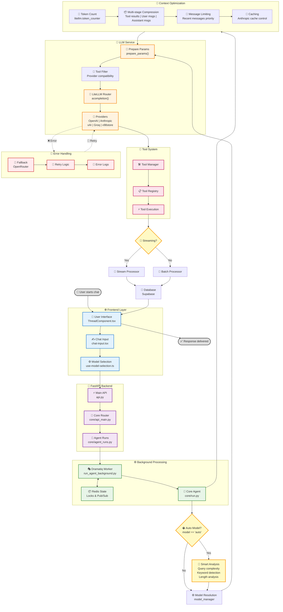

# ChainLens Chat Flow Diagram

Biểu đồ luồng xử lý request-to-response của hệ thống ChainLens từ frontend đến backend.

## Overview

Sơ đồ này mô tả chi tiết quá trình xử lý từ khi user gửi message đến khi nhận được response, bao gồm:
- Frontend UI components và model selection
- Backend API routing và agent run management
- **🤖 Auto Model Selection** với intelligent query analysis
- **🧠 Context Optimization** với multi-stage compression
- **🏢 v98store Integration** với 9 premium models
- **🔧 Smart Tool Management** với provider compatibility
- Tool execution và response processing
- Error handling và fallback mechanisms

---

---

## Key Components Explanation

### 🌐 **Frontend Layer**
- **ThreadComponent.tsx**: Main chat interface quản lý conversation state
- **chat-input.tsx**: Input component xử lý user message submission
- **use-model-selection.ts**: Hook quản lý model selection với "auto" option và v98store models

### 🔗 **FastAPI Backend**
- **api.py**: Main application với CORS, middleware setup
- **core/api_main.py**: Core routing với sub-routers cho various services
- **core/agent_runs.py**: Agent lifecycle management (start/stop/status)

### ⚙️ **Background Processing**
- **Dramatiq Worker**: Background task processing với Redis coordination
- **Redis State Management**: Locks, TTLs, pub/sub cho distributed coordination
- **Core Agent Run**: Main execution logic trong `core/run.py`

### 🤖 **Auto Model Selection** *(NEW)*
- **Intelligent Query Analysis**: Keyword detection cho complex tasks (code, implement, analyze, etc.)
- **Length-based Detection**: Queries > 8 words được classify as complex
- **Smart Model Mapping**:
  - Complex queries → `openai-compatible/gpt-4o` (premium model)
  - Simple queries → `openai-compatible/gpt-4o-mini` (efficient model)
- **Environment Control**: `AUTO_MODEL_ENABLED=true` để enable feature
- **Model Resolution**: `model_manager.resolve_model_id()` với auto selection logic

### 🧠 **LLM Service Layer**
- **Parameter Preparation**: Provider-specific configurations
- **Tool Schema Filtering**: Smart detection cho provider compatibility
- **LiteLLM Router**: Unified interface cho multiple providers
- **Provider Support**: OpenAI, Anthropic, xAI, Groq, OpenRouter, Bedrock, **v98store**

### 🏢 **v98store Integration** *(NEW)*
- **9 Premium Models**: GPT-4o, GPT-5, Qwen 3 32B/235B, Claude 3.7 Sonnet, Grok 4, Kimi K2
- **OpenAI-Compatible API**: Seamless integration thông qua LiteLLM Router
- **Tool Schema Compatibility**: Automatic tool filtering cho v98store models
- **Model Aliases**: Support multiple naming conventions (gpt-4o, v98store/gpt-4o, etc.)
- **Cost Optimization**: Premium models accessible với competitive pricing

### 🔧 **Smart Tool Management** *(ENHANCED)*
- **Tool Manager**: Register various agent capabilities
- **Tool Registry**: OpenAPI schemas cho native tool calling
- **Provider Compatibility Detection**: Automatic tool filtering based on model provider
- **v98store Compatibility**: Tools disabled cho v98store models (không support tool schemas)
- **Tool Execution**: Function calls với error handling

### 📤 **Response Processing**
- **Streaming Support**: Real-time response chunks
- **Non-Streaming**: Complete response processing
- **Database Persistence**: Supabase storage cho conversation history

### 🚨 **Error Handling**
- **Fallback Mechanisms**: OpenRouter backup khi primary provider fails
- **Retry Logic**: Exponential backoff cho transient errors
- **Comprehensive Logging**: Structured logs với Langfuse tracing

### 🧠 **Context Optimization** *(ENHANCED)*
- **Accurate Token Counting**: `litellm.token_counter` cho precise measurements
- **Multi-stage Compression**:
  - Tool result messages compression (except most recent)
  - User message compression (except most recent)
  - Assistant message compression (except most recent)
- **Message Limiting**: Keep recent messages với priority system
- **Context Window Utilization (CWU)**: Monitor và optimize usage (target 60-70%)
- **Balanced Threshold**: 25,000 tokens cho better tool availability
- **Caching**: Anthropic cache control cho cost optimization

---

## Flow Descriptions

### 🎯 **Main Request Flow**
1. User inputs message trong chat interface
2. Model selection (auto/specific) được xác định
3. FastAPI routes request qua core API
4. Agent run được tạo và queued trong background
5. Dramatiq worker picks up task
6. Smart model routing analyzes và selects optimal model
7. LLM API call được thực hiện với appropriate parameters
8. Response được processed (streaming/non-streaming)
9. Tools được executed nếu needed
10. Results được persisted và returned to frontend

### 🤖 **Auto Model Selection Flow** *(ENHANCED)*
1. Check if model === "auto" và `AUTO_MODEL_ENABLED=true`
2. **Query Analysis**:
   - Keyword detection: ['code', 'implement', 'create', 'analyze', 'design', 'strategy', 'build', 'develop', 'function', 'class', 'algorithm', 'optimize', 'debug', 'refactor']
   - Length analysis: > 8 words = complex
3. **Model Selection Logic**:
   - Complex queries → `openai-compatible/gpt-4o` (premium v98store model)
   - Simple queries → `openai-compatible/gpt-4o-mini` (efficient v98store model)
4. Resolve model ID thông qua model manager
5. Use resolved model cho LLM API call

### 🚨 **Error Handling Flow**
1. Primary provider fails
2. Fallback to OpenRouter equivalent
3. Retry with exponential backoff
4. Log structured error information
5. Return user-friendly error message nếu all attempts fail

---

### 🧠 **Context Optimization Flow** *(NEW)*
1. **Token Counting**: Use `litellm.token_counter` cho accurate measurement
2. **Message Limiting**: Keep recent messages (max 8) + system message
3. **Multi-stage Compression**:
   - Compress tool results (except most recent)
   - Compress user messages (except most recent)
   - Compress assistant messages (except most recent)
4. **CWU Monitoring**: Calculate Context Window Utilization ratio
5. **Iterative Optimization**: Repeat until under threshold hoặc max iterations

## Technical Notes

- **Redis Keys**: `active_run:{instance_id}:{agent_run_id}` format
- **Control Channels**: `agent_run:{agent_run_id}:control` cho stop signals
- **Response Lists**: `agent_run:{agent_run_id}:responses` cho streaming data
- **Tool Calling**: Native support thông qua OpenAPI schemas với provider compatibility
- **Context Limits**: Automatic compression khi token threshold exceeded (25,000 tokens)
- **Provider Fallbacks**: Mapped cho high availability
- **v98store API**: `https://v98store.com/v1` với OpenAI-compatible interface
- **Tool Schema Filtering**: Automatic detection và skip cho incompatible providers
- **Auto Model Environment**: `AUTO_MODEL_ENABLED=true` để enable intelligent selection

---

## Recent Updates (v3.1)

### ✨ **New Features Added:**
- **🤖 Auto Model Selection**: Intelligent model selection based on query complexity
- **🧠 Context Optimization**: Multi-stage compression với CWU monitoring
- **🏢 v98store Integration**: 9 premium models với competitive pricing
- **🔧 Smart Tool Management**: Provider compatibility detection

### 🔧 **Technical Improvements:**
- **Token Counting**: Accurate measurement với `litellm.token_counter`
- **Message Compression**: Multi-stage approach cho optimal context usage
- **Tool Schema Filtering**: Automatic compatibility detection
- **Model Registry**: Enhanced với v98store models và aliases

---

*Diagram updated: 2025-09-28*
*Source: ChainLens codebase analysis - Version 3.1*