```mermaid
flowchart TD
    %% User starts conversation
    START(["👤 User starts chat"]) --> UI

    %% Frontend Layer
    subgraph FE ["🌐 Frontend Layer"]
        UI["📱 User Interface<br/>ThreadComponent.tsx"]
        CI["✍️ Chat Input<br/>chat-input.tsx"]
        MS["⚙️ Model Selection<br/>use-model-selection.ts"]
        UI --> CI
        CI --> MS
    end

    %% API Gateway
    subgraph API ["🔗 FastAPI Backend"]
        MAIN["⚡ Main API<br/>api.py"]
        CORE["🎯 Core Router<br/>core/api_main.py"]
        RUNS["🏃 Agent Runs<br/>core/agent_runs.py"]
        MAIN --> CORE
        CORE --> RUNS
    end

    %% Background Processing
    subgraph BG ["⚙️ Background Processing"]
        DRAMA["🎭 Dramatiq Worker<br/>run_agent_background.py"]
        REDIS["📦 Redis State<br/>Locks & Pub/Sub"]
        CORE_RUN["🧠 Core Agent<br/>core/run.py"]
        DRAMA <--> REDIS
        DRAMA --> CORE_RUN
    end

    %% Model Management with Auto Detection
    AUTO{"🤔 Auto Model?<br/>model == 'auto'"}
    HEURISTIC["🎯 Smart Analysis<br/>Query complexity<br/>User tier"]
    RESOLVE["⚙️ Model Resolution<br/>model_manager"]

    %% LLM Service Layer
    subgraph LLM ["🧠 LLM Service"]
        PREP["🔧 Prepare Params<br/>prepare_params()"]
        ROUTER["🔄 LiteLLM Router<br/>acompletion()"]
        PROVIDERS["🏢 Providers<br/>OpenAI | Anthropic<br/>xAI | Groq"]
        PREP --> ROUTER
        ROUTER --> PROVIDERS
    end

    %% Tool System
    subgraph TOOLS ["🔧 Tool System"]
        TM["🛠️ Tool Manager"]
        TR["📋 Tool Registry"]
        EXEC["⚡ Tool Execution"]
        TM --> TR
        TR --> EXEC
    end

    %% Response Processing
    STREAM{"🌊 Streaming?"}
    PROC_S["📡 Stream Processor"]
    PROC_NS["📄 Batch Processor"]
    PERSIST["💾 Database<br/>Supabase"]

    %% Error Handling
    subgraph ERROR ["🚨 Error Handling"]
        FALLBACK["🔄 Fallback<br/>OpenRouter"]
        RETRY["🔁 Retry Logic"]
        ERR_LOG["📝 Error Logs"]
        FALLBACK --> RETRY
        RETRY --> ERR_LOG
    end

    %% Context Management
    subgraph CONTEXT ["🧠 Context Mgmt"]
        TOKEN["🔢 Token Count"]
        COMPRESS["📦 Compression"]
        CACHE["💾 Caching"]
        TOKEN --> COMPRESS
        COMPRESS --> CACHE
    end

    %% Main Flow Connections
    MS --> MAIN
    RUNS --> DRAMA
    CORE_RUN --> AUTO
    AUTO -->|Yes| HEURISTIC
    AUTO -->|No| RESOLVE
    HEURISTIC --> RESOLVE
    RESOLVE --> PREP
    
    %% LLM to Tools
    PROVIDERS --> TOOLS
    EXEC --> STREAM
    
    %% Response Processing Flow
    STREAM -->|Yes| PROC_S
    STREAM -->|No| PROC_NS
    PROC_S --> PERSIST
    PROC_NS --> PERSIST
    
    %% Context Management Flow
    CORE_RUN --> CONTEXT
    CONTEXT --> PREP
    
    %% Error Handling Flow
    PROVIDERS -.->|"❌ Error"| ERROR
    ERROR -.->|"🔄 Retry"| PROVIDERS
    
    %% Final Response
    PERSIST --> UI
    
    %% End point
    UI --> FINISH(["✅ Response delivered"])

    %% Styling
    classDef frontend fill:#e3f2fd,stroke:#1976d2,stroke-width:2px
    classDef backend fill:#f3e5f5,stroke:#7b1fa2,stroke-width:2px
    classDef processing fill:#e8f5e8,stroke:#388e3c,stroke-width:2px
    classDef llm fill:#fff3e0,stroke:#f57c00,stroke-width:2px
    classDef tools fill:#fce4ec,stroke:#c2185b,stroke-width:2px
    classDef decision fill:#fff9c4,stroke:#f9a825,stroke-width:3px
    classDef error fill:#ffebee,stroke:#d32f2f,stroke-width:2px
    classDef startend fill:#e0e0e0,stroke:#424242,stroke-width:2px

    class UI,CI,MS frontend
    class MAIN,CORE,RUNS backend
    class DRAMA,REDIS,CORE_RUN processing
    class PREP,ROUTER,PROVIDERS llm
    class TM,TR,EXEC tools
    class AUTO,HEURISTIC,STREAM decision
    class FALLBACK,RETRY,ERR_LOG error
    class START,FINISH startend
```

# ChainLens Chat Flow Diagram

Biểu đồ luồng xử lý request-to-response của hệ thống ChainLens từ frontend đến backend.

## Overview

Sơ đồ này mô tả chi tiết quá trình xử lý từ khi user gửi message đến khi nhận được response, bao gồm:
- Frontend UI components và model selection
- Backend API routing và agent run management
- **🤖 Auto Model Selection** với intelligent query analysis
- **🧠 Context Optimization** với multi-stage compression
- **🏢 v98store Integration** với 9 premium models
- **🔧 Smart Tool Management** với provider compatibility
- Tool execution và response processing
- Error handling và fallback mechanisms

---

---

## Key Components Explanation

### 🌐 **Frontend Layer**
- **ThreadComponent.tsx**: Main chat interface quản lý conversation state
- **chat-input.tsx**: Input component xử lý user message submission
- **_use-model-selection.ts**: Hook quản lý model selection với "auto" option

### 🔗 **FastAPI Backend**
- **api.py**: Main application với CORS, middleware setup
- **core/api_main.py**: Core routing với sub-routers cho various services
- **core/agent_runs.py**: Agent lifecycle management (start/stop/status)

### ⚙️ **Background Processing**
- **Dramatiq Worker**: Background task processing với Redis coordination
- **Redis State Management**: Locks, TTLs, pub/sub cho distributed coordination
- **Core Agent Run**: Main execution logic trong `core/run.py`

### 🤖 **Smart Model Routing**
- **Auto Detection**: Phân tích query complexity để chọn optimal model
- **Heuristics**: User tier consideration, cost optimization
- **Model Resolution**: `model_manager.resolve_model_id()` mapping

### 🧠 **LLM Service Layer**  
- **Parameter Preparation**: Provider-specific configurations
- **LiteLLM Router**: Unified interface cho multiple providers
- **Provider Support**: OpenAI, Anthropic, xAI, Groq, OpenRouter, Bedrock

### 🔧 **Tool System**
- **Tool Manager**: Register various agent capabilities
- **Tool Registry**: OpenAPI schemas cho native tool calling
- **Tool Execution**: Function calls với error handling

### 📤 **Response Processing**
- **Streaming Support**: Real-time response chunks
- **Non-Streaming**: Complete response processing
- **Database Persistence**: Supabase storage cho conversation history

### 🚨 **Error Handling**
- **Fallback Mechanisms**: OpenRouter backup khi primary provider fails
- **Retry Logic**: Exponential backoff cho transient errors
- **Comprehensive Logging**: Structured logs với Langfuse tracing

### 🧠 **Context Management**
- **Token Counting**: Monitor context length limits
- **Message Compression**: Automatic summarization khi over threshold
- **Caching**: Anthropic cache control cho cost optimization

---

## Flow Descriptions

### 🎯 **Main Request Flow**
1. User inputs message trong chat interface
2. Model selection (auto/specific) được xác định
3. FastAPI routes request qua core API
4. Agent run được tạo và queued trong background
5. Dramatiq worker picks up task
6. Smart model routing analyzes và selects optimal model
7. LLM API call được thực hiện với appropriate parameters
8. Response được processed (streaming/non-streaming)
9. Tools được executed nếu needed
10. Results được persisted và returned to frontend

### 🔄 **Auto Model Selection Flow**
1. Check if model === "auto"
2. Analyze query complexity và user tier
3. Apply heuristics để determine optimal model
4. Resolve model ID thông qua model manager
5. Use resolved model cho LLM API call

### 🚨 **Error Handling Flow**
1. Primary provider fails
2. Fallback to OpenRouter equivalent
3. Retry with exponential backoff
4. Log structured error information
5. Return user-friendly error message nếu all attempts fail

---

## Technical Notes

- **Redis Keys**: `active_run:{instance_id}:{agent_run_id}` format
- **Control Channels**: `agent_run:{agent_run_id}:control` cho stop signals
- **Response Lists**: `agent_run:{agent_run_id}:responses` cho streaming data
- **Tool Calling**: Native support thông qua OpenAPI schemas
- **Context Limits**: Automatic compression khi token threshold exceeded
- **Provider Fallbacks**: Mapped cho high availability

---

*Diagram generated: 2025-01-18*  
*Source: ChainLens codebase analysis*