# ChainLens Crypto Services Architecture Document

**Version:** 1.0  
**Date:** 2024-01-01  
**Author:** Winston - Holistic System Architect  
**Status:** Final  

## Executive Summary

This document presents the comprehensive architecture for ChainLens Crypto Services - a suite of 5 microservices that extend ChainLens-Automation with advanced cryptocurrency analysis capabilities. The system includes ChainLens-Core (API Gateway & Orchestrator) and 4 specialized analysis services: OnChain, Sentiment, Tokenomics, and Team Verification.

**Key Architectural Decisions:**
- **Microservices Architecture:** Domain-separated services with independent scaling
- **NestJS Framework:** TypeScript-based enterprise framework for all new services  
- **Hybrid Database Strategy:** Supabase PostgreSQL shared + dedicated PostgreSQL instance
- **API Gateway Pattern:** ChainLens-Core as central orchestrator
- **Integration Approach:** Seamless connection with existing ChainLens-Automation

## 1. Introduction

### Project Context

ChainLens-Automation is a complete FastAPI + Next.js system providing AI-powered automation tools. This project extends it with cryptocurrency analysis capabilities by adding 5 new services that integrate seamlessly with the existing backend.

### Architectural Philosophy

**Pragmatic Enhancement Over Complete Rebuild**
- Leverage existing ChainLens-Automation infrastructure
- Add crypto capabilities without disrupting current functionality
- Maintain user experience consistency
- Enable independent scaling of crypto services

### Key Stakeholders

- **End Users:** ChainLens-Automation users seeking crypto analysis
- **Development Team:** Full-stack developers implementing the services
- **DevOps Team:** Infrastructure and deployment management
- **Product Team:** Feature definition and user experience
- **Business Team:** Revenue impact and market validation

## 2. High Level Architecture

### System Overview

```mermaid
graph TB
    User[👤 User] --> Frontend[🖥️ ChainLens-Automation Frontend<br/>Next.js Port 3000]
    Frontend --> Backend[🔧 ChainLens-Automation Backend<br/>FastAPI Port 8000]
    Backend -.->|Crypto Query Detection| Core[🎯 ChainLens-Core<br/>NestJS Port 3006<br/>API Gateway & Orchestrator]
    
    Core -.->|Parallel Orchestration| OnChain[⛓️ OnChain Service<br/>NestJS Port 3001]
    Core -.->|Parallel Orchestration| Sentiment[😊 Sentiment Service<br/>NestJS Port 3002]
    Core -.->|Parallel Orchestration| Tokenomics[💰 Tokenomics Service<br/>NestJS Port 3003]
    Core -.->|Parallel Orchestration| Team[👥 Team Service<br/>NestJS Port 3004]
    
    OnChain --> ExtAPI1[🔗 Moralis API<br/>DexScreener API<br/>DeFiLlama API]
    Sentiment --> ExtAPI2[🔗 Twitter API<br/>Reddit API<br/>News API]
    Tokenomics --> ExtAPI3[🔗 DeFiLlama API<br/>CoinGecko API]
    Team --> ExtAPI4[🔗 GitHub API<br/>LinkedIn API]
    
    Core --> Cache[⚡ Redis Cache<br/>Port 6379]
    Core --> DB1[🗄️ Supabase PostgreSQL<br/>Shared Database]
    
    OnChain --> DB2[🗄️ PostgreSQL<br/>Microservices Database]
    Sentiment --> DB2
    Tokenomics --> DB2
    Team --> DB2
```



### Component Relationships

**ChainLens-Automation (Existing)**
- Frontend: Next.js application serving users
- Backend: FastAPI handling chat, authentication, billing
- Database: Supabase PostgreSQL with auth and user data

**ChainLens-Core (New)**
- API Gateway and orchestrator for crypto services
- Handles authentication, rate limiting, response aggregation
- Shares Supabase database for user integration

**4 Crypto Microservices (New)**
- Independent services with specialized analysis capabilities
- Share dedicated PostgreSQL instance with separate schemas
- Communicate via HTTP APIs with ChainLens-Core

## 3. Tech Stack

### Core Technologies

**Backend Framework:** NestJS + TypeScript
- Enterprise-grade Node.js framework
- Dependency injection and modular architecture
- Built-in support for microservices patterns
- Excellent TypeScript integration

**Database Strategy:** Hybrid PostgreSQL
- Supabase PostgreSQL: Shared by ChainLens-Automation + ChainLens-Core
- Dedicated PostgreSQL: Microservices with separate schemas
- Rationale: Balance cost-effectiveness with service isolation

**Caching & Messaging:** Redis
- Response caching with TTL strategies
- Pub/sub for real-time updates
- Session storage and rate limiting

**Container Orchestration:** Kubernetes
- Production deployment on AWS EKS
- Auto-scaling and service discovery
- Health checks and rolling updates

### External Integrations

**Blockchain Data:**
- Moralis API: Token prices, holder data, transactions
- DexScreener API: DEX trading pairs and liquidity
- DeFiLlama API: DeFi protocols and TVL data
- CoinGecko API: Market data and historical prices

**Social & News Data:**
- Twitter API: Social sentiment analysis
- Reddit API: Community discussions
- News API: Cryptocurrency news articles

**Development Data:**
- GitHub API: Repository analysis and team verification
- LinkedIn API: Professional background verification

## 4. Data Models

### Core Data Structures

```typescript
// Project Analysis Request
interface AnalysisRequest {
  projectId: string;           // e.g., "ethereum", "bitcoin"
  userId: string;              // Supabase user ID
  analysisType: 'full' | 'onchain-only' | 'sentiment-only' | 'tokenomics-only' | 'team-only';
  options?: {
    includeHistorical?: boolean;
    timeframe?: '24h' | '7d' | '30d';
    confidenceThreshold?: number;
  };
}

// Aggregated Analysis Response
interface AnalysisResponse {
  projectId: string;
  overallScore: number;        // 0-100 composite score
  confidence: number;          // 0-1 confidence level
  analysis: {
    onchain?: OnChainAnalysisResult;
    sentiment?: SentimentAnalysisResult;
    tokenomics?: TokenomicsAnalysisResult;
    team?: TeamVerificationResult;
  };
  metadata: {
    analysisType: string;
    processingTime: number;     // milliseconds
    dataFreshness: number;      // 0-1 score
    warnings?: string[];
  };
}
```

### Service-Specific Models

**OnChain Analysis:**
```typescript
interface OnChainAnalysisResult {
  projectId: string;
  tokenAddress?: string;
  chainId?: string;
  marketCap: number;
  volume24h: number;
  priceChange24h: number;
  liquidityScore: number;      // 0-100
  holderCount: number;
  riskScore: number;          // 0-100 (lower is better)
  confidence: number;
  dataSource: string;
  lastUpdated: Date;
}
```

**Sentiment Analysis:**
```typescript
interface SentimentAnalysisResult {
  projectId: string;
  overallSentiment: number;    // -1 to 1
  socialMentions: number;
  newsArticles: number;
  influencerMentions: number;
  sentimentTrend: 'bullish' | 'bearish' | 'neutral';
  keyTopics: string[];
  riskFlags: string[];
  confidence: number;
  analysisDate: Date;
}
```

## 5. API Specification

### ChainLens-Core API Gateway

**Base URL:** `https://api-crypto.chainlens.com`

#### Authentication
```http
Authorization: Bearer <supabase_jwt_token>
Content-Type: application/json
```

#### Core Endpoints

**POST /api/v1/analyze**
```json
{
  "projectId": "ethereum",
  "userId": "user-uuid",
  "analysisType": "full"
}
```

Response:
```json
{
  "projectId": "ethereum",
  "overallScore": 85,
  "confidence": 0.92,
  "analysis": {
    "onchain": { "riskScore": 15, "liquidityScore": 95 },
    "sentiment": { "overallSentiment": 0.7, "socialMentions": 1500 },
    "tokenomics": { "distributionScore": 85, "stakingRewards": 5.2 },
    "team": { "overallScore": 90, "verificationStatus": "verified" }
  },
  "metadata": {
    "processingTime": 2500,
    "dataFreshness": 0.95
  }
}
```

**GET /api/v1/analyze/{analysisId}/status**
```json
{
  "analysisId": "analysis-uuid",
  "status": "completed",
  "progress": 100,
  "estimatedCompletion": null,
  "result": { /* AnalysisResponse */ }
}
```

### Microservice Internal APIs

Each microservice exposes standardized endpoints:

**POST /api/v1/{service}/analyze**
- OnChain: `/api/v1/onchain/analyze`
- Sentiment: `/api/v1/sentiment/analyze`
- Tokenomics: `/api/v1/tokenomics/analyze`
- Team: `/api/v1/team/verify`

**GET /health** - Health check endpoint
**GET /metrics** - Prometheus metrics

## 6. Components

### ChainLens-Core (Port 3006)

**Primary Responsibilities:**
- API Gateway for all crypto analysis requests
- Authentication and authorization using Supabase JWT
- Rate limiting based on user tiers (Free/Pro/Enterprise)
- Orchestration of parallel microservice calls
- Response aggregation and caching
- Integration with ChainLens-Automation backend

**Key Modules:**
- `AuthModule`: JWT validation and user tier detection
- `OrchestrationModule`: Parallel service coordination
- `CacheModule`: Redis-based response caching
- `AnalyticsModule`: Usage tracking and billing integration

### OnChain Analysis Service (Port 3001)

**Primary Responsibilities:**
- Blockchain data analysis and risk assessment
- Token price, volume, and liquidity analysis
- Holder distribution and transaction pattern analysis
- Multi-chain support (Ethereum, BSC, Polygon, etc.)

**External API Integrations:**
- **Moralis API**: Token prices, holder data, transaction history
- **DexScreener API**: DEX trading pairs, liquidity pools
- **DeFiLlama API**: Protocol TVL, yield farming data
- **CoinGecko API**: Market data and historical prices

**Key Features:**
- Real-time price tracking
- Liquidity score calculation
- Risk assessment algorithms
- Multi-chain token analysis

### Sentiment Analysis Service (Port 3002)

**Primary Responsibilities:**
- Social media sentiment analysis
- News article sentiment processing
- Influencer mention tracking
- Trend analysis and risk flag detection

**External API Integrations:**
- **Twitter API**: Tweet sentiment analysis
- **Reddit API**: Community discussion analysis
- **News API**: Cryptocurrency news sentiment

**Key Features:**
- NLP-powered sentiment scoring
- Real-time social media monitoring
- Influencer impact analysis
- Risk flag detection

### Tokenomics Analysis Service (Port 3003)

**Primary Responsibilities:**
- Token economics analysis
- Vesting schedule evaluation
- Distribution fairness assessment
- DeFi yield and staking analysis

**External API Integrations:**
- **DeFiLlama API**: DeFi protocol data, yields
- **CoinGecko API**: Token supply and distribution data

**Key Features:**
- Vesting schedule analysis
- Token distribution scoring
- Yield farming opportunity analysis
- Inflation/deflation trend analysis

### Team Verification Service (Port 3004)

**Primary Responsibilities:**
- Team member verification and credibility assessment
- Project history analysis
- Social media presence verification
- Professional background validation

**External API Integrations:**
- **GitHub API**: Repository analysis, contribution history
- **LinkedIn API**: Professional background verification

**Key Features:**
- Team credibility scoring
- Project history analysis
- Social media verification
- Professional experience validation

## 7. External APIs

### DeFiLlama API Integration

**Base URL:** `https://api.llama.fi`
**Authentication:** None required (free)
**Rate Limits:** No official limits (respectful usage)

**Key Endpoints:**
```typescript
// Protocol TVL data
GET /protocol/{protocol}
// Example: /protocol/uniswap

// All protocols list
GET /protocols

// Chain TVL data
GET /chains

// Yield farming data
GET /yields?project={project}

// Historical TVL
GET /tvl/{protocol}
```

**Integration Strategy:**
```typescript
@Injectable()
export class DeFiLlamaService {
  private readonly baseUrl = 'https://api.llama.fi';
  
  @RateLimit(60) // 60 requests per minute (respectful)
  async getProtocolTVL(protocol: string): Promise<ProtocolTVL> {
    return this.externalApiService.makeRequest({
      url: `${this.baseUrl}/protocol/${protocol}`,
      method: 'GET',
      timeout: 10000,
      retries: 3
    });
  }
  
  @Cache(900) // 15 minutes TTL
  async getYieldData(project: string): Promise<YieldData[]> {
    return this.externalApiService.makeRequest({
      url: `${this.baseUrl}/yields?project=${project}`,
      method: 'GET'
    });
  }
}
```

### DexScreener API Integration

**Base URL:** `https://api.dexscreener.com`
**Authentication:** None required (free)
**Rate Limits:** 60-300 requests/minute per endpoint

**Key Endpoints:**
```typescript
// Latest DEX pairs
GET /latest/dex/pairs

// Search pairs
GET /latest/dex/search?q={query}

// Token pairs by chain and address
GET /tokens/v1/{chainId}/{tokenAddress}

// Specific pair data
GET /token-pairs/v1/{chainId}/{pairAddress}
```

**Integration Strategy:**
```typescript
@Injectable()
export class DexScreenerService {
  private readonly baseUrl = 'https://api.dexscreener.com';
  
  @RateLimit(300) // 300 requests per minute
  @Cache(120) // 2 minutes TTL for real-time data
  async getTokenPairs(chainId: string, tokenAddress: string): Promise<TokenPair[]> {
    return this.externalApiService.makeRequest({
      url: `${this.baseUrl}/tokens/v1/${chainId}/${tokenAddress}`,
      method: 'GET',
      timeout: 5000
    });
  }
  
  @RateLimit(60) // 60 requests per minute for search
  async searchPairs(query: string): Promise<SearchResult[]> {
    return this.externalApiService.makeRequest({
      url: `${this.baseUrl}/latest/dex/search?q=${encodeURIComponent(query)}`,
      method: 'GET'
    });
  }
}
```

### Enhanced Caching Strategy

```typescript
// Multi-tier caching with different TTLs
const cachingStrategy = {
  DexScreener: {
    pairData: 120, // 2 minutes - real-time trading data
    searchResults: 300, // 5 minutes - search queries
    tokenInfo: 600 // 10 minutes - basic token information
  },
  
  DeFiLlama: {
    protocolTVL: 900, // 15 minutes - protocol data
    yieldData: 1800, // 30 minutes - yield information
    chainData: 3600 // 1 hour - chain statistics
  },
  
  Moralis: {
    tokenPrice: 60, // 1 minute - price data
    holderData: 1800, // 30 minutes - holder information
    transactionData: 300 // 5 minutes - transaction history
  }
};
```

## 8. Core Workflows

### Complete Crypto Analysis Request

```mermaid
sequenceDiagram
    participant User as 👤 User
    participant Frontend as 🖥️ ChainLens-Automation Frontend
    participant Backend as 🔧 ChainLens-Automation Backend
    participant Core as 🎯 ChainLens-Core
    participant Cache as ⚡ Redis Cache
    participant OnChain as ⛓️ OnChain Service
    participant Sentiment as 😊 Sentiment Service
    participant Tokenomics as 💰 Tokenomics Service
    participant Team as 👥 Team Service

    User->>Frontend: Request analysis for "Uniswap"
    Frontend->>Backend: POST /api/chat with crypto query
    Backend->>Backend: Detect crypto analysis intent
    Backend->>Core: POST /api/v1/analyze
    
    Core->>Cache: Check existing analysis
    Cache-->>Core: Cache miss
    
    Note over Core: Parallel orchestration begins
    
    par OnChain Analysis
        Core->>OnChain: POST /api/v1/onchain/analyze
        OnChain->>OnChain: Fetch data from multiple APIs
        OnChain-->>Core: OnChainAnalysisResult
    and Sentiment Analysis
        Core->>Sentiment: POST /api/v1/sentiment/analyze
        Sentiment->>Sentiment: Process social media data
        Sentiment-->>Core: SentimentAnalysisResult
    and Tokenomics Analysis
        Core->>Tokenomics: POST /api/v1/tokenomics/analyze
        Tokenomics->>Tokenomics: Analyze token economics
        Tokenomics-->>Core: TokenomicsAnalysisResult
    and Team Verification
        Core->>Team: POST /api/v1/team/verify
        Team->>Team: Verify team credibility
        Team-->>Core: TeamVerificationResult
    end
    
    Core->>Core: Aggregate all results
    Core->>Cache: Store aggregated result
    Core-->>Backend: AggregatedAnalysisResult
    Backend-->>Frontend: Formatted crypto analysis
    Frontend-->>User: Display comprehensive analysis
```



### Error Handling & Fallback Strategies

```mermaid
sequenceDiagram
    participant Core as 🎯 ChainLens-Core
    participant OnChain as ⛓️ OnChain Service
    participant Moralis as 🔗 Moralis API
    participant CoinGecko as 📊 CoinGecko API
    participant Circuit as ⚡ Circuit Breaker
    participant Cache as 💾 Fallback Cache

    Core->>OnChain: Request token analysis
    OnChain->>Circuit: Check Moralis circuit state
    Circuit-->>OnChain: Circuit OPEN (too many failures)
    
    Note over OnChain: Primary API unavailable, try fallback
    
    OnChain->>CoinGecko: GET /coins/{id} (fallback)
    CoinGecko-->>OnChain: Basic price data
    
    OnChain->>Cache: Check stale cache for Moralis data
    Cache-->>OnChain: Stale data (2 hours old)
    
    OnChain->>OnChain: Combine available data
    Note over OnChain: Confidence score: 0.7 (reduced due to missing data)
    
    OnChain-->>Core: Partial OnChainAnalysisResult
    Note over OnChain,Core: {confidence: 0.7, dataSource: "fallback", warnings: ["moralis_unavailable"]}
```



## 9. Database Schema

### Supabase PostgreSQL Schema (Shared)

```sql
-- ChainLens-Core tables in Supabase
CREATE SCHEMA IF NOT EXISTS chainlens_core;

-- Project Analysis tracking
CREATE TABLE chainlens_core.project_analyses (
    id UUID PRIMARY KEY DEFAULT gen_random_uuid(),
    project_id VARCHAR(100) NOT NULL,
    user_id UUID NOT NULL REFERENCES auth.users(id) ON DELETE CASCADE,
    analysis_type VARCHAR(50) NOT NULL DEFAULT 'full',
    status VARCHAR(50) NOT NULL DEFAULT 'pending',
    requested_at TIMESTAMP WITH TIME ZONE DEFAULT NOW(),
    completed_at TIMESTAMP WITH TIME ZONE,
    cache_key VARCHAR(255) UNIQUE,
    metadata JSONB DEFAULT '{}',
    
    CONSTRAINT valid_analysis_type CHECK (analysis_type IN ('full', 'onchain-only', 'sentiment-only', 'tokenomics-only', 'team-only')),
    CONSTRAINT valid_status CHECK (status IN ('pending', 'processing', 'completed', 'failed', 'cached'))
);

-- Analysis cache for Redis backup
CREATE TABLE chainlens_core.analysis_cache (
    cache_key VARCHAR(255) PRIMARY KEY,
    project_id VARCHAR(100) NOT NULL,
    analysis_data JSONB NOT NULL,
    expires_at TIMESTAMP WITH TIME ZONE NOT NULL,
    created_at TIMESTAMP WITH TIME ZONE DEFAULT NOW(),
    data_freshness DECIMAL(3,2) DEFAULT 1.0
);

-- Usage tracking for billing
CREATE TABLE chainlens_core.usage_events (
    id UUID PRIMARY KEY DEFAULT gen_random_uuid(),
    user_id UUID NOT NULL REFERENCES auth.users(id) ON DELETE CASCADE,
    project_id VARCHAR(100) NOT NULL,
    analysis_id UUID REFERENCES chainlens_core.project_analyses(id) ON DELETE CASCADE,
    event_type VARCHAR(50) NOT NULL,
    cost_credits INTEGER DEFAULT 0,
    created_at TIMESTAMP WITH TIME ZONE DEFAULT NOW(),
    metadata JSONB DEFAULT '{}'
);

-- Performance indexes
CREATE INDEX idx_project_analyses_user_id ON chainlens_core.project_analyses(user_id);
CREATE INDEX idx_project_analyses_project_id ON chainlens_core.project_analyses(project_id);
CREATE INDEX idx_usage_events_user_id ON chainlens_core.usage_events(user_id);
```

### Microservices PostgreSQL Schema (Dedicated)

```sql
-- OnChain Analysis Schema
CREATE SCHEMA IF NOT EXISTS onchain_analysis;

CREATE TABLE onchain_analysis.blockchain_data (
    id UUID PRIMARY KEY DEFAULT gen_random_uuid(),
    project_id VARCHAR(100) NOT NULL,
    token_address VARCHAR(100) NOT NULL,
    chain_id VARCHAR(50) NOT NULL,
    market_cap BIGINT,
    volume_24h BIGINT,
    liquidity_score INTEGER CHECK (liquidity_score BETWEEN 0 AND 100),
    risk_score INTEGER CHECK (risk_score BETWEEN 0 AND 100),
    confidence DECIMAL(3,2) DEFAULT 1.0,
    last_updated TIMESTAMP WITH TIME ZONE DEFAULT NOW(),
    
    UNIQUE(project_id, token_address, chain_id)
);

-- Sentiment Analysis Schema
CREATE SCHEMA IF NOT EXISTS sentiment_analysis;

CREATE TABLE sentiment_analysis.sentiment_results (
    id UUID PRIMARY KEY DEFAULT gen_random_uuid(),
    project_id VARCHAR(100) NOT NULL,
    overall_sentiment DECIMAL(3,2) CHECK (overall_sentiment BETWEEN -1 AND 1),
    social_mentions INTEGER DEFAULT 0,
    sentiment_trend VARCHAR(20) CHECK (sentiment_trend IN ('bullish', 'bearish', 'neutral')),
    confidence DECIMAL(3,2) DEFAULT 1.0,
    analysis_date TIMESTAMP WITH TIME ZONE DEFAULT NOW(),
    
    UNIQUE(project_id, analysis_date::DATE)
);

-- Tokenomics Analysis Schema
CREATE SCHEMA IF NOT EXISTS tokenomics_analysis;

CREATE TABLE tokenomics_analysis.token_economics (
    id UUID PRIMARY KEY DEFAULT gen_random_uuid(),
    project_id VARCHAR(100) NOT NULL,
    total_supply BIGINT,
    circulating_supply BIGINT,
    distribution_score INTEGER CHECK (distribution_score BETWEEN 0 AND 100),
    confidence DECIMAL(3,2) DEFAULT 1.0,
    last_updated TIMESTAMP WITH TIME ZONE DEFAULT NOW(),
    
    UNIQUE(project_id)
);

-- Team Verification Schema
CREATE SCHEMA IF NOT EXISTS team_verification;

CREATE TABLE team_verification.verification_results (
    id UUID PRIMARY KEY DEFAULT gen_random_uuid(),
    project_id VARCHAR(100) NOT NULL,
    overall_score INTEGER CHECK (overall_score BETWEEN 0 AND 100),
    verification_status VARCHAR(50) CHECK (verification_status IN ('verified', 'partial', 'unverified')),
    confidence DECIMAL(3,2) DEFAULT 1.0,
    last_updated TIMESTAMP WITH TIME ZONE DEFAULT NOW(),
    
    UNIQUE(project_id)
);
```

## 10. Security & Monitoring

### Authentication & Authorization

```typescript
// JWT Token validation middleware
@Injectable()
export class JwtAuthGuard implements CanActivate {
  async canActivate(context: ExecutionContext): Promise<boolean> {
    const request = context.switchToHttp().getRequest();
    const token = this.extractTokenFromHeader(request);
    
    if (!token) {
      throw new UnauthorizedException('Missing authentication token');
    }
    
    try {
      const payload = await this.jwtService.verifyAsync(token, {
        secret: process.env.SUPABASE_JWT_SECRET,
        issuer: process.env.SUPABASE_URL
      });
      
      request.user = {
        id: payload.sub,
        email: payload.email,
        tier: payload.app_metadata?.tier || 'free'
      };
      
      return true;
    } catch (error) {
      throw new UnauthorizedException('Invalid token');
    }
  }
}

// Rate limiting based on user tier
@Injectable()
export class TierBasedRateLimitGuard implements CanActivate {
  async canActivate(context: ExecutionContext): Promise<boolean> {
    const request = context.switchToHttp().getRequest();
    const user = request.user;
    
    const limits = {
      free: { requests: 10, window: 3600 }, // 10 requests/hour
      pro: { requests: 1000, window: 3600 }, // 1000 requests/hour
      enterprise: { requests: 10000, window: 3600 } // 10k requests/hour
    };
    
    const userLimit = limits[user.tier] || limits.free;
    const key = `rate_limit:${user.id}:${Date.now() / userLimit.window | 0}`;
    
    const current = await this.redisService.incr(key);
    await this.redisService.expire(key, userLimit.window);
    
    if (current > userLimit.requests) {
      throw new TooManyRequestsException('Rate limit exceeded');
    }
    
    return true;
  }
}
```

### Monitoring & Observability

```typescript
// Comprehensive logging service
@Injectable()
export class LoggerService {
  private logger = winston.createLogger({
    level: process.env.LOG_LEVEL || 'info',
    format: winston.format.combine(
      winston.format.timestamp(),
      winston.format.errors({ stack: true }),
      winston.format.json()
    ),
    defaultMeta: {
      service: process.env.SERVICE_NAME,
      version: process.env.SERVICE_VERSION,
      environment: process.env.NODE_ENV
    }
  });
  
  logApiRequest(req: Request, res: Response, duration: number) {
    this.logger.info('API Request', {
      method: req.method,
      url: req.url,
      statusCode: res.statusCode,
      duration,
      userId: req.user?.id,
      correlationId: req.headers['x-correlation-id']
    });
  }
}

// Prometheus metrics
@Injectable()
export class MetricsService {
  private readonly httpRequestDuration = new prometheus.Histogram({
    name: 'http_request_duration_seconds',
    help: 'Duration of HTTP requests in seconds',
    labelNames: ['method', 'route', 'status_code', 'service']
  });
  
  recordHttpRequest(method: string, route: string, statusCode: number, duration: number) {
    this.httpRequestDuration
      .labels(method, route, statusCode.toString(), process.env.SERVICE_NAME)
      .observe(duration / 1000);
  }
}
```

## 11. Deployment Architecture

### Container Architecture

```dockerfile
# Base Dockerfile for NestJS services
FROM node:18-alpine AS builder
WORKDIR /app
COPY package*.json ./
RUN npm ci --only=production
COPY src/ ./src/
RUN npm run build

FROM node:18-alpine AS production
RUN addgroup -g 1001 -S nodejs && adduser -S nestjs -u 1001
WORKDIR /app
COPY --from=builder --chown=nestjs:nodejs /app/dist ./dist
COPY --from=builder --chown=nestjs:nodejs /app/node_modules ./node_modules

HEALTHCHECK --interval=30s --timeout=3s --start-period=5s --retries=3 \
  CMD curl -f http://localhost:3000/health || exit 1

USER nestjs
EXPOSE 3000
CMD ["node", "dist/main.js"]
```

### Kubernetes Production Deployment

```yaml
# ChainLens-Core Deployment
apiVersion: apps/v1
kind: Deployment
metadata:
  name: chainlens-core
  namespace: chainlens-crypto
spec:
  replicas: 2
  selector:
    matchLabels:
      app: chainlens-core
  template:
    metadata:
      labels:
        app: chainlens-core
    spec:
      containers:
      - name: chainlens-core
        image: chainlens/core:latest
        ports:
        - containerPort: 3006
        env:
        - name: DATABASE_URL
          valueFrom:
            secretKeyRef:
              name: chainlens-secrets
              key: DATABASE_URL
        resources:
          requests:
            memory: "256Mi"
            cpu: "200m"
          limits:
            memory: "512Mi"
            cpu: "500m"
        livenessProbe:
          httpGet:
            path: /health
            port: 3006
          initialDelaySeconds: 30
          periodSeconds: 10
```

### CI/CD Pipeline

```yaml
# GitHub Actions Workflow
name: Deploy ChainLens Crypto Services
on:
  push:
    branches: [main]

jobs:
  test:
    runs-on: ubuntu-latest
    strategy:
      matrix:
        service: [chainlens-core, onchain-analysis, sentiment-analysis, tokenomics-analysis, team-verification]
    steps:
    - uses: actions/checkout@v3
    - name: Setup Node.js
      uses: actions/setup-node@v3
      with:
        node-version: '18'
    - name: Run tests
      run: |
        cd services/${{ matrix.service }}
        npm ci
        npm run test
        npm run test:e2e

  deploy:
    needs: test
    runs-on: ubuntu-latest
    steps:
    - name: Deploy to Kubernetes
      run: |
        kubectl apply -f k8s/
        kubectl rollout status deployment/chainlens-core -n chainlens-crypto
```

## 12. Testing Strategy

### Testing Pyramid

```typescript
// Unit Tests Example
describe('OnChainAnalysisService', () => {
  let service: OnChainAnalysisService;
  let mockMoralisService: jest.Mocked<MoralisService>;

  beforeEach(async () => {
    const module: TestingModule = await Test.createTestingModule({
      providers: [
        OnChainAnalysisService,
        { provide: MoralisService, useValue: { getTokenPrice: jest.fn() } }
      ],
    }).compile();

    service = module.get<OnChainAnalysisService>(OnChainAnalysisService);
    mockMoralisService = module.get(MoralisService);
  });

  it('should return comprehensive analysis for valid token', async () => {
    mockMoralisService.getTokenPrice.mockResolvedValue({
      usdPrice: 6.45,
      priceChange24h: 2.3,
    });

    const result = await service.analyzeToken('ethereum', '0x1f9840...');

    expect(result).toMatchObject({
      projectId: 'ethereum',
      riskScore: expect.any(Number),
      confidence: expect.any(Number),
    });
    expect(result.riskScore).toBeGreaterThanOrEqual(0);
    expect(result.riskScore).toBeLessThanOrEqual(100);
  });
});
```

### Integration Tests

```typescript
// Service Integration Tests
describe('Orchestration Integration (e2e)', () => {
  let app: INestApplication;

  beforeAll(async () => {
    const moduleFixture: TestingModule = await Test.createTestingModule({
      imports: [AppModule],
    }).compile();

    app = moduleFixture.createNestApplication();
    await app.init();
  });

  it('should orchestrate all microservices successfully', async () => {
    const response = await request(app.getHttpServer())
      .post('/api/v1/analyze')
      .send({
        projectId: 'ethereum',
        userId: 'test-user-123',
        analysisType: 'full',
      })
      .expect(200);

    expect(response.body).toMatchObject({
      projectId: 'ethereum',
      overallScore: expect.any(Number),
      confidence: expect.any(Number),
      analysis: {
        onchain: expect.any(Object),
        sentiment: expect.any(Object),
        tokenomics: expect.any(Object),
        team: expect.any(Object),
      },
    });
  });
});
```

### Performance Testing

```yaml
# Artillery Load Test Configuration
config:
  target: 'http://localhost:3006'
  phases:
    - duration: 60
      arrivalRate: 10
    - duration: 120
      arrivalRate: 50
    - duration: 300
      arrivalRate: 100

scenarios:
  - name: "Crypto Analysis Load Test"
    flow:
      - post:
          url: "/api/v1/analyze"
          json:
            projectId: "ethereum"
            userId: "load-test-user"
            analysisType: "full"
          expect:
            - statusCode: 200
            - hasProperty: "overallScore"
```

## 13. Implementation Timeline

### 26-Day Implementation Plan

**Phase 1: Foundation (Days 1-5)**
- Infrastructure setup (AWS EKS, PostgreSQL, Redis)
- Database schema implementation
- Security configuration

**Phase 2: Microservices Development (Days 6-17)**
- ChainLens-Core development (Days 6-10)
- Parallel microservices development (Days 11-14)
  - OnChain Service
  - Sentiment Service
  - Tokenomics Service
  - Team Verification Service

**Phase 3: Integration & Testing (Days 15-19)**
- Service integration (Days 15-17)
- ChainLens-Automation integration
- Comprehensive testing (Days 18-19)

**Phase 4: Production Deployment (Days 20-21)**
- Staging deployment and validation
- Production deployment with blue-green strategy
- Post-deployment validation

**Phase 5: Optimization (Days 22-26)**
- Performance optimization (Days 22-24)
- Documentation and training (Days 25-26)

### Resource Allocation

```typescript
const teamStructure = {
  Backend_Developers: 3,
  DevOps_Engineer: 1,
  Database_Engineer: 1,
  QA_Engineer: 1,
  Security_Engineer: 0.5, // Part-time
  Project_Manager: 1
};

const workloadDistribution = {
  ChainLens_Core: "1 senior developer",
  OnChain_Service: "1 developer",
  Sentiment_Service: "1 developer",
  Tokenomics_Service: "1 developer (shared)",
  Team_Service: "1 developer (shared)",
  Infrastructure: "1 DevOps engineer",
  Testing: "1 QA engineer + all developers"
};
```

## 14. Success Metrics & KPIs

### Technical Performance Metrics

```typescript
const technicalMetrics = {
  Response_Time_SLA: {
    target: "<3 seconds for 95% of requests",
    measurement: "P95 response time",
    alerting: {
      warning: ">2.5 seconds",
      critical: ">5 seconds"
    }
  },

  System_Availability: {
    target: "99.5% uptime",
    measurement: "Service availability percentage",
    success_criteria: "Achieve 99.5% uptime in first month"
  },

  Error_Rate: {
    target: "<1% error rate",
    measurement: "HTTP 5xx errors / Total requests",
    breakdown: {
      ChainLens_Core: "<0.5%",
      Microservices: "<1% each"
    }
  },

  Cache_Hit_Rate: {
    target: ">70% cache hit rate",
    breakdown: {
      Analysis_Cache: ">80%",
      Price_Data_Cache: ">60%"
    }
  }
};
```

### Business Impact Metrics

```typescript
const businessMetrics = {
  User_Adoption: {
    target: "50% of active users try crypto analysis within 30 days",
    milestones: {
      Week_1: "10% adoption",
      Week_2: "25% adoption",
      Week_4: "50% adoption"
    }
  },

  Revenue_Impact: {
    current_baseline: "$888 MRR",
    target: "$30,000 MRR within 6 months",
    milestones: {
      Month_1: "$2,000 MRR",
      Month_3: "$10,000 MRR",
      Month_6: "$30,000 MRR"
    }
  },

  User_Satisfaction: {
    target: "4.5/5.0 average rating",
    measurement: "In-app rating system",
    success_criteria: "Maintain >4.5 rating consistently"
  },

  Conversion_Rate: {
    target: "15% free-to-pro conversion for crypto users",
    timeline: "Within 30 days of first crypto analysis"
  }
};
```

### Operational Efficiency Metrics

```typescript
const operationalMetrics = {
  Infrastructure_Cost: {
    target: "<$500/month for first 1000 users",
    breakdown: {
      EKS_Cluster: "$150/month",
      RDS_PostgreSQL: "$100/month",
      ElastiCache_Redis: "$50/month",
      Other: "$200/month"
    }
  },

  External_API_Costs: {
    target: "<$0.10 per analysis",
    optimization: "Aggressive caching to reduce API calls"
  },

  Development_Velocity: {
    target: "Deploy new features weekly",
    tracking: "Story points completed per sprint"
  }
};
```

### Success Milestones

**30-Day Milestones:**
- ✅ 99.5% system uptime achieved
- ✅ 50% user adoption rate
- ✅ $2,000 MRR from crypto features
- ✅ 4.5/5.0 user satisfaction

**60-Day Milestones:**
- 🎯 75% user adoption rate
- 🎯 $10,000 MRR from crypto features
- 🎯 NPS >50 achieved
- 🎯 Cost efficiency improved

**90-Day Milestones:**
- 🚀 Product-market fit validated
- 🚀 $30,000 MRR trajectory
- 🚀 Operational excellence achieved
- 🚀 Next phase planning ready

---

## Conclusion

This comprehensive architecture document provides a complete foundation for implementing ChainLens Crypto Services. The system is designed for:

- **Scalability:** Microservices architecture with independent scaling
- **Reliability:** 99.5% uptime with comprehensive monitoring
- **Security:** Multi-layer security with authentication and rate limiting
- **Performance:** <3s response time with intelligent caching
- **Integration:** Seamless connection with existing ChainLens-Automation

**Ready for 26-day implementation with clear milestones and success metrics.**
