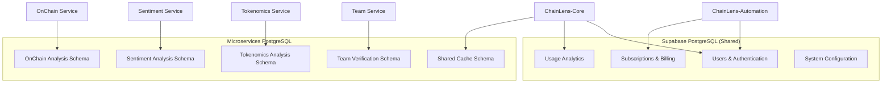

# ChainLens Crypto Services - Database Design & Schema Documentation

**Version:** 1.0  
**Date:** 27/01/2025  
**Author:** Winston - System Architect  
**Status:** Approved for Implementation  

---

## 1. Database Architecture Overview

### 1.1 Hybrid Database Strategy



### 1.2 Database Design Principles

- **Data Isolation:** Separate schemas for each microservice
- **Performance:** Optimized indexes và partitioning
- **Scalability:** Horizontal scaling capability
- **Consistency:** ACID compliance where needed
- **Flexibility:** JSON columns for dynamic data
- **Auditability:** Comprehensive audit trails

### 1.3 Connection Strategy

```yaml
# Database Connections
supabase_connection:
  host: ${SUPABASE_HOST}
  database: postgres
  user: ${SUPABASE_USER}
  password: ${SUPABASE_PASSWORD}
  ssl: true
  pool_size: 20

microservices_connection:
  host: ${POSTGRES_HOST}
  database: chainlens_microservices
  user: chainlens
  password: ${POSTGRES_PASSWORD}
  ssl: true
  pool_size: 10
```

---

## 2. Supabase PostgreSQL Schema (Shared)

### 2.1 Users và Authentication

#### users table (Supabase Auth)
```sql
-- Managed by Supabase Auth
-- Extended với custom profile data
CREATE TABLE public.user_profiles (
    id UUID PRIMARY KEY REFERENCES auth.users(id) ON DELETE CASCADE,
    email VARCHAR(255) NOT NULL,
    full_name VARCHAR(255),
    avatar_url TEXT,
    tier VARCHAR(20) DEFAULT 'free' CHECK (tier IN ('free', 'pro', 'enterprise')),
    preferences JSONB DEFAULT '{}',
    created_at TIMESTAMP WITH TIME ZONE DEFAULT NOW(),
    updated_at TIMESTAMP WITH TIME ZONE DEFAULT NOW()
);

-- Indexes
CREATE INDEX idx_user_profiles_tier ON public.user_profiles(tier);
CREATE INDEX idx_user_profiles_email ON public.user_profiles(email);
```

#### api_keys table (Enterprise)
```sql
CREATE TABLE public.api_keys (
    id UUID PRIMARY KEY DEFAULT gen_random_uuid(),
    user_id UUID NOT NULL REFERENCES public.user_profiles(id) ON DELETE CASCADE,
    key_hash VARCHAR(255) NOT NULL UNIQUE,
    name VARCHAR(100) NOT NULL,
    permissions JSONB DEFAULT '[]',
    rate_limit INTEGER DEFAULT 1000,
    last_used_at TIMESTAMP WITH TIME ZONE,
    expires_at TIMESTAMP WITH TIME ZONE,
    is_active BOOLEAN DEFAULT true,
    created_at TIMESTAMP WITH TIME ZONE DEFAULT NOW()
);

-- Indexes
CREATE INDEX idx_api_keys_user_id ON public.api_keys(user_id);
CREATE INDEX idx_api_keys_hash ON public.api_keys(key_hash);
CREATE INDEX idx_api_keys_active ON public.api_keys(is_active) WHERE is_active = true;
```

### 2.2 Subscriptions và Billing

#### subscriptions table
```sql
CREATE TABLE public.subscriptions (
    id UUID PRIMARY KEY DEFAULT gen_random_uuid(),
    user_id UUID NOT NULL REFERENCES public.user_profiles(id) ON DELETE CASCADE,
    stripe_subscription_id VARCHAR(255) UNIQUE,
    tier VARCHAR(20) NOT NULL CHECK (tier IN ('free', 'pro', 'enterprise')),
    status VARCHAR(20) NOT NULL CHECK (status IN ('active', 'canceled', 'past_due', 'unpaid')),
    current_period_start TIMESTAMP WITH TIME ZONE,
    current_period_end TIMESTAMP WITH TIME ZONE,
    cancel_at_period_end BOOLEAN DEFAULT false,
    metadata JSONB DEFAULT '{}',
    created_at TIMESTAMP WITH TIME ZONE DEFAULT NOW(),
    updated_at TIMESTAMP WITH TIME ZONE DEFAULT NOW()
);

-- Indexes
CREATE INDEX idx_subscriptions_user_id ON public.subscriptions(user_id);
CREATE INDEX idx_subscriptions_stripe_id ON public.subscriptions(stripe_subscription_id);
CREATE INDEX idx_subscriptions_status ON public.subscriptions(status);
```

#### billing_events table
```sql
CREATE TABLE public.billing_events (
    id UUID PRIMARY KEY DEFAULT gen_random_uuid(),
    user_id UUID NOT NULL REFERENCES public.user_profiles(id),
    subscription_id UUID REFERENCES public.subscriptions(id),
    event_type VARCHAR(50) NOT NULL,
    stripe_event_id VARCHAR(255),
    amount INTEGER, -- in cents
    currency VARCHAR(3) DEFAULT 'USD',
    status VARCHAR(20),
    metadata JSONB DEFAULT '{}',
    processed_at TIMESTAMP WITH TIME ZONE,
    created_at TIMESTAMP WITH TIME ZONE DEFAULT NOW()
);

-- Indexes
CREATE INDEX idx_billing_events_user_id ON public.billing_events(user_id);
CREATE INDEX idx_billing_events_type ON public.billing_events(event_type);
CREATE INDEX idx_billing_events_created_at ON public.billing_events(created_at);
```

### 2.3 Usage Analytics

#### usage_events table
```sql
CREATE TABLE public.usage_events (
    id UUID PRIMARY KEY DEFAULT gen_random_uuid(),
    user_id UUID NOT NULL REFERENCES public.user_profiles(id),
    event_type VARCHAR(50) NOT NULL,
    resource_type VARCHAR(50),
    resource_id VARCHAR(255),
    metadata JSONB DEFAULT '{}',
    ip_address INET,
    user_agent TEXT,
    created_at TIMESTAMP WITH TIME ZONE DEFAULT NOW()
);

-- Partitioning by month for performance
CREATE TABLE public.usage_events_y2025m01 PARTITION OF public.usage_events
FOR VALUES FROM ('2025-01-01') TO ('2025-02-01');

-- Indexes
CREATE INDEX idx_usage_events_user_id ON public.usage_events(user_id);
CREATE INDEX idx_usage_events_type ON public.usage_events(event_type);
CREATE INDEX idx_usage_events_created_at ON public.usage_events(created_at);
```

#### rate_limits table
```sql
CREATE TABLE public.rate_limits (
    id UUID PRIMARY KEY DEFAULT gen_random_uuid(),
    user_id UUID NOT NULL REFERENCES public.user_profiles(id),
    resource_type VARCHAR(50) NOT NULL,
    count INTEGER DEFAULT 0,
    window_start TIMESTAMP WITH TIME ZONE NOT NULL,
    window_end TIMESTAMP WITH TIME ZONE NOT NULL,
    created_at TIMESTAMP WITH TIME ZONE DEFAULT NOW(),
    
    UNIQUE(user_id, resource_type, window_start)
);

-- Indexes
CREATE INDEX idx_rate_limits_user_resource ON public.rate_limits(user_id, resource_type);
CREATE INDEX idx_rate_limits_window ON public.rate_limits(window_start, window_end);
```

---

## 3. Microservices PostgreSQL Schema

### 3.1 OnChain Analysis Schema

#### project_analyses table
```sql
CREATE SCHEMA IF NOT EXISTS onchain_analysis;

CREATE TABLE onchain_analysis.project_analyses (
    id UUID PRIMARY KEY DEFAULT gen_random_uuid(),
    project_id VARCHAR(100) NOT NULL,
    token_address VARCHAR(42),
    chain_id INTEGER,
    
    -- Price Data
    price_data JSONB NOT NULL DEFAULT '{}',
    -- {
    --   "current": 12.45,
    --   "change24h": 2.3,
    --   "change7d": -1.2,
    --   "marketCap": 12500000000,
    --   "volume24h": 125000000,
    --   "volatility": 0.45
    -- }
    
    -- Liquidity Data
    liquidity_data JSONB NOT NULL DEFAULT '{}',
    -- {
    --   "totalLiquidity": 850000000,
    --   "liquidityScore": 85,
    --   "topPools": [...],
    --   "slippageEstimate": {...}
    -- }
    
    -- Holder Data
    holder_data JSONB NOT NULL DEFAULT '{}',
    -- {
    --   "totalHolders": 285000,
    --   "top10Concentration": 0.15,
    --   "distributionScore": 78,
    --   "whaleActivity": "low"
    -- }
    
    -- Transaction Data
    transaction_data JSONB NOT NULL DEFAULT '{}',
    
    -- Calculated Metrics
    risk_score DECIMAL(5,2) NOT NULL,
    confidence DECIMAL(3,2) NOT NULL,
    
    -- Metadata
    data_sources JSONB DEFAULT '[]',
    processing_time INTEGER, -- milliseconds
    correlation_id VARCHAR(50),
    
    created_at TIMESTAMP WITH TIME ZONE DEFAULT NOW(),
    updated_at TIMESTAMP WITH TIME ZONE DEFAULT NOW()
);

-- Indexes
CREATE INDEX idx_onchain_project_id ON onchain_analysis.project_analyses(project_id);
CREATE INDEX idx_onchain_token_address ON onchain_analysis.project_analyses(token_address);
CREATE INDEX idx_onchain_created_at ON onchain_analysis.project_analyses(created_at);
CREATE INDEX idx_onchain_risk_score ON onchain_analysis.project_analyses(risk_score);

-- GIN index for JSONB queries
CREATE INDEX idx_onchain_price_data_gin ON onchain_analysis.project_analyses USING GIN(price_data);
```

#### price_history table
```sql
CREATE TABLE onchain_analysis.price_history (
    id UUID PRIMARY KEY DEFAULT gen_random_uuid(),
    project_id VARCHAR(100) NOT NULL,
    token_address VARCHAR(42),
    chain_id INTEGER,
    
    price DECIMAL(20,8) NOT NULL,
    market_cap BIGINT,
    volume_24h BIGINT,
    timestamp TIMESTAMP WITH TIME ZONE NOT NULL,
    
    created_at TIMESTAMP WITH TIME ZONE DEFAULT NOW()
);

-- Partitioning by month
CREATE TABLE onchain_analysis.price_history_y2025m01 PARTITION OF onchain_analysis.price_history
FOR VALUES FROM ('2025-01-01') TO ('2025-02-01');

-- Indexes
CREATE INDEX idx_price_history_project_timestamp ON onchain_analysis.price_history(project_id, timestamp);
CREATE INDEX idx_price_history_token_timestamp ON onchain_analysis.price_history(token_address, timestamp);
```

### 3.2 Sentiment Analysis Schema

#### sentiment_analyses table
```sql
CREATE SCHEMA IF NOT EXISTS sentiment_analysis;

CREATE TABLE sentiment_analysis.sentiment_analyses (
    id UUID PRIMARY KEY DEFAULT gen_random_uuid(),
    project_id VARCHAR(100) NOT NULL,
    keywords JSONB NOT NULL DEFAULT '[]',
    timeframe VARCHAR(10) NOT NULL DEFAULT '24h',
    
    -- Overall Sentiment
    overall_sentiment DECIMAL(3,2) NOT NULL, -- -1 to 1
    sentiment_trend VARCHAR(20), -- positive, negative, neutral
    
    -- Source Data
    twitter_data JSONB DEFAULT '{}',
    reddit_data JSONB DEFAULT '{}',
    news_data JSONB DEFAULT '{}',
    
    -- Aggregated Metrics
    total_mentions INTEGER DEFAULT 0,
    engagement_score INTEGER DEFAULT 0,
    influencer_mentions INTEGER DEFAULT 0,
    
    -- Analysis Metadata
    confidence DECIMAL(3,2) NOT NULL,
    data_quality_score INTEGER DEFAULT 0,
    bot_detection_score DECIMAL(3,2) DEFAULT 0,
    
    correlation_id VARCHAR(50),
    processing_time INTEGER,
    
    created_at TIMESTAMP WITH TIME ZONE DEFAULT NOW(),
    updated_at TIMESTAMP WITH TIME ZONE DEFAULT NOW()
);

-- Indexes
CREATE INDEX idx_sentiment_project_id ON sentiment_analysis.sentiment_analyses(project_id);
CREATE INDEX idx_sentiment_created_at ON sentiment_analysis.sentiment_analyses(created_at);
CREATE INDEX idx_sentiment_overall_score ON sentiment_analysis.sentiment_analyses(overall_sentiment);
CREATE INDEX idx_sentiment_keywords_gin ON sentiment_analysis.sentiment_analyses USING GIN(keywords);
```

#### social_mentions table
```sql
CREATE TABLE sentiment_analysis.social_mentions (
    id UUID PRIMARY KEY DEFAULT gen_random_uuid(),
    analysis_id UUID NOT NULL REFERENCES sentiment_analysis.sentiment_analyses(id) ON DELETE CASCADE,
    
    source VARCHAR(20) NOT NULL, -- twitter, reddit, news
    platform_id VARCHAR(255), -- tweet_id, post_id, article_id
    author VARCHAR(255),
    content TEXT,
    sentiment_score DECIMAL(3,2),
    engagement_metrics JSONB DEFAULT '{}',
    
    published_at TIMESTAMP WITH TIME ZONE,
    created_at TIMESTAMP WITH TIME ZONE DEFAULT NOW()
);

-- Indexes
CREATE INDEX idx_social_mentions_analysis_id ON sentiment_analysis.social_mentions(analysis_id);
CREATE INDEX idx_social_mentions_source ON sentiment_analysis.social_mentions(source);
CREATE INDEX idx_social_mentions_published_at ON sentiment_analysis.social_mentions(published_at);
```

### 3.3 Tokenomics Analysis Schema

#### tokenomics_analyses table
```sql
CREATE SCHEMA IF NOT EXISTS tokenomics_analysis;

CREATE TABLE tokenomics_analysis.tokenomics_analyses (
    id UUID PRIMARY KEY DEFAULT gen_random_uuid(),
    project_id VARCHAR(100) NOT NULL,
    token_address VARCHAR(42),
    protocol_name VARCHAR(100),
    
    -- Supply Metrics
    supply_data JSONB NOT NULL DEFAULT '{}',
    -- {
    --   "total": 1000000000,
    --   "circulating": 753000000,
    --   "inflation": 2.5,
    --   "vestingSchedule": {...}
    -- }
    
    -- Distribution Data
    distribution_data JSONB NOT NULL DEFAULT '{}',
    -- {
    --   "team": 0.2,
    --   "investors": 0.18,
    --   "community": 0.62,
    --   "fairnessScore": 82
    -- }
    
    -- DeFi Integration
    defi_data JSONB NOT NULL DEFAULT '{}',
    -- {
    --   "stakingAPY": 8.5,
    --   "yieldOpportunities": [...],
    --   "totalStaked": 125000000
    -- }
    
    -- Utility Analysis
    utility_data JSONB NOT NULL DEFAULT '{}',
    
    -- Calculated Scores
    tokenomics_score INTEGER NOT NULL,
    fairness_score INTEGER NOT NULL,
    utility_score INTEGER NOT NULL,
    confidence DECIMAL(3,2) NOT NULL,
    
    correlation_id VARCHAR(50),
    processing_time INTEGER,
    
    created_at TIMESTAMP WITH TIME ZONE DEFAULT NOW(),
    updated_at TIMESTAMP WITH TIME ZONE DEFAULT NOW()
);

-- Indexes
CREATE INDEX idx_tokenomics_project_id ON tokenomics_analysis.tokenomics_analyses(project_id);
CREATE INDEX idx_tokenomics_token_address ON tokenomics_analysis.tokenomics_analyses(token_address);
CREATE INDEX idx_tokenomics_score ON tokenomics_analysis.tokenomics_analyses(tokenomics_score);
CREATE INDEX idx_tokenomics_created_at ON tokenomics_analysis.tokenomics_analyses(created_at);
```

### 3.4 Team Verification Schema

#### team_analyses table
```sql
CREATE SCHEMA IF NOT EXISTS team_verification;

CREATE TABLE team_verification.team_analyses (
    id UUID PRIMARY KEY DEFAULT gen_random_uuid(),
    project_id VARCHAR(100) NOT NULL,
    project_website VARCHAR(255),
    github_org VARCHAR(100),
    
    -- Team Overview
    team_size INTEGER DEFAULT 0,
    credibility_score INTEGER NOT NULL,
    verification_level VARCHAR(20) NOT NULL, -- low, medium, high
    
    -- Development Metrics
    development_data JSONB NOT NULL DEFAULT '{}',
    -- {
    --   "githubActivity": 95,
    --   "commits30d": 234,
    --   "contributors": 67,
    --   "codeQuality": 88
    -- }
    
    -- Risk Assessment
    risk_flags JSONB DEFAULT '[]',
    background_data JSONB DEFAULT '{}',
    
    confidence DECIMAL(3,2) NOT NULL,
    correlation_id VARCHAR(50),
    processing_time INTEGER,
    
    created_at TIMESTAMP WITH TIME ZONE DEFAULT NOW(),
    updated_at TIMESTAMP WITH TIME ZONE DEFAULT NOW()
);

-- Indexes
CREATE INDEX idx_team_project_id ON team_verification.team_analyses(project_id);
CREATE INDEX idx_team_credibility_score ON team_verification.team_analyses(credibility_score);
CREATE INDEX idx_team_verification_level ON team_verification.team_analyses(verification_level);
CREATE INDEX idx_team_created_at ON team_verification.team_analyses(created_at);
```

#### team_members table
```sql
CREATE TABLE team_verification.team_members (
    id UUID PRIMARY KEY DEFAULT gen_random_uuid(),
    analysis_id UUID NOT NULL REFERENCES team_verification.team_analyses(id) ON DELETE CASCADE,
    
    name VARCHAR(255) NOT NULL,
    role VARCHAR(100),
    
    -- Social Profiles
    linkedin_profile VARCHAR(255),
    github_profile VARCHAR(255),
    twitter_profile VARCHAR(255),
    
    -- Verification Data
    verification_data JSONB NOT NULL DEFAULT '{}',
    -- {
    --   "linkedin": {"verified": true, "credibilityScore": 92},
    --   "github": {"verified": true, "credibilityScore": 95},
    --   "twitter": {"verified": true, "credibilityScore": 88}
    -- }
    
    overall_score INTEGER NOT NULL,
    risk_flags JSONB DEFAULT '[]',
    
    created_at TIMESTAMP WITH TIME ZONE DEFAULT NOW(),
    updated_at TIMESTAMP WITH TIME ZONE DEFAULT NOW()
);

-- Indexes
CREATE INDEX idx_team_members_analysis_id ON team_verification.team_members(analysis_id);
CREATE INDEX idx_team_members_name ON team_verification.team_members(name);
CREATE INDEX idx_team_members_overall_score ON team_verification.team_members(overall_score);
```

---

## 4. Shared Cache Schema

### 4.1 Analysis Cache

#### analysis_cache table
```sql
CREATE SCHEMA IF NOT EXISTS shared_cache;

CREATE TABLE shared_cache.analysis_cache (
    id UUID PRIMARY KEY DEFAULT gen_random_uuid(),
    cache_key VARCHAR(255) NOT NULL UNIQUE,
    project_id VARCHAR(100) NOT NULL,
    analysis_type VARCHAR(50) NOT NULL,
    
    -- Cached Data
    cached_data JSONB NOT NULL,
    
    -- Cache Metadata
    confidence DECIMAL(3,2),
    ttl_seconds INTEGER NOT NULL,
    hit_count INTEGER DEFAULT 0,
    
    expires_at TIMESTAMP WITH TIME ZONE NOT NULL,
    created_at TIMESTAMP WITH TIME ZONE DEFAULT NOW(),
    last_accessed_at TIMESTAMP WITH TIME ZONE DEFAULT NOW()
);

-- Indexes
CREATE INDEX idx_cache_key ON shared_cache.analysis_cache(cache_key);
CREATE INDEX idx_cache_project_id ON shared_cache.analysis_cache(project_id);
CREATE INDEX idx_cache_expires_at ON shared_cache.analysis_cache(expires_at);
CREATE INDEX idx_cache_analysis_type ON shared_cache.analysis_cache(analysis_type);

-- Auto-cleanup expired cache entries
CREATE OR REPLACE FUNCTION shared_cache.cleanup_expired_cache()
RETURNS void AS $$
BEGIN
    DELETE FROM shared_cache.analysis_cache 
    WHERE expires_at < NOW();
END;
$$ LANGUAGE plpgsql;

-- Schedule cleanup every hour
SELECT cron.schedule('cleanup-cache', '0 * * * *', 'SELECT shared_cache.cleanup_expired_cache();');
```

---

## 5. Database Functions và Triggers

### 5.1 Utility Functions

#### Update timestamp trigger
```sql
CREATE OR REPLACE FUNCTION update_updated_at_column()
RETURNS TRIGGER AS $$
BEGIN
    NEW.updated_at = NOW();
    RETURN NEW;
END;
$$ LANGUAGE plpgsql;

-- Apply to all tables với updated_at column
CREATE TRIGGER update_user_profiles_updated_at 
    BEFORE UPDATE ON public.user_profiles 
    FOR EACH ROW EXECUTE FUNCTION update_updated_at_column();
```

#### Rate limit check function
```sql
CREATE OR REPLACE FUNCTION public.check_rate_limit(
    p_user_id UUID,
    p_resource_type VARCHAR(50),
    p_limit INTEGER,
    p_window_minutes INTEGER DEFAULT 60
) RETURNS BOOLEAN AS $$
DECLARE
    current_count INTEGER;
    window_start TIMESTAMP WITH TIME ZONE;
    window_end TIMESTAMP WITH TIME ZONE;
BEGIN
    window_start := date_trunc('hour', NOW());
    window_end := window_start + INTERVAL '1 hour';
    
    -- Get current count for this window
    SELECT COALESCE(count, 0) INTO current_count
    FROM public.rate_limits
    WHERE user_id = p_user_id 
      AND resource_type = p_resource_type
      AND window_start = window_start;
    
    -- Check if limit exceeded
    IF current_count >= p_limit THEN
        RETURN FALSE;
    END IF;
    
    -- Increment counter
    INSERT INTO public.rate_limits (user_id, resource_type, count, window_start, window_end)
    VALUES (p_user_id, p_resource_type, 1, window_start, window_end)
    ON CONFLICT (user_id, resource_type, window_start)
    DO UPDATE SET count = rate_limits.count + 1;
    
    RETURN TRUE;
END;
$$ LANGUAGE plpgsql;
```

### 5.2 Analytics Functions

#### Usage analytics aggregation
```sql
CREATE OR REPLACE FUNCTION public.get_usage_analytics(
    p_user_id UUID,
    p_start_date DATE DEFAULT CURRENT_DATE - INTERVAL '30 days',
    p_end_date DATE DEFAULT CURRENT_DATE
) RETURNS TABLE (
    date DATE,
    event_type VARCHAR(50),
    count BIGINT
) AS $$
BEGIN
    RETURN QUERY
    SELECT 
        DATE(created_at) as date,
        event_type,
        COUNT(*) as count
    FROM public.usage_events
    WHERE user_id = p_user_id
      AND created_at >= p_start_date
      AND created_at <= p_end_date + INTERVAL '1 day'
    GROUP BY DATE(created_at), event_type
    ORDER BY date DESC, event_type;
END;
$$ LANGUAGE plpgsql;
```

---

## 6. Performance Optimization

### 6.1 Indexing Strategy

```sql
-- Composite indexes for common queries
CREATE INDEX idx_usage_events_user_type_date 
ON public.usage_events(user_id, event_type, created_at);

CREATE INDEX idx_project_analyses_project_created 
ON onchain_analysis.project_analyses(project_id, created_at DESC);

-- Partial indexes for active records
CREATE INDEX idx_subscriptions_active 
ON public.subscriptions(user_id) 
WHERE status = 'active';

-- Expression indexes for JSON queries
CREATE INDEX idx_price_data_current 
ON onchain_analysis.project_analyses((price_data->>'current')::numeric);
```

### 6.2 Partitioning Strategy

```sql
-- Partition usage_events by month
CREATE TABLE public.usage_events_y2025m02 PARTITION OF public.usage_events
FOR VALUES FROM ('2025-02-01') TO ('2025-03-01');

-- Partition price_history by month
CREATE TABLE onchain_analysis.price_history_y2025m02 PARTITION OF onchain_analysis.price_history
FOR VALUES FROM ('2025-02-01') TO ('2025-03-01');
```

---

## 7. Backup và Recovery

### 7.1 Backup Strategy

```bash
# Daily full backup
pg_dump -h $POSTGRES_HOST -U chainlens -d chainlens_microservices \
  --format=custom --compress=9 \
  --file=backup_$(date +%Y%m%d).dump

# Continuous WAL archiving
archive_command = 'cp %p /backup/wal_archive/%f'
```

### 7.2 Point-in-Time Recovery

```sql
-- Create restore point
SELECT pg_create_restore_point('before_major_update');

-- Recovery configuration
restore_command = 'cp /backup/wal_archive/%f %p'
recovery_target_time = '2025-01-27 10:00:00'
```

---

**Database Design Status:** ✅ Complete Schema Ready for Implementation

**Next Steps:**
1. Migration scripts creation
2. Seed data preparation
3. Performance testing
4. Backup automation setup
5. Monitoring configuration
