# 🏗️ System Architecture Diagrams

## 📖 Table of Contents

- [Overview](#overview)
- [High-Level System Architecture](#high-level-system-architecture)
- [Microservices Topology](#microservices-topology)
- [Database Schema](#database-schema)
- [Authentication & Authorization Flow](#authentication--authorization-flow)
- [Agent Workflow Pipeline](#agent-workflow-pipeline)
- [Tool Integration Architecture](#tool-integration-architecture)
- [Deployment Architecture](#deployment-architecture)
- [Network Security Architecture](#network-security-architecture)
- [Data Flow Diagrams](#data-flow-diagrams)
- [Event-Driven Architecture](#event-driven-architecture)
- [Monitoring & Observability](#monitoring--observability)

---

## 🎯 Overview

This document provides comprehensive visual representations of the ChainLens AI Agent Platform architecture using Mermaid diagrams. These diagrams serve as the single source of truth for understanding system components, their relationships, and data flows.

### **🔍 Diagram Types**

| Diagram Type | Purpose | Audience |
|--------------|---------|----------|
| **System Architecture** | High-level component overview | Architects, Product Managers |
| **Microservices Topology** | Service dependencies | Developers, DevOps |
| **Database Schema** | Data relationships | Backend Developers, DBAs |
| **Authentication Flow** | Security mechanisms | Security Team, Developers |
| **Agent Workflow** | AI processing pipeline | AI Engineers, Developers |
| **Deployment** | Infrastructure layout | DevOps, SREs |

---

## 🏛️ High-Level System Architecture


---

## 🔗 Microservices Topology

```mermaid
graph LR
    %% API Gateway
    Gateway[🔌 API Gateway<br/>🔒 Auth + Rate Limiting<br/>📊 Metrics Collection]
    
    %% Core Backend Services
    subgraph "Core Services"
        Backend[🚀 Backend API<br/>📦 FastAPI<br/>🔄 REST + WebSocket]
        Auth[🔐 Auth Service<br/>🎫 JWT Tokens<br/>👤 User Management]
        Agent[🤖 Agent Engine<br/>🧠 LLM Integration<br/>⚡ Task Orchestration]
    end
    
    %% Microservices Cluster
    subgraph "Analysis Microservices"
        OnChain[⛓️ OnChain Service<br/>🏠 Port: 3001<br/>🔍 Blockchain Analytics<br/>💎 Token Analysis]
        Sentiment[💭 Sentiment Service<br/>🏠 Port: 3002<br/>📱 Social Media<br/>📈 Market Sentiment]
        Tokenomics[💰 Tokenomics Service<br/>🏠 Port: 3003<br/>📊 Financial Metrics<br/>💹 Price Analysis]
        Team[👥 Team Service<br/>🏠 Port: 3004<br/>✅ Team Verification<br/>🎯 Credibility Scoring]
    end
    
    %% Message Queue & Background Processing
    subgraph "Queue System"
        TaskQueue[📋 Task Queue<br/>🔄 Dramatiq<br/>⚡ Background Jobs]
        Worker1[👷 Worker Pool 1<br/>🔄 Agent Tasks]
        Worker2[👷 Worker Pool 2<br/>📊 Analytics Jobs]
        Worker3[👷 Worker Pool 3<br/>🔍 Data Processing]
    end
    
    %% Data Services
    subgraph "Data Layer"
        Postgres[(🐘 PostgreSQL<br/>📊 Structured Data)]
        Redis[(🔴 Redis<br/>💾 Cache + Sessions<br/>📨 Pub/Sub)]
        Vector[(🔍 Vector DB<br/>🧠 Embeddings<br/>🔎 Semantic Search)]
        Storage[📁 Object Storage<br/>📄 Files + Assets]
    end
    
    %% External Services
    subgraph "External APIs"
        LLM[🧠 LLM Providers<br/>OpenAI + Anthropic<br/>🤖 Model Inference]
        Blockchain[⛓️ Blockchain APIs<br/>Moralis + Alchemy<br/>📊 On-chain Data]
        Social[📱 Social APIs<br/>Twitter + Discord<br/>💬 Social Data]
        Finance[💹 Financial APIs<br/>CoinGecko + CMC<br/>💰 Price Data]
    end
    
    %% Request Flow
    Gateway --> Backend
    Gateway --> Auth
    
    %% Backend Service Communication
    Backend --> Agent
    Agent --> TaskQueue
    
    %% Agent to Microservices (Service Mesh)
    Agent -.-> OnChain
    Agent -.-> Sentiment
    Agent -.-> Tokenomics
    Agent -.-> Team
    
    %% Queue to Workers
    TaskQueue --> Worker1
    TaskQueue --> Worker2
    TaskQueue --> Worker3
    
    %% Data Layer Connections
    Backend --> Postgres
    Backend --> Redis
    Auth --> Postgres
    Agent --> Vector
    Agent --> Storage
    
    %% Microservices to Data
    OnChain --> Redis
    Sentiment --> Redis
    Tokenomics --> Redis
    Team --> Redis
    
    %% External API Connections
    Agent --> LLM
    OnChain --> Blockchain
    Sentiment --> Social
    Tokenomics --> Finance
    Team --> Social
    
    %% Service Discovery & Health Checks
    Gateway -.->|Health Check| Backend
    Gateway -.->|Health Check| Auth
    Agent -.->|Service Discovery| OnChain
    Agent -.->|Service Discovery| Sentiment
    Agent -.->|Service Discovery| Tokenomics
    Agent -.->|Service Discovery| Team
    
    %% Styling
    classDef coreService fill:#e8f5e8,stroke:#2e7d32,stroke-width:2px
    classDef microService fill:#e3f2fd,stroke:#1565c0,stroke-width:2px
    classDef queueService fill:#fff8e1,stroke:#f57c00,stroke-width:2px
    classDef dataService fill:#fce4ec,stroke:#c2185b,stroke-width:2px
    classDef externalService fill:#f3e5f5,stroke:#7b1fa2,stroke-width:2px
    
    class Backend,Auth,Agent coreService
    class OnChain,Sentiment,Tokenomics,Team microService
    class TaskQueue,Worker1,Worker2,Worker3 queueService
    class Postgres,Redis,Vector,Storage dataService
    class LLM,Blockchain,Social,Finance externalService
```



---

## 🗄️ Database Schema


---

## 🔐 Authentication & Authorization Flow

```mermaid
sequenceDiagram
    participant User as 👤 User
    participant Frontend as 🖥️ Frontend
    participant Gateway as 🔌 API Gateway
    participant Auth as 🔐 Auth Service
    participant Backend as 🚀 Backend API
    participant DB as 🐘 Database
    participant Redis as 🔴 Redis Cache
    
    Note over User, Redis: Authentication Flow
    
    %% Registration Flow
    User->>+Frontend: Register Account
    Frontend->>+Gateway: POST /auth/register
    Gateway->>+Auth: Forward Registration
    Auth->>+DB: Check Email Exists
    DB-->>-Auth: Email Available
    Auth->>+DB: Create User Record
    DB-->>-Auth: User Created
    Auth->>+Redis: Store Verification Token
    Redis-->>-Auth: Token Stored
    Auth-->>-Gateway: Registration Success
    Gateway-->>-Frontend: 201 Created
    Frontend-->>-User: Check Email for Verification
    
    Note over User, Redis: Email Verification
    
    User->>+Frontend: Click Verification Link
    Frontend->>+Gateway: POST /auth/verify-email
    Gateway->>+Auth: Verify Token
    Auth->>+Redis: Check Verification Token
    Redis-->>-Auth: Token Valid
    Auth->>+DB: Update User as Verified
    DB-->>-Auth: User Verified
    Auth->>+Redis: Clear Verification Token
    Redis-->>-Auth: Token Cleared
    Auth-->>-Gateway: Verification Success
    Gateway-->>-Frontend: 200 OK
    Frontend-->>-User: Account Verified
    
    Note over User, Redis: Login Flow
    
    User->>+Frontend: Login Credentials
    Frontend->>+Gateway: POST /auth/login
    Gateway->>+Auth: Authenticate User
    Auth->>+DB: Validate Credentials
    DB-->>-Auth: Credentials Valid
    Auth->>Auth: Generate JWT Token
    Auth->>+Redis: Store Refresh Token
    Redis-->>-Auth: Token Stored
    Auth-->>-Gateway: JWT + Refresh Token
    Gateway-->>-Frontend: 200 OK + Tokens
    Frontend->>Frontend: Store Tokens
    Frontend-->>-User: Login Success
    
    Note over User, Redis: Authenticated API Calls
    
    User->>+Frontend: Make API Request
    Frontend->>+Gateway: Request + JWT Token
    Gateway->>Gateway: Validate JWT
    
    alt JWT Valid
        Gateway->>+Backend: Forward Request
        Backend->>+DB: Process Request
        DB-->>-Backend: Return Data
        Backend-->>-Gateway: Response Data
        Gateway-->>-Frontend: 200 OK + Data
        Frontend-->>-User: Display Results
    else JWT Expired
        Gateway-->>-Frontend: 401 Unauthorized
        Frontend->>+Gateway: POST /auth/refresh
        Gateway->>+Auth: Refresh Token Request
        Auth->>+Redis: Validate Refresh Token
        Redis-->>-Auth: Token Valid
        Auth->>Auth: Generate New JWT
        Auth-->>-Gateway: New JWT Token
        Gateway-->>-Frontend: 200 OK + New JWT
        Frontend->>Frontend: Update Stored Token
        Frontend->>+Gateway: Retry Original Request
        Gateway->>+Backend: Forward Request
        Backend-->>-Gateway: Response Data
        Gateway-->>-Frontend: 200 OK + Data
        Frontend-->>-User: Display Results
    else JWT Invalid
        Gateway-->>Frontend: 401 Unauthorized
        Frontend-->>User: Redirect to Login
    end
    
    Note over User, Redis: Logout Flow
    
    User->>+Frontend: Logout Request
    Frontend->>+Gateway: POST /auth/logout
    Gateway->>+Auth: Logout Request
    Auth->>+Redis: Blacklist JWT Token
    Redis-->>-Auth: Token Blacklisted
    Auth->>+Redis: Remove Refresh Token
    Redis-->>-Auth: Token Removed
    Auth-->>-Gateway: Logout Success
    Gateway-->>-Frontend: 200 OK
    Frontend->>Frontend: Clear Stored Tokens
    Frontend-->>-User: Logged Out
```

---

## 🤖 Agent Workflow Pipeline

```mermaid
flowchart TD
    %% User Input
    Start([👤 User Input<br/>Chat Message])
    
    %% Input Processing
    InputValidation{🔍 Input Validation<br/>& Sanitization}
    SessionCheck{🔐 Session Valid?}
    
    %% Agent Selection & Configuration
    AgentLoad[🤖 Load Agent Config<br/>Model + Tools + Prompt]
    ContextBuild[📚 Build Context<br/>History + Memory]
    
    %% LLM Processing
    PromptGen[📝 Generate System Prompt<br/>Context + Instructions]
    LLMCall[🧠 LLM API Call<br/>OpenAI/Anthropic]
    
    %% Response Processing
    ResponseParse{🔍 Parse Response<br/>Tool Calls?}
    
    %% Tool Execution Branch
    ToolRouter[🔧 Tool Router<br/>Route to Services]
    
    %% Parallel Tool Execution
    subgraph "Tool Execution"
        OnChainTool[⛓️ OnChain Analysis<br/>Blockchain Data]
        SentimentTool[💭 Sentiment Analysis<br/>Social Media]
        TokenomicsTool[💰 Tokenomics<br/>Financial Data]
        TeamTool[👥 Team Analysis<br/>Verification]
        WebSearchTool[🔍 Web Search<br/>Current Info]
        CodeTool[💻 Code Interpreter<br/>Data Analysis]
    end
    
    %% Tool Results Aggregation
    ToolResults[📊 Aggregate Results<br/>Merge Tool Outputs]
    
    %% Final LLM Processing
    FinalPrompt[📝 Final Prompt<br/>Original + Tool Results]
    FinalLLM[🧠 Final LLM Call<br/>Generate Response]
    
    %% Response Formatting
    ResponseFormat[📋 Format Response<br/>Markdown + Citations]
    
    %% Storage & Analytics
    StoreMessage[💾 Store Message<br/>Database]
    UpdateAnalytics[📊 Update Analytics<br/>Usage + Performance]
    UpdateMemory[🧠 Update Memory<br/>Vector Database]
    
    %% Final Response
    StreamResponse[📡 Stream Response<br/>WebSocket]
    End([✅ Response Complete])
    
    %% Error Handling
    ValidationError[❌ Validation Error]
    SessionError[❌ Session Invalid]
    LLMError[❌ LLM Error]
    ToolError[❌ Tool Error]
    GeneralError[❌ System Error]
    
    %% Flow Connections
    Start --> InputValidation
    InputValidation -->|Valid| SessionCheck
    InputValidation -->|Invalid| ValidationError
    
    SessionCheck -->|Valid| AgentLoad
    SessionCheck -->|Invalid| SessionError
    
    AgentLoad --> ContextBuild
    ContextBuild --> PromptGen
    PromptGen --> LLMCall
    
    LLMCall -->|Success| ResponseParse
    LLMCall -->|Error| LLMError
    
    ResponseParse -->|Tool Calls| ToolRouter
    ResponseParse -->|Text Response| ResponseFormat
    
    %% Tool Routing
    ToolRouter --> OnChainTool
    ToolRouter --> SentimentTool
    ToolRouter --> TokenomicsTool
    ToolRouter --> TeamTool
    ToolRouter --> WebSearchTool
    ToolRouter --> CodeTool
    
    %% Tool Results Processing
    OnChainTool --> ToolResults
    SentimentTool --> ToolResults
    TokenomicsTool --> ToolResults
    TeamTool --> ToolResults
    WebSearchTool --> ToolResults
    CodeTool --> ToolResults
    
    ToolResults -->|Success| FinalPrompt
    ToolResults -->|Error| ToolError
    
    FinalPrompt --> FinalLLM
    FinalLLM -->|Success| ResponseFormat
    FinalLLM -->|Error| LLMError
    
    %% Response Processing
    ResponseFormat --> StoreMessage
    StoreMessage --> UpdateAnalytics
    UpdateAnalytics --> UpdateMemory
    UpdateMemory --> StreamResponse
    StreamResponse --> End
    
    %% Error Handling
    ValidationError --> End
    SessionError --> End
    LLMError --> GeneralError
    ToolError --> GeneralError
    GeneralError --> End
    
    %% Styling
    classDef startEnd fill:#e8f5e8,stroke:#2e7d32,stroke-width:3px
    classDef process fill:#e3f2fd,stroke:#1565c0,stroke-width:2px
    classDef decision fill:#fff8e1,stroke:#f57c00,stroke-width:2px
    classDef tool fill:#f3e5f5,stroke:#7b1fa2,stroke-width:2px
    classDef error fill:#ffebee,stroke:#c62828,stroke-width:2px
    classDef storage fill:#fce4ec,stroke:#c2185b,stroke-width:2px
    
    class Start,End startEnd
    class AgentLoad,ContextBuild,PromptGen,LLMCall,FinalPrompt,FinalLLM,ResponseFormat,StreamResponse process
    class InputValidation,SessionCheck,ResponseParse decision
    class OnChainTool,SentimentTool,TokenomicsTool,TeamTool,WebSearchTool,CodeTool,ToolRouter tool
    class ValidationError,SessionError,LLMError,ToolError,GeneralError error
    class StoreMessage,UpdateAnalytics,UpdateMemory storage
```



---

## 🔧 Tool Integration Architecture

```mermaid
graph TD
    %% Agent Engine Core
    Agent[🤖 Agent Engine<br/>Tool Orchestrator]
    
    %% Tool Manager
    ToolManager[🔧 Tool Manager<br/>Registry + Validation<br/>Error Handling]
    
    %% Built-in Tools
    subgraph "Built-in Tools"
        WebSearch[🔍 Web Search Tool<br/>Tavily API<br/>Real-time Information]
        CodeInterpreter[💻 Code Interpreter<br/>E2B Runtime<br/>Python + Analysis]
        FileHandler[📁 File Handler<br/>Upload + Processing<br/>PDF, CSV, JSON]
        Calculator[🧮 Calculator<br/>Mathematical Operations<br/>Unit Conversions]
    end
    
    %% Microservice Tools
    subgraph "Microservice Tools"
        OnChainAnalyzer[⛓️ OnChain Analyzer<br/>HTTP Client<br/>Blockchain Data]
        SentimentAnalyzer[💭 Sentiment Analyzer<br/>HTTP Client<br/>Social Sentiment]
        TokenomicsAnalyzer[💰 Tokenomics Analyzer<br/>HTTP Client<br/>Financial Metrics]
        TeamAnalyzer[👥 Team Analyzer<br/>HTTP Client<br/>Team Verification]
    end
    
    %% External API Tools
    subgraph "External API Tools"
        TwitterTool[🐦 Twitter Tool<br/>Twitter API v2<br/>Social Media Data]
        GitHubTool[🐙 GitHub Tool<br/>GitHub API<br/>Repository Analysis]
        EmailTool[📧 Email Tool<br/>SMTP/IMAP<br/>Communication]
        SlackTool[💬 Slack Tool<br/>Slack API<br/>Team Communication]
    end
    
    %% Custom Plugin System
    subgraph "Plugin System"
        PluginLoader[📦 Plugin Loader<br/>Dynamic Loading<br/>Sandbox Execution]
        PluginRegistry[📋 Plugin Registry<br/>Metadata + Permissions<br/>Version Control]
        CustomTool1[🔌 Custom Tool 1<br/>User Defined<br/>Business Logic]
        CustomTool2[🔌 Custom Tool 2<br/>User Defined<br/>Integration]
    end
    
    %% Tool Execution Environment
    subgraph "Execution Environment"
        Executor[⚡ Tool Executor<br/>Async Execution<br/>Timeout Management]
        Validator[✅ Input Validator<br/>Schema Validation<br/>Sanitization]
        Cache[💾 Result Cache<br/>Redis Cache<br/>Performance Optimization]
        Monitor[📊 Execution Monitor<br/>Metrics + Logging<br/>Error Tracking]
    end
    
    %% External Services
    subgraph "External Services"
        TavilyAPI[🌐 Tavily API<br/>Web Search]
        E2BRuntime[⚡ E2B Runtime<br/>Code Execution]
        BlockchainAPIs[⛓️ Blockchain APIs<br/>Moralis, Alchemy]
        SocialAPIs[📱 Social APIs<br/>Twitter, Discord]
        FinanceAPIs[💹 Finance APIs<br/>CoinGecko, CMC]
    end
    
    %% Data Flow
    Agent --> ToolManager
    
    %% Tool Registration
    ToolManager --> WebSearch
    ToolManager --> CodeInterpreter
    ToolManager --> FileHandler
    ToolManager --> Calculator
    
    ToolManager --> OnChainAnalyzer
    ToolManager --> SentimentAnalyzer
    ToolManager --> TokenomicsAnalyzer
    ToolManager --> TeamAnalyzer
    
    ToolManager --> TwitterTool
    ToolManager --> GitHubTool
    ToolManager --> EmailTool
    ToolManager --> SlackTool
    
    %% Plugin System
    ToolManager --> PluginLoader
    PluginLoader --> PluginRegistry
    PluginRegistry --> CustomTool1
    PluginRegistry --> CustomTool2
    
    %% Execution Pipeline
    ToolManager --> Executor
    Executor --> Validator
    Validator --> Cache
    Cache --> Monitor
    
    %% External Service Connections
    WebSearch -.-> TavilyAPI
    CodeInterpreter -.-> E2BRuntime
    OnChainAnalyzer -.-> BlockchainAPIs
    SentimentAnalyzer -.-> SocialAPIs
    TokenomicsAnalyzer -.-> FinanceAPIs
    TwitterTool -.-> SocialAPIs
    
    %% Tool Schema Definition
    ToolSchema[📋 Tool Schema<br/>OpenAPI 3.0<br/>Input/Output Types]
    ToolManager --> ToolSchema
    
    %% Error Handling
    ErrorHandler[❌ Error Handler<br/>Retry Logic<br/>Fallback Strategies]
    Monitor --> ErrorHandler
    
    %% Security
    SecurityLayer[🔒 Security Layer<br/>Permission Checks<br/>Rate Limiting]
    Validator --> SecurityLayer
    
    %% Styling
    classDef coreService fill:#e8f5e8,stroke:#2e7d32,stroke-width:2px
    classDef builtinTool fill:#e3f2fd,stroke:#1565c0,stroke-width:2px
    classDef microTool fill:#fff8e1,stroke:#f57c00,stroke-width:2px
    classDef externalTool fill:#f3e5f5,stroke:#7b1fa2,stroke-width:2px
    classDef pluginTool fill:#fce4ec,stroke:#c2185b,stroke-width:2px
    classDef executionEnv fill:#e0f2f1,stroke:#00695c,stroke-width:2px
    classDef externalService fill:#ffebee,stroke:#c62828,stroke-width:2px
    
    class Agent,ToolManager coreService
    class WebSearch,CodeInterpreter,FileHandler,Calculator builtinTool
    class OnChainAnalyzer,SentimentAnalyzer,TokenomicsAnalyzer,TeamAnalyzer microTool
    class TwitterTool,GitHubTool,EmailTool,SlackTool externalTool
    class PluginLoader,PluginRegistry,CustomTool1,CustomTool2 pluginTool
    class Executor,Validator,Cache,Monitor,ToolSchema,ErrorHandler,SecurityLayer executionEnv
    class TavilyAPI,E2BRuntime,BlockchainAPIs,SocialAPIs,FinanceAPIs externalService
```



---

## 🚀 Deployment Architecture


---

## 🔒 Network Security Architecture


---

## 📊 Data Flow Diagrams


---

## ⚡ Event-Driven Architecture

```mermaid
flowchart TD
    %% Event Sources
    subgraph "Event Sources"
        UserEvents[👤 User Events<br/>Login, Logout, Messages]
        AgentEvents[🤖 Agent Events<br/>Created, Updated, Executed]
        SystemEvents[⚙️ System Events<br/>Health, Errors, Performance]
        IntegrationEvents[🔌 Integration Events<br/>API Calls, Webhooks]
    end
    
    %% Event Bus
    EventBus[🚌 Event Bus<br/>Redis Pub/Sub<br/>Message Routing]
    
    %% Event Processors
    subgraph "Event Processors"
        subgraph "Real-time Processing"
            WebSocketHandler[📡 WebSocket Handler<br/>Real-time Updates]
            NotificationService[🔔 Notification Service<br/>Push Notifications]
            CacheUpdater[💾 Cache Updater<br/>Real-time Cache Sync]
        end
        
        subgraph "Batch Processing"
            AnalyticsProcessor[📊 Analytics Processor<br/>Usage Metrics]
            ReportGenerator[📋 Report Generator<br/>Periodic Reports]
            DataAggregator[📈 Data Aggregator<br/>Statistical Processing]
        end
        
        subgraph "Background Tasks"
            EmailProcessor[📧 Email Processor<br/>Transactional Emails]
            FileProcessor[📁 File Processor<br/>Document Processing]
            CleanupProcessor[🧹 Cleanup Processor<br/>Data Retention]
        end
    end
    
    %% Event Store
    subgraph "Event Storage"
        EventStore[(📚 Event Store<br/>PostgreSQL<br/>Audit Trail)]
        EventCache[🔴 Event Cache<br/>Redis<br/>Recent Events]
        EventArchive[📦 Event Archive<br/>S3 Storage<br/>Long-term Retention]
    end
    
    %% External Integrations
    subgraph "External Systems"
        WebhookEndpoints[🔗 Webhook Endpoints<br/>External Services]
        APICallbacks[📞 API Callbacks<br/>Third-party Integrations]
        MonitoringAlerts[🚨 Monitoring Alerts<br/>Alert Systems]
    end
    
    %% Event Flow
    UserEvents --> EventBus
    AgentEvents --> EventBus
    SystemEvents --> EventBus
    IntegrationEvents --> EventBus
    
    %% Real-time Processing
    EventBus -->|Real-time| WebSocketHandler
    EventBus -->|Real-time| NotificationService
    EventBus -->|Real-time| CacheUpdater
    
    %% Batch Processing
    EventBus -->|Batch| AnalyticsProcessor
    EventBus -->|Batch| ReportGenerator
    EventBus -->|Batch| DataAggregator
    
    %% Background Processing
    EventBus -->|Background| EmailProcessor
    EventBus -->|Background| FileProcessor
    EventBus -->|Background| CleanupProcessor
    
    %% Event Storage
    EventBus --> EventStore
    EventBus --> EventCache
    EventStore --> EventArchive
    
    %% External Integrations
    EventBus --> WebhookEndpoints
    EventBus --> APICallbacks
    EventBus --> MonitoringAlerts
    
    %% Event Types & Schemas
    subgraph "Event Schemas"
        UserEventSchema[👤 User Event Schema<br/>{type, userId, timestamp, data}]
        AgentEventSchema[🤖 Agent Event Schema<br/>{type, agentId, sessionId, payload}]
        SystemEventSchema[⚙️ System Event Schema<br/>{type, severity, component, details}]
    end
    
    EventBus -.->|Schema Validation| UserEventSchema
    EventBus -.->|Schema Validation| AgentEventSchema
    EventBus -.->|Schema Validation| SystemEventSchema
    
    %% Error Handling
    DeadLetterQueue[💀 Dead Letter Queue<br/>Failed Events<br/>Manual Processing]
    EventBus -->|Failed Events| DeadLetterQueue
    
    %% Event Replay System
    EventReplay[🔄 Event Replay<br/>Historical Processing<br/>System Recovery]
    EventStore --> EventReplay
    EventReplay --> EventBus
    
    %% Styling
    classDef eventSource fill:#e8f5e8,stroke:#2e7d32,stroke-width:2px
    classDef eventBus fill:#e3f2fd,stroke:#1565c0,stroke-width:3px
    classDef processor fill:#fff8e1,stroke:#f57c00,stroke-width:2px
    classDef storage fill:#fce4ec,stroke:#c2185b,stroke-width:2px
    classDef external fill:#f3e5f5,stroke:#7b1fa2,stroke-width:2px
    classDef schema fill:#e0f2f1,stroke:#00695c,stroke-width:2px
    classDef errorHandling fill:#ffebee,stroke:#c62828,stroke-width:2px
    
    class UserEvents,AgentEvents,SystemEvents,IntegrationEvents eventSource
    class EventBus eventBus
    class WebSocketHandler,NotificationService,CacheUpdater,AnalyticsProcessor,ReportGenerator,DataAggregator,EmailProcessor,FileProcessor,CleanupProcessor processor
    class EventStore,EventCache,EventArchive storage
    class WebhookEndpoints,APICallbacks,MonitoringAlerts external
    class UserEventSchema,AgentEventSchema,SystemEventSchema schema
    class DeadLetterQueue,EventReplay errorHandling
```

---

## 📊 Monitoring & Observability

```mermaid
graph TB
    %% Application Components
    subgraph "Application Layer"
        Frontend[🖥️ Frontend<br/>Next.js App<br/>User Interface]
        Backend[🚀 Backend API<br/>FastAPI<br/>Business Logic]
        AgentEngine[🤖 Agent Engine<br/>LLM Processing<br/>Tool Orchestration]
        Microservices[🔧 Microservices<br/>Analysis Services<br/>External Integrations]
        Database[(🐘 Database<br/>PostgreSQL<br/>Data Storage)]
        Cache[🔴 Redis Cache<br/>Session Storage<br/>Message Queue]
    end
    
    %% Metrics Collection
    subgraph "Metrics Collection"
        PrometheusAgent[📊 Prometheus Node Exporter<br/>System Metrics]
        AppMetrics[📈 Application Metrics<br/>Custom Metrics<br/>Business KPIs]
        
        subgraph "Metric Types"
            Counters[🔢 Counters<br/>API Requests<br/>Message Count]
            Gauges[📏 Gauges<br/>Active Users<br/>Queue Size]
            Histograms[📊 Histograms<br/>Response Times<br/>Request Duration]
            Summaries[📈 Summaries<br/>Percentiles<br/>SLA Metrics]
        end
    end
    
    %% Logging System
    subgraph "Logging & Tracing"
        AppLogs[📝 Application Logs<br/>Structured JSON<br/>Error Tracking]
        AccessLogs[🔍 Access Logs<br/>HTTP Requests<br/>API Usage]
        AuditLogs[📋 Audit Logs<br/>User Actions<br/>Security Events]
        
        subgraph "LLM Observability"
            Langfuse[🧠 Langfuse<br/>LLM Tracing<br/>Token Usage<br/>Cost Tracking]
            AIMetrics[🤖 AI Metrics<br/>Model Performance<br/>Response Quality]
        end
    end
    
    %% Monitoring Platform
    subgraph "Monitoring Platform"
        Prometheus[📊 Prometheus<br/>Time Series Database<br/>Metrics Storage]
        Grafana[📈 Grafana<br/>Visualization<br/>Dashboards]
        AlertManager[🚨 AlertManager<br/>Alert Routing<br/>Notification Management]
        
        subgraph "Dashboards"
            SystemDashboard[🖥️ System Dashboard<br/>Infrastructure Metrics<br/>Resource Usage]
            ApplicationDashboard[🚀 Application Dashboard<br/>API Performance<br/>Business Metrics]
            AIModelDashboard[🤖 AI Model Dashboard<br/>LLM Performance<br/>Cost Analysis]
            UserDashboard[👤 User Dashboard<br/>User Activity<br/>Engagement Metrics]
        end
    end
    
    %% Error Tracking & APM
    subgraph "Error Tracking & APM"
        Sentry[🐛 Sentry<br/>Error Tracking<br/>Performance Monitoring<br/>Release Tracking]
        
        subgraph "Error Categories"
            ApplicationErrors[❌ Application Errors<br/>500 Errors<br/>Exceptions]
            UserErrors[👤 User Errors<br/>400 Errors<br/>Validation Failures]
            IntegrationErrors[🔌 Integration Errors<br/>External API Failures<br/>Timeout Issues]
        end
    end
    
    %% Health Checks
    subgraph "Health Monitoring"
        HealthChecks[💊 Health Checks<br/>Service Status<br/>Dependency Checks]
        UptimeMonitoring[⏰ Uptime Monitoring<br/>External Monitoring<br/>SLA Tracking]
        SyntheticMonitoring[🤖 Synthetic Monitoring<br/>User Journey Testing<br/>API Testing]
    end
    
    %% Alert Channels
    subgraph "Alert Channels"
        SlackAlerts[💬 Slack Alerts<br/>Team Notifications<br/>Critical Issues]
        EmailAlerts[📧 Email Alerts<br/>Management Reports<br/>SLA Breaches]
        PagerDutyAlerts[📟 PagerDuty<br/>On-call Rotation<br/>Incident Management]
        WebhookAlerts[🔗 Webhook Alerts<br/>Custom Integrations<br/>Automation Triggers]
    end
    
    %% Data Flow - Metrics
    Frontend --> AppMetrics
    Backend --> AppMetrics
    AgentEngine --> AppMetrics
    Microservices --> AppMetrics
    Database --> PrometheusAgent
    Cache --> PrometheusAgent
    
    AppMetrics --> Counters
    AppMetrics --> Gauges
    AppMetrics --> Histograms
    AppMetrics --> Summaries
    
    %% Data Flow - Logging
    Frontend --> AppLogs
    Backend --> AppLogs
    AgentEngine --> AppLogs
    Microservices --> AppLogs
    
    Backend --> AccessLogs
    Backend --> AuditLogs
    
    AgentEngine --> Langfuse
    AgentEngine --> AIMetrics
    
    %% Monitoring Platform Flow
    AppMetrics --> Prometheus
    PrometheusAgent --> Prometheus
    Counters --> Prometheus
    Gauges --> Prometheus
    Histograms --> Prometheus
    Summaries --> Prometheus
    
    Prometheus --> Grafana
    Grafana --> SystemDashboard
    Grafana --> ApplicationDashboard
    Grafana --> AIModelDashboard
    Grafana --> UserDashboard
    
    Prometheus --> AlertManager
    
    %% Error Tracking Flow
    AppLogs --> Sentry
    Sentry --> ApplicationErrors
    Sentry --> UserErrors
    Sentry --> IntegrationErrors
    
    %% Health Monitoring Flow
    Backend --> HealthChecks
    Microservices --> HealthChecks
    Database --> HealthChecks
    Cache --> HealthChecks
    
    HealthChecks --> UptimeMonitoring
    HealthChecks --> SyntheticMonitoring
    
    %% Alert Distribution
    AlertManager --> SlackAlerts
    AlertManager --> EmailAlerts
    AlertManager --> PagerDutyAlerts
    AlertManager --> WebhookAlerts
    
    Sentry --> SlackAlerts
    UptimeMonitoring --> PagerDutyAlerts
    
    %% Styling
    classDef application fill:#e8f5e8,stroke:#2e7d32,stroke-width:2px
    classDef metrics fill:#e3f2fd,stroke:#1565c0,stroke-width:2px
    classDef logging fill:#fff8e1,stroke:#f57c00,stroke-width:2px
    classDef monitoring fill:#f3e5f5,stroke:#7b1fa2,stroke-width:2px
    classDef errors fill:#ffebee,stroke:#c62828,stroke-width:2px
    classDef health fill:#e0f2f1,stroke:#00695c,stroke-width:2px
    classDef alerts fill:#fce4ec,stroke:#c2185b,stroke-width:2px
    
    class Frontend,Backend,AgentEngine,Microservices,Database,Cache application
    class PrometheusAgent,AppMetrics,Counters,Gauges,Histograms,Summaries metrics
    class AppLogs,AccessLogs,AuditLogs,Langfuse,AIMetrics logging
    class Prometheus,Grafana,AlertManager,SystemDashboard,ApplicationDashboard,AIModelDashboard,UserDashboard monitoring
    class Sentry,ApplicationErrors,UserErrors,IntegrationErrors errors
    class HealthChecks,UptimeMonitoring,SyntheticMonitoring health
    class SlackAlerts,EmailAlerts,PagerDutyAlerts,WebhookAlerts alerts
```



---

## 📐 How to Use These Diagrams

### **🔧 For Developers**
1. **System Understanding**: Use High-Level Architecture for system overview
2. **Service Integration**: Reference Microservices Topology for API dependencies
3. **Data Modeling**: Follow Database Schema for data relationships
4. **Authentication**: Implement flows per Authentication diagram

### **🏗️ For DevOps/SREs**
1. **Infrastructure Planning**: Use Deployment Architecture for cloud setup
2. **Security Implementation**: Follow Network Security Architecture
3. **Monitoring Setup**: Implement per Monitoring & Observability diagram
4. **Event Processing**: Configure Event-Driven Architecture

### **🎨 For Product Managers**
1. **Feature Planning**: Understand Agent Workflow Pipeline
2. **User Experience**: Reference Data Flow for user interactions
3. **Tool Integration**: Plan new tools using Tool Integration Architecture
4. **Performance Monitoring**: Track metrics per Monitoring diagrams

### **📊 Diagram Maintenance**

| Update Trigger | Responsible | Frequency |
|---------------|------------|-----------|
| **Architecture Changes** | Solutions Architect | As needed |
| **New Microservices** | Backend Team | Per deployment |
| **Security Updates** | Security Team | Monthly |
| **Infrastructure Changes** | DevOps Team | Per release |

---

## 🔄 Diagram Updates

These diagrams are **living documentation** and should be updated when:

- **🏗️ System Architecture Changes**: New services, removed components
- **🔒 Security Updates**: New security measures, compliance requirements  
- **🚀 Deployment Changes**: Infrastructure updates, new environments
- **🔌 Integration Changes**: New external services, API changes
- **📊 Monitoring Updates**: New metrics, dashboard changes

**Last Updated**: January 15, 2025  
**Version**: 2.1.0  
**Next Review**: February 15, 2025

---

**🧙 Generated by BMad Master Architecture Framework**  
*A picture is worth a thousand words, a diagram is worth a thousand meetings.*
