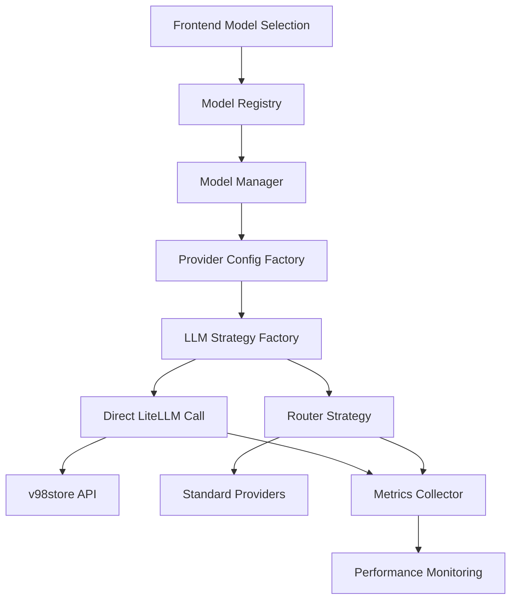

# OpenAI-Compatible Model Integration Architecture

## Overview

This document describes the architectural implementation of OpenAI-compatible model integration in the Suna AI Agent system, specifically designed to support third-party providers like v98store that follow the OpenAI API specification.

## Architecture Principles

### 1. **Holistic System Thinking**
- Integration designed as part of the larger LLM provider ecosystem
- Maintains consistency with existing provider patterns
- Considers impact on all system layers (frontend, backend, infrastructure)

### 2. **Progressive Complexity**
- Simple configuration for basic usage
- Advanced features available for complex scenarios
- Extensible design for future provider additions

### 3. **Cross-Stack Performance Focus**
- Optimized model name resolution
- Efficient routing strategies
- Comprehensive monitoring and metrics

## System Components

### Core Components



### 1. **Model Registry Enhancement**
- **Location**: `backend/core/ai_models/registry.py`
- **Purpose**: Centralized model definition and resolution
- **Key Features**:
  - Support for `OPENAI_COMPATIBLE` provider type
  - Model name transformation capabilities
  - Alias-based model lookup

```python
# Model Definition Example
Model(
    id="openai-compatible/gpt-4o-mini",
    name="GPT-4o Mini (v98store)",
    provider=ModelProvider.OPENAI_COMPATIBLE,
    aliases=["gpt-4o-mini-v98", "v98store/gpt-4o-mini"],
    context_window=128_000,
    capabilities=[ModelCapability.CHAT, ModelCapability.FUNCTION_CALLING]
)
```

### 2. **Provider Configuration System**
- **Location**: `backend/core/ai_models/provider_config.py`
- **Purpose**: Centralized configuration management
- **Key Features**:
  - Environment-based configuration
  - Credential validation
  - Model name transformation rules

```python
# Configuration Usage
config = OpenAICompatibleConfig.from_env()
if config.validate():
    credentials = config.get_credentials()
    transformed_model = config.transform_model_name("openai-compatible/gpt-4o-mini")
```

### 3. **Strategy Pattern Implementation**
- **Location**: `backend/core/ai_models/llm_strategies.py`
- **Purpose**: Clean abstraction for different LLM calling approaches
- **Key Features**:
  - Direct LiteLLM calls for OpenAI-compatible models
  - Router-based calls for standard providers
  - Consistent error handling across strategies

```python
# Strategy Selection
strategy = LLMStrategyFactory.get_strategy(model_name, router)
response = await strategy.call_llm(**params)
```

### 4. **Comprehensive Metrics System**
- **Location**: `backend/core/ai_models/llm_metrics.py`
- **Purpose**: Performance monitoring and health tracking
- **Key Features**:
  - Real-time metrics collection
  - Provider and model performance tracking
  - Error analysis and health monitoring

## Data Flow

### 1. **Model Selection Flow**
```
Frontend Selection → Model Registry → Model Resolution → Provider Identification
```

### 2. **API Call Flow**
```
Request → Strategy Selection → Configuration Application → LLM Call → Response Processing → Metrics Recording
```

### 3. **Error Handling Flow**
```
Error Occurrence → Strategy-Specific Handling → Metrics Recording → Error Processing → User Feedback
```

## Configuration

### Environment Variables
```bash
# Required for OpenAI-compatible providers
OPENAI_COMPATIBLE_API_KEY=sk-your-api-key
OPENAI_COMPATIBLE_API_BASE=https://your-provider.com/v1
```

### Model Registration
```python
# In registry.py
self.register(Model(
    id="openai-compatible/model-name",
    name="Display Name (Provider)",
    provider=ModelProvider.OPENAI_COMPATIBLE,
    # ... other configuration
))
```

## Performance Characteristics

### Latency Optimization
- **Direct LiteLLM Calls**: Bypass router overhead for OpenAI-compatible models
- **Model Name Caching**: Efficient resolution through registry caching
- **Connection Pooling**: Reuse HTTP connections for better performance

### Scalability Considerations
- **Stateless Design**: No server-side state for model calls
- **Horizontal Scaling**: Each instance can handle OpenAI-compatible calls independently
- **Resource Isolation**: Separate metrics and monitoring per provider

## Security Implementation

### API Key Management
- Environment-based configuration
- No hardcoded credentials
- Secure credential validation

### Request Validation
- Model name sanitization
- Parameter validation
- Error message sanitization

## Monitoring and Observability

### Metrics Collection
- **Call Success Rates**: Per provider and model
- **Response Times**: Average and percentile tracking
- **Error Rates**: Categorized by error type
- **Token Usage**: Input/output token tracking

### Health Monitoring
- **Provider Health**: Real-time status checking
- **Model Availability**: Continuous availability monitoring
- **Performance Degradation**: Automatic detection and alerting

### API Endpoints
```
GET /api/llm/health - Overall health status
GET /api/llm/metrics/providers - Provider performance metrics
GET /api/llm/metrics/models - Model performance metrics
GET /api/llm/metrics/failures - Recent failure analysis
```

## Testing Strategy

### Unit Testing
- Provider configuration validation
- Model name transformation
- Strategy selection logic

### Integration Testing
- End-to-end API calls
- Error handling scenarios
- Metrics collection accuracy

### Performance Testing
- Load testing with multiple providers
- Latency benchmarking
- Resource usage monitoring

## Future Enhancements

### Planned Improvements
1. **Dynamic Provider Discovery**: Automatic detection of new OpenAI-compatible providers
2. **Advanced Load Balancing**: Intelligent routing based on provider performance
3. **Cost Optimization**: Automatic provider selection based on cost and performance
4. **Enhanced Monitoring**: Real-time dashboards and alerting

### Extensibility Points
- **New Provider Types**: Easy addition of non-OpenAI-compatible providers
- **Custom Strategies**: Plugin-based strategy implementation
- **Advanced Metrics**: Custom metric collection and analysis

## Troubleshooting

### Common Issues
1. **Authentication Failures**: Check API key and base URL configuration
2. **Model Not Found**: Verify model registration in registry
3. **Performance Issues**: Check metrics for bottlenecks

### Debug Information
- Comprehensive logging at all levels
- Request/response tracing
- Performance metrics collection

## Conclusion

The OpenAI-compatible model integration provides a robust, scalable, and maintainable solution for integrating third-party LLM providers. The architecture follows established patterns while introducing necessary enhancements for performance and monitoring.

The implementation successfully balances simplicity for basic usage with extensibility for advanced scenarios, ensuring long-term maintainability and evolution of the system.
