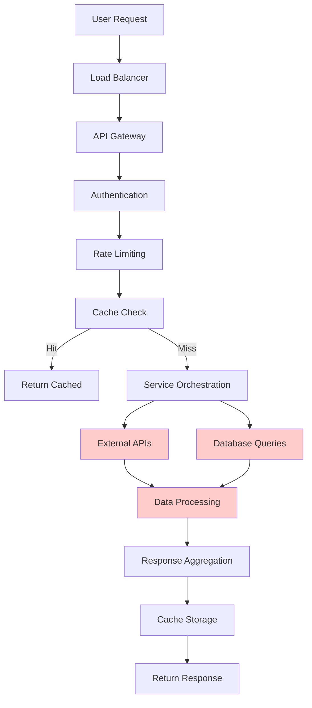
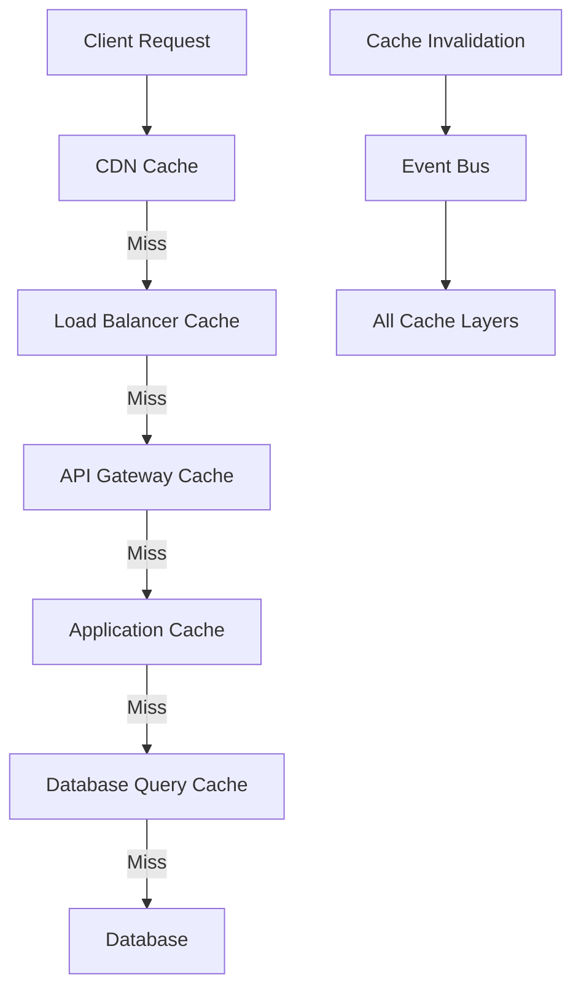

# ChainLens Crypto Services - Performance Optimization & Scalability Guide

**Version:** 1.0  
**Date:** 27/01/2025  
**Author:** Winston - System Architect  
**Status:** Approved for Implementation  

---

## 1. Performance Architecture Overview

### 1.1 Performance Targets

| Metric | Target | Measurement | Priority |
|--------|--------|-------------|----------|
| **Response Time** | <5s (95th percentile) | End-to-end analysis | Critical |
| **Throughput** | 100 req/sec sustained | Concurrent requests | High |
| **Availability** | 99.5% uptime | Monthly average | Critical |
| **Cache Hit Rate** | >60% | Redis metrics | High |
| **Database Query Time** | <500ms (95th percentile) | Query execution | High |
| **External API Response** | <3s (95th percentile) | Third-party calls | Medium |

### 1.2 Performance Bottlenecks Analysis



**Identified Bottlenecks:**
- External API latency (2-4 seconds)
- Database query complexity
- Data processing algorithms
- Network I/O overhead

---

## 2. Caching Strategy

### 2.1 Multi-Layer Caching Architecture



### 2.2 Redis Caching Implementation

#### Cache Service
```typescript
@Injectable()
export class CacheService {
  constructor(
    @Inject('REDIS_CLIENT') private redis: Redis,
    private configService: ConfigService
  ) {}
  
  async get<T>(key: string): Promise<T | null> {
    try {
      const cached = await this.redis.get(key);
      if (!cached) return null;
      
      const data = JSON.parse(cached);
      
      // Check if data has expired based on confidence
      if (this.isExpiredByConfidence(data)) {
        await this.redis.del(key);
        return null;
      }
      
      // Update access statistics
      await this.updateCacheStats(key, 'hit');
      
      return data.value;
    } catch (error) {
      console.error('Cache get error:', error);
      return null;
    }
  }
  
  async set<T>(
    key: string,
    value: T,
    options: CacheOptions = {}
  ): Promise<void> {
    try {
      const ttl = this.calculateTTL(options);
      const cacheData = {
        value,
        confidence: options.confidence || 1,
        timestamp: Date.now(),
        ttl
      };
      
      await this.redis.setex(key, ttl, JSON.stringify(cacheData));
      await this.updateCacheStats(key, 'set');
    } catch (error) {
      console.error('Cache set error:', error);
    }
  }
  
  private calculateTTL(options: CacheOptions): number {
    const { confidence = 1, baseTTL = 300 } = options;
    
    // Higher confidence = longer cache time
    if (confidence > 0.9) return baseTTL * 6; // 30 minutes
    if (confidence > 0.8) return baseTTL * 3; // 15 minutes
    if (confidence > 0.6) return baseTTL * 2; // 10 minutes
    return baseTTL; // 5 minutes
  }
  
  async invalidatePattern(pattern: string): Promise<void> {
    const keys = await this.redis.keys(pattern);
    if (keys.length > 0) {
      await this.redis.del(...keys);
    }
  }
}
```

#### Cache Key Strategy
```typescript
export class CacheKeyBuilder {
  static analysisKey(projectId: string, analysisType: string): string {
    return `analysis:${projectId}:${analysisType}`;
  }
  
  static userKey(userId: string, resource: string): string {
    return `user:${userId}:${resource}`;
  }
  
  static externalApiKey(service: string, endpoint: string, params: any): string {
    const paramHash = crypto
      .createHash('md5')
      .update(JSON.stringify(params))
      .digest('hex');
    return `external:${service}:${endpoint}:${paramHash}`;
  }
  
  static aggregationKey(type: string, timeframe: string): string {
    const timestamp = Math.floor(Date.now() / (5 * 60 * 1000)); // 5-minute buckets
    return `agg:${type}:${timeframe}:${timestamp}`;
  }
}
```

### 2.3 Cache Warming Strategy

#### Background Cache Warming
```typescript
@Injectable()
export class CacheWarmingService {
  constructor(
    private cacheService: CacheService,
    private analysisService: AnalysisService
  ) {}
  
  @Cron('0 */5 * * * *') // Every 5 minutes
  async warmPopularProjects(): Promise<void> {
    const popularProjects = await this.getPopularProjects();
    
    const warmingPromises = popularProjects.map(async (project) => {
      const cacheKey = CacheKeyBuilder.analysisKey(project.id, 'full');
      const cached = await this.cacheService.get(cacheKey);
      
      // Warm cache if missing or expiring soon
      if (!cached || this.isExpiringSoon(cached)) {
        await this.warmProjectCache(project.id);
      }
    });
    
    await Promise.allSettled(warmingPromises);
  }
  
  private async warmProjectCache(projectId: string): Promise<void> {
    try {
      // Perform analysis in background
      const analysis = await this.analysisService.analyzeProject({
        projectId,
        analysisType: 'full'
      });
      
      // Cache results
      const cacheKey = CacheKeyBuilder.analysisKey(projectId, 'full');
      await this.cacheService.set(cacheKey, analysis, {
        confidence: analysis.confidence,
        baseTTL: 1800 // 30 minutes for popular projects
      });
    } catch (error) {
      console.error(`Failed to warm cache for ${projectId}:`, error);
    }
  }
}
```

---

## 3. Database Optimization

### 3.1 Query Optimization

#### Optimized Repository Patterns
```typescript
@Injectable()
export class OptimizedAnalysisRepository {
  constructor(
    @InjectRepository(ProjectAnalysis)
    private repository: Repository<ProjectAnalysis>
  ) {}
  
  async findRecentAnalyses(
    projectId: string,
    limit: number = 10
  ): Promise<ProjectAnalysis[]> {
    return this.repository
      .createQueryBuilder('analysis')
      .select([
        'analysis.id',
        'analysis.projectId',
        'analysis.overallScore',
        'analysis.confidence',
        'analysis.createdAt'
      ])
      .where('analysis.projectId = :projectId', { projectId })
      .orderBy('analysis.createdAt', 'DESC')
      .limit(limit)
      .getMany();
  }
  
  async getAggregatedMetrics(
    projectIds: string[],
    timeframe: string
  ): Promise<AggregatedMetrics[]> {
    const query = this.repository
      .createQueryBuilder('analysis')
      .select([
        'analysis.projectId',
        'AVG(analysis.overallScore) as avgScore',
        'COUNT(*) as analysisCount',
        'MAX(analysis.createdAt) as lastAnalysis'
      ])
      .where('analysis.projectId IN (:...projectIds)', { projectIds })
      .andWhere('analysis.createdAt >= :startDate', {
        startDate: this.getStartDate(timeframe)
      })
      .groupBy('analysis.projectId');
    
    return query.getRawMany();
  }
  
  async findWithPagination(
    options: PaginationOptions
  ): Promise<PaginatedResult<ProjectAnalysis>> {
    const [items, total] = await this.repository.findAndCount({
      where: options.where,
      order: { createdAt: 'DESC' },
      skip: (options.page - 1) * options.limit,
      take: options.limit,
      select: [
        'id',
        'projectId',
        'overallScore',
        'confidence',
        'createdAt'
      ]
    });
    
    return {
      items,
      total,
      page: options.page,
      limit: options.limit,
      totalPages: Math.ceil(total / options.limit)
    };
  }
}
```

#### Database Indexing Strategy
```sql
-- Composite indexes for common query patterns
CREATE INDEX CONCURRENTLY idx_project_analyses_project_created 
ON onchain_analysis.project_analyses(project_id, created_at DESC);

CREATE INDEX CONCURRENTLY idx_project_analyses_score_confidence 
ON onchain_analysis.project_analyses(overall_score, confidence) 
WHERE overall_score IS NOT NULL;

-- Partial indexes for active data
CREATE INDEX CONCURRENTLY idx_recent_analyses 
ON onchain_analysis.project_analyses(project_id, created_at) 
WHERE created_at >= NOW() - INTERVAL '30 days';

-- GIN indexes for JSONB queries
CREATE INDEX CONCURRENTLY idx_price_data_gin 
ON onchain_analysis.project_analyses USING GIN(price_data);

-- Expression indexes for calculated fields
CREATE INDEX CONCURRENTLY idx_risk_level 
ON onchain_analysis.project_analyses((
  CASE 
    WHEN risk_score >= 80 THEN 'low'
    WHEN risk_score >= 60 THEN 'medium'
    WHEN risk_score >= 40 THEN 'high'
    ELSE 'very-high'
  END
));
```

### 3.2 Connection Pooling

#### Database Connection Management
```typescript
@Module({
  imports: [
    TypeOrmModule.forRootAsync({
      useFactory: (configService: ConfigService) => ({
        type: 'postgres',
        host: configService.get('DB_HOST'),
        port: configService.get('DB_PORT'),
        username: configService.get('DB_USERNAME'),
        password: configService.get('DB_PASSWORD'),
        database: configService.get('DB_NAME'),
        
        // Connection pooling
        extra: {
          max: 20,                    // Maximum connections
          min: 5,                     // Minimum connections
          acquire: 30000,             // Maximum time to get connection
          idle: 10000,                // Maximum idle time
          evict: 60000,               // Eviction interval
          handleDisconnects: true,    // Auto-reconnect
          
          // Performance optimizations
          statement_timeout: 30000,   // 30 seconds
          query_timeout: 30000,
          connectionTimeoutMillis: 5000,
          idleTimeoutMillis: 30000,
          
          // SSL configuration
          ssl: configService.get('NODE_ENV') === 'production' ? {
            rejectUnauthorized: false
          } : false
        },
        
        // Query optimization
        logging: configService.get('NODE_ENV') === 'development',
        synchronize: false,
        migrationsRun: true,
        cache: {
          type: 'redis',
          options: {
            host: configService.get('REDIS_HOST'),
            port: configService.get('REDIS_PORT'),
            duration: 30000 // 30 seconds
          }
        }
      }),
      inject: [ConfigService]
    })
  ]
})
export class DatabaseModule {}
```

---

## 4. External API Optimization

### 4.1 Parallel Processing

#### Concurrent API Calls
```typescript
@Injectable()
export class OptimizedExternalApiService {
  constructor(
    private httpService: HttpService,
    private cacheService: CacheService
  ) {}
  
  async fetchAllData(projectId: string): Promise<ExternalApiData> {
    const promises = [
      this.fetchMoralisData(projectId),
      this.fetchDexScreenerData(projectId),
      this.fetchDeFiLlamaData(projectId),
      this.fetchCoinGeckoData(projectId)
    ];
    
    // Execute all API calls in parallel với timeout
    const results = await Promise.allSettled(
      promises.map(promise => 
        this.withTimeout(promise, 10000) // 10 second timeout
      )
    );
    
    return this.aggregateResults(results);
  }
  
  private async withTimeout<T>(
    promise: Promise<T>,
    timeoutMs: number
  ): Promise<T> {
    const timeoutPromise = new Promise<never>((_, reject) => {
      setTimeout(() => reject(new Error('Timeout')), timeoutMs);
    });
    
    return Promise.race([promise, timeoutPromise]);
  }
  
  private async fetchWithCache<T>(
    cacheKey: string,
    fetcher: () => Promise<T>,
    ttl: number = 300
  ): Promise<T> {
    // Check cache first
    const cached = await this.cacheService.get<T>(cacheKey);
    if (cached) return cached;
    
    // Fetch from API
    const data = await fetcher();
    
    // Cache result
    await this.cacheService.set(cacheKey, data, { baseTTL: ttl });
    
    return data;
  }
}
```

### 4.2 Circuit Breaker Implementation

#### Resilient API Client
```typescript
@Injectable()
export class ResilientApiClient {
  private circuitBreakers = new Map<string, CircuitBreaker>();
  
  async makeRequest<T>(
    service: string,
    request: () => Promise<T>
  ): Promise<T> {
    const breaker = this.getCircuitBreaker(service);
    
    return breaker.execute(async () => {
      const startTime = Date.now();
      
      try {
        const result = await request();
        const duration = Date.now() - startTime;
        
        // Record success metrics
        this.recordMetrics(service, 'success', duration);
        
        return result;
      } catch (error) {
        const duration = Date.now() - startTime;
        
        // Record failure metrics
        this.recordMetrics(service, 'failure', duration);
        
        throw error;
      }
    });
  }
  
  private getCircuitBreaker(service: string): CircuitBreaker {
    if (!this.circuitBreakers.has(service)) {
      const breaker = new CircuitBreaker({
        timeout: 10000,           // 10 seconds
        errorThresholdPercentage: 50,
        resetTimeout: 30000,      // 30 seconds
        minimumNumberOfCalls: 10,
        slidingWindowSize: 100,
        
        // Fallback function
        fallback: () => this.getFallbackData(service),
        
        // Event handlers
        onOpen: () => console.warn(`Circuit breaker opened for ${service}`),
        onHalfOpen: () => console.info(`Circuit breaker half-open for ${service}`),
        onClose: () => console.info(`Circuit breaker closed for ${service}`)
      });
      
      this.circuitBreakers.set(service, breaker);
    }
    
    return this.circuitBreakers.get(service);
  }
}
```

---

## 5. Application-Level Optimizations

### 5.1 Asynchronous Processing

#### Background Job Processing
```typescript
@Injectable()
export class BackgroundJobService {
  constructor(
    @InjectQueue('analysis') private analysisQueue: Queue,
    @InjectQueue('cache-warming') private cacheQueue: Queue
  ) {}
  
  async queueAnalysis(request: AnalysisRequest): Promise<string> {
    const job = await this.analysisQueue.add('analyze-project', request, {
      priority: this.calculatePriority(request),
      attempts: 3,
      backoff: {
        type: 'exponential',
        delay: 2000
      },
      removeOnComplete: 100,
      removeOnFail: 50
    });
    
    return job.id;
  }
  
  @Process('analyze-project')
  async processAnalysis(job: Job<AnalysisRequest>): Promise<AnalysisResult> {
    const { data } = job;
    
    try {
      // Update job progress
      await job.progress(10);
      
      // Perform analysis
      const result = await this.performAnalysis(data);
      
      await job.progress(100);
      return result;
    } catch (error) {
      console.error('Analysis job failed:', error);
      throw error;
    }
  }
  
  private calculatePriority(request: AnalysisRequest): number {
    // Higher priority for paid users
    if (request.userTier === 'enterprise') return 10;
    if (request.userTier === 'pro') return 5;
    return 1;
  }
}
```

### 5.2 Memory Optimization

#### Memory-Efficient Data Processing
```typescript
@Injectable()
export class MemoryOptimizedProcessor {
  async processLargeDataset<T, R>(
    data: T[],
    processor: (item: T) => Promise<R>,
    batchSize: number = 100
  ): Promise<R[]> {
    const results: R[] = [];
    
    // Process in batches to avoid memory issues
    for (let i = 0; i < data.length; i += batchSize) {
      const batch = data.slice(i, i + batchSize);
      
      const batchResults = await Promise.all(
        batch.map(item => processor(item))
      );
      
      results.push(...batchResults);
      
      // Force garbage collection hint
      if (global.gc && i % (batchSize * 10) === 0) {
        global.gc();
      }
    }
    
    return results;
  }
  
  createStreamProcessor<T>(
    transform: (chunk: T) => any
  ): Transform {
    return new Transform({
      objectMode: true,
      transform(chunk: T, encoding, callback) {
        try {
          const result = transform(chunk);
          callback(null, result);
        } catch (error) {
          callback(error);
        }
      }
    });
  }
}
```

---

## 6. Scalability Architecture

### 6.1 Horizontal Scaling

#### Auto-Scaling Configuration
```yaml
# Kubernetes HPA
apiVersion: autoscaling/v2
kind: HorizontalPodAutoscaler
metadata:
  name: chainlens-core-hpa
spec:
  scaleTargetRef:
    apiVersion: apps/v1
    kind: Deployment
    name: chainlens-core
  minReplicas: 2
  maxReplicas: 20
  metrics:
  - type: Resource
    resource:
      name: cpu
      target:
        type: Utilization
        averageUtilization: 70
  - type: Resource
    resource:
      name: memory
      target:
        type: Utilization
        averageUtilization: 80
  - type: Pods
    pods:
      metric:
        name: http_requests_per_second
      target:
        type: AverageValue
        averageValue: "100"
  behavior:
    scaleDown:
      stabilizationWindowSeconds: 300
      policies:
      - type: Percent
        value: 10
        periodSeconds: 60
    scaleUp:
      stabilizationWindowSeconds: 60
      policies:
      - type: Percent
        value: 50
        periodSeconds: 60
```

#### Load Balancing Strategy
```typescript
@Injectable()
export class LoadBalancingService {
  private serviceInstances = new Map<string, ServiceInstance[]>();
  
  async getHealthyInstance(serviceName: string): Promise<ServiceInstance> {
    const instances = this.serviceInstances.get(serviceName) || [];
    const healthyInstances = instances.filter(instance => 
      instance.isHealthy && instance.load < 0.8
    );
    
    if (healthyInstances.length === 0) {
      throw new ServiceUnavailableException(`No healthy instances for ${serviceName}`);
    }
    
    // Weighted round-robin based on current load
    return this.selectByWeight(healthyInstances);
  }
  
  private selectByWeight(instances: ServiceInstance[]): ServiceInstance {
    const totalWeight = instances.reduce((sum, instance) => 
      sum + (1 - instance.load), 0
    );
    
    let random = Math.random() * totalWeight;
    
    for (const instance of instances) {
      random -= (1 - instance.load);
      if (random <= 0) {
        return instance;
      }
    }
    
    return instances[0]; // Fallback
  }
}
```

### 6.2 Database Scaling

#### Read Replica Configuration
```typescript
@Module({
  imports: [
    TypeOrmModule.forRootAsync({
      name: 'master',
      useFactory: (configService: ConfigService) => ({
        type: 'postgres',
        host: configService.get('DB_MASTER_HOST'),
        // ... master configuration
        replication: {
          master: {
            host: configService.get('DB_MASTER_HOST'),
            port: configService.get('DB_MASTER_PORT'),
            username: configService.get('DB_MASTER_USER'),
            password: configService.get('DB_MASTER_PASSWORD'),
            database: configService.get('DB_NAME')
          },
          slaves: [
            {
              host: configService.get('DB_SLAVE1_HOST'),
              port: configService.get('DB_SLAVE1_PORT'),
              username: configService.get('DB_SLAVE1_USER'),
              password: configService.get('DB_SLAVE1_PASSWORD'),
              database: configService.get('DB_NAME')
            },
            {
              host: configService.get('DB_SLAVE2_HOST'),
              port: configService.get('DB_SLAVE2_PORT'),
              username: configService.get('DB_SLAVE2_USER'),
              password: configService.get('DB_SLAVE2_PASSWORD'),
              database: configService.get('DB_NAME')
            }
          ]
        }
      }),
      inject: [ConfigService]
    })
  ]
})
export class ScalableDatabaseModule {}
```

---

## 7. Performance Monitoring

### 7.1 Metrics Collection

#### Performance Metrics Service
```typescript
@Injectable()
export class PerformanceMetricsService {
  constructor(
    @Inject('PROMETHEUS_REGISTRY') private registry: Registry
  ) {
    this.initializeMetrics();
  }
  
  private httpRequestDuration = new Histogram({
    name: 'http_request_duration_seconds',
    help: 'Duration of HTTP requests in seconds',
    labelNames: ['method', 'route', 'status_code'],
    buckets: [0.1, 0.5, 1, 2, 5, 10]
  });
  
  private cacheHitRate = new Gauge({
    name: 'cache_hit_rate',
    help: 'Cache hit rate percentage',
    labelNames: ['cache_type']
  });
  
  private externalApiDuration = new Histogram({
    name: 'external_api_duration_seconds',
    help: 'Duration of external API calls',
    labelNames: ['service', 'endpoint'],
    buckets: [0.5, 1, 2, 5, 10, 30]
  });
  
  recordHttpRequest(
    method: string,
    route: string,
    statusCode: number,
    duration: number
  ): void {
    this.httpRequestDuration
      .labels(method, route, statusCode.toString())
      .observe(duration / 1000);
  }
  
  recordCacheHit(cacheType: string, hit: boolean): void {
    const current = this.cacheHitRate.get({ cache_type: cacheType });
    const newValue = hit ? 1 : 0;
    
    // Simple moving average
    const alpha = 0.1;
    const updated = current ? (1 - alpha) * current + alpha * newValue : newValue;
    
    this.cacheHitRate.labels(cacheType).set(updated);
  }
}
```

### 7.2 Performance Alerting

#### Alert Configuration
```yaml
# Prometheus Alerting Rules
groups:
- name: performance
  rules:
  - alert: HighResponseTime
    expr: histogram_quantile(0.95, http_request_duration_seconds) > 5
    for: 2m
    labels:
      severity: warning
    annotations:
      summary: "High response time detected"
      description: "95th percentile response time is {{ $value }}s"
      
  - alert: LowCacheHitRate
    expr: cache_hit_rate < 0.6
    for: 5m
    labels:
      severity: warning
    annotations:
      summary: "Low cache hit rate"
      description: "Cache hit rate is {{ $value | humanizePercentage }}"
      
  - alert: ExternalApiSlow
    expr: histogram_quantile(0.95, external_api_duration_seconds) > 10
    for: 3m
    labels:
      severity: critical
    annotations:
      summary: "External API performance degraded"
      description: "{{ $labels.service }} API 95th percentile is {{ $value }}s"
```

---

**Performance & Scalability Status:** ✅ Complete Optimization Guide

**Next Steps:**
1. Performance testing framework setup
2. Load testing scenarios
3. Monitoring dashboard configuration
4. Auto-scaling validation
5. Performance regression testing
