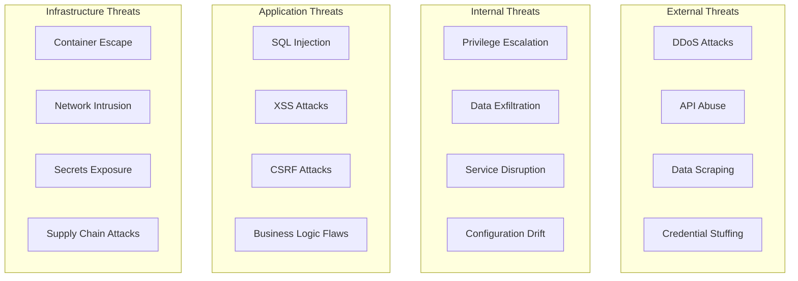
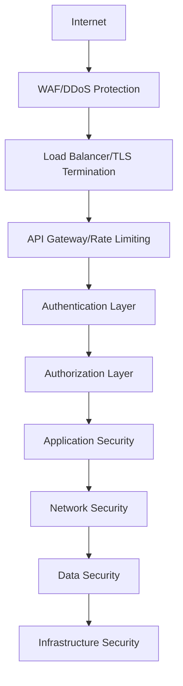

# ChainLens Crypto Services - Security Architecture & Implementation Guide

**Version:** 1.0  
**Date:** 27/01/2025  
**Author:** Winston - System Architect  
**Status:** Approved for Implementation  
**Classification:** Internal Use Only  

---

## 1. Security Architecture Overview

### 1.1 Security Principles

- **Zero Trust Architecture:** Never trust, always verify
- **Defense in Depth:** Multiple security layers
- **Least Privilege:** Minimal access rights
- **Security by Design:** Built-in security from ground up
- **Continuous Monitoring:** Real-time threat detection
- **Compliance Ready:** GDPR, SOC 2, PCI DSS alignment

### 1.2 Threat Model



### 1.3 Security Layers



---

## 2. Authentication Architecture

### 2.1 JWT-Based Authentication

#### Token Structure
```typescript
interface JWTPayload {
  sub: string;           // User ID
  email: string;         // User email
  tier: 'free' | 'pro' | 'enterprise';
  permissions: string[]; // Granular permissions
  iat: number;          // Issued at
  exp: number;          // Expires at
  iss: string;          // Issuer
  aud: string;          // Audience
}
```

#### Token Implementation
```typescript
@Injectable()
export class AuthService {
  private readonly jwtSecret = this.configService.get<string>('JWT_SECRET');
  private readonly jwtExpiry = this.configService.get<string>('JWT_EXPIRY', '1h');
  
  async generateTokens(user: User): Promise<TokenPair> {
    const payload: JWTPayload = {
      sub: user.id,
      email: user.email,
      tier: user.tier,
      permissions: await this.getUserPermissions(user.id),
      iat: Math.floor(Date.now() / 1000),
      exp: Math.floor(Date.now() / 1000) + 3600, // 1 hour
      iss: 'chainlens-core',
      aud: 'chainlens-services'
    };
    
    const accessToken = jwt.sign(payload, this.jwtSecret, {
      algorithm: 'HS256',
      expiresIn: this.jwtExpiry
    });
    
    const refreshToken = await this.generateRefreshToken(user.id);
    
    return { accessToken, refreshToken };
  }
  
  async validateToken(token: string): Promise<JWTPayload> {
    try {
      const decoded = jwt.verify(token, this.jwtSecret) as JWTPayload;
      
      // Additional validation
      await this.validateUserStatus(decoded.sub);
      await this.validatePermissions(decoded.permissions);
      
      return decoded;
    } catch (error) {
      throw new UnauthorizedException('Invalid token');
    }
  }
}
```

### 2.2 API Key Authentication (Enterprise)

#### API Key Generation
```typescript
@Injectable()
export class ApiKeyService {
  async generateApiKey(userId: string, name: string): Promise<ApiKey> {
    const keyData = {
      userId,
      name,
      prefix: 'cl_',
      timestamp: Date.now(),
      random: crypto.randomBytes(32).toString('hex')
    };
    
    const rawKey = `${keyData.prefix}${keyData.timestamp}_${keyData.random}`;
    const keyHash = await bcrypt.hash(rawKey, 12);
    
    const apiKey = await this.apiKeyRepository.save({
      userId,
      name,
      keyHash,
      permissions: await this.getDefaultPermissions(userId),
      rateLimit: await this.getUserRateLimit(userId),
      expiresAt: new Date(Date.now() + 365 * 24 * 60 * 60 * 1000) // 1 year
    });
    
    // Return raw key only once
    return { ...apiKey, rawKey };
  }
  
  async validateApiKey(rawKey: string): Promise<ApiKeyValidation> {
    const apiKey = await this.findByKeyHash(rawKey);
    
    if (!apiKey || !apiKey.isActive) {
      throw new UnauthorizedException('Invalid API key');
    }
    
    if (apiKey.expiresAt && apiKey.expiresAt < new Date()) {
      throw new UnauthorizedException('API key expired');
    }
    
    // Update last used timestamp
    await this.updateLastUsed(apiKey.id);
    
    return {
      userId: apiKey.userId,
      permissions: apiKey.permissions,
      rateLimit: apiKey.rateLimit
    };
  }
}
```

---

## 3. Authorization Framework

### 3.1 Role-Based Access Control (RBAC)

#### Permission System
```typescript
enum Permission {
  // Analysis permissions
  CRYPTO_ANALYZE = 'crypto:analyze',
  CRYPTO_ANALYZE_PREMIUM = 'crypto:analyze:premium',
  CRYPTO_HISTORY = 'crypto:history',
  
  // Data permissions
  DATA_EXPORT = 'data:export',
  DATA_EXPORT_BULK = 'data:export:bulk',
  
  // API permissions
  API_ACCESS = 'api:access',
  API_WEBHOOKS = 'api:webhooks',
  
  // Admin permissions
  ADMIN_USERS = 'admin:users',
  ADMIN_ANALYTICS = 'admin:analytics'
}

const TIER_PERMISSIONS = {
  free: [Permission.CRYPTO_ANALYZE],
  pro: [
    Permission.CRYPTO_ANALYZE,
    Permission.CRYPTO_ANALYZE_PREMIUM,
    Permission.CRYPTO_HISTORY,
    Permission.DATA_EXPORT
  ],
  enterprise: [
    Permission.CRYPTO_ANALYZE,
    Permission.CRYPTO_ANALYZE_PREMIUM,
    Permission.CRYPTO_HISTORY,
    Permission.DATA_EXPORT,
    Permission.DATA_EXPORT_BULK,
    Permission.API_ACCESS,
    Permission.API_WEBHOOKS
  ]
};
```

#### Authorization Guard
```typescript
@Injectable()
export class AuthorizationGuard implements CanActivate {
  constructor(
    private reflector: Reflector,
    private authService: AuthService
  ) {}
  
  async canActivate(context: ExecutionContext): Promise<boolean> {
    const requiredPermissions = this.reflector.getAllAndOverride<Permission[]>(
      'permissions',
      [context.getHandler(), context.getClass()]
    );
    
    if (!requiredPermissions) {
      return true;
    }
    
    const request = context.switchToHttp().getRequest();
    const user = request.user;
    
    if (!user) {
      throw new UnauthorizedException('Authentication required');
    }
    
    const hasPermission = requiredPermissions.every(permission =>
      user.permissions.includes(permission)
    );
    
    if (!hasPermission) {
      throw new ForbiddenException('Insufficient permissions');
    }
    
    return true;
  }
}

// Usage decorator
export const RequirePermissions = (...permissions: Permission[]) =>
  SetMetadata('permissions', permissions);
```

### 3.2 Resource-Level Authorization

#### Resource Access Control
```typescript
@Injectable()
export class ResourceAuthService {
  async canAccessAnalysis(
    userId: string,
    analysisId: string
  ): Promise<boolean> {
    const analysis = await this.analysisRepository.findOne({
      where: { id: analysisId },
      relations: ['user']
    });
    
    if (!analysis) {
      return false;
    }
    
    // Owner can always access
    if (analysis.user.id === userId) {
      return true;
    }
    
    // Check if analysis is public
    if (analysis.isPublic) {
      return true;
    }
    
    // Check organization access
    return await this.checkOrganizationAccess(userId, analysis.organizationId);
  }
  
  async canExportData(userId: string, dataType: string): Promise<boolean> {
    const user = await this.userService.findById(userId);
    
    // Check tier permissions
    if (!TIER_PERMISSIONS[user.tier].includes(Permission.DATA_EXPORT)) {
      return false;
    }
    
    // Check rate limits
    const exportCount = await this.getExportCount(userId, '24h');
    const limit = this.getExportLimit(user.tier);
    
    return exportCount < limit;
  }
}
```

---

## 4. Input Validation và Sanitization

### 4.1 Request Validation

#### DTO Validation
```typescript
import { IsString, IsOptional, IsEnum, IsArray, ValidateNested } from 'class-validator';
import { Transform, Type } from 'class-transformer';
import { ApiProperty } from '@nestjs/swagger';

export class AnalysisRequestDto {
  @ApiProperty({ example: 'uniswap' })
  @IsString()
  @Transform(({ value }) => value.toLowerCase().trim())
  projectId: string;
  
  @ApiProperty({ enum: ['full', 'onchain', 'sentiment'] })
  @IsEnum(['full', 'onchain', 'sentiment', 'tokenomics', 'team'])
  @IsOptional()
  analysisType?: string = 'full';
  
  @ApiProperty({ example: ['ethereum', 'polygon'] })
  @IsArray()
  @IsString({ each: true })
  @IsOptional()
  chains?: string[];
  
  @ApiProperty()
  @ValidateNested()
  @Type(() => AnalysisOptionsDto)
  @IsOptional()
  options?: AnalysisOptionsDto;
}

export class AnalysisOptionsDto {
  @IsOptional()
  @Transform(({ value }) => Boolean(value))
  includeHistorical?: boolean = false;
  
  @IsOptional()
  @IsEnum(['1h', '24h', '7d', '30d'])
  timeframe?: string = '24h';
}
```

#### SQL Injection Prevention
```typescript
@Injectable()
export class SafeQueryBuilder {
  constructor(private dataSource: DataSource) {}
  
  async findProjectAnalyses(
    projectId: string,
    options: QueryOptions
  ): Promise<ProjectAnalysis[]> {
    // Use parameterized queries
    const query = this.dataSource
      .getRepository(ProjectAnalysis)
      .createQueryBuilder('analysis')
      .where('analysis.projectId = :projectId', { projectId })
      .andWhere('analysis.createdAt >= :startDate', { 
        startDate: options.startDate 
      });
    
    // Validate and sanitize sort options
    const allowedSortFields = ['createdAt', 'riskScore', 'confidence'];
    if (options.sortBy && allowedSortFields.includes(options.sortBy)) {
      const sortOrder = options.sortOrder === 'DESC' ? 'DESC' : 'ASC';
      query.orderBy(`analysis.${options.sortBy}`, sortOrder);
    }
    
    return query.getMany();
  }
}
```

### 4.2 XSS Protection

#### Content Sanitization
```typescript
import DOMPurify from 'isomorphic-dompurify';

@Injectable()
export class SanitizationService {
  sanitizeHtml(input: string): string {
    return DOMPurify.sanitize(input, {
      ALLOWED_TAGS: ['b', 'i', 'em', 'strong', 'a'],
      ALLOWED_ATTR: ['href'],
      ALLOW_DATA_ATTR: false
    });
  }
  
  sanitizeUserInput(input: any): any {
    if (typeof input === 'string') {
      return this.sanitizeString(input);
    }
    
    if (Array.isArray(input)) {
      return input.map(item => this.sanitizeUserInput(item));
    }
    
    if (typeof input === 'object' && input !== null) {
      const sanitized = {};
      for (const [key, value] of Object.entries(input)) {
        sanitized[key] = this.sanitizeUserInput(value);
      }
      return sanitized;
    }
    
    return input;
  }
  
  private sanitizeString(input: string): string {
    return input
      .replace(/<script\b[^<]*(?:(?!<\/script>)<[^<]*)*<\/script>/gi, '')
      .replace(/javascript:/gi, '')
      .replace(/on\w+\s*=/gi, '')
      .trim();
  }
}
```

---

## 5. Rate Limiting và DDoS Protection

### 5.1 Multi-Layer Rate Limiting

#### Application-Level Rate Limiting
```typescript
@Injectable()
export class RateLimitService {
  constructor(
    private redis: Redis,
    private configService: ConfigService
  ) {}
  
  async checkRateLimit(
    identifier: string,
    tier: UserTier,
    resource: string
  ): Promise<RateLimitResult> {
    const limits = this.getRateLimits(tier, resource);
    const results = await Promise.all([
      this.checkSlidingWindow(identifier, limits.perMinute, 60),
      this.checkSlidingWindow(identifier, limits.perHour, 3600),
      this.checkSlidingWindow(identifier, limits.perDay, 86400)
    ]);
    
    const blocked = results.some(result => result.blocked);
    const remaining = Math.min(...results.map(r => r.remaining));
    const resetTime = Math.max(...results.map(r => r.resetTime));
    
    return { blocked, remaining, resetTime };
  }
  
  private async checkSlidingWindow(
    identifier: string,
    limit: number,
    windowSeconds: number
  ): Promise<WindowResult> {
    const key = `rate_limit:${identifier}:${windowSeconds}`;
    const now = Date.now();
    const windowStart = now - (windowSeconds * 1000);
    
    const pipeline = this.redis.pipeline();
    
    // Remove old entries
    pipeline.zremrangebyscore(key, 0, windowStart);
    
    // Count current entries
    pipeline.zcard(key);
    
    // Add current request
    pipeline.zadd(key, now, `${now}-${Math.random()}`);
    
    // Set expiry
    pipeline.expire(key, windowSeconds);
    
    const results = await pipeline.exec();
    const currentCount = results[1][1] as number;
    
    const blocked = currentCount >= limit;
    const remaining = Math.max(0, limit - currentCount - 1);
    const resetTime = now + (windowSeconds * 1000);
    
    return { blocked, remaining, resetTime };
  }
}
```

#### Rate Limit Middleware
```typescript
@Injectable()
export class RateLimitMiddleware implements NestMiddleware {
  constructor(private rateLimitService: RateLimitService) {}
  
  async use(req: Request, res: Response, next: NextFunction) {
    const identifier = this.getIdentifier(req);
    const tier = req.user?.tier || 'free';
    const resource = this.getResourceType(req.path);
    
    const result = await this.rateLimitService.checkRateLimit(
      identifier,
      tier,
      resource
    );
    
    // Set rate limit headers
    res.setHeader('X-RateLimit-Limit', this.getRateLimit(tier, resource));
    res.setHeader('X-RateLimit-Remaining', result.remaining);
    res.setHeader('X-RateLimit-Reset', result.resetTime);
    
    if (result.blocked) {
      throw new TooManyRequestsException({
        message: 'Rate limit exceeded',
        retryAfter: Math.ceil((result.resetTime - Date.now()) / 1000)
      });
    }
    
    next();
  }
  
  private getIdentifier(req: Request): string {
    // Use user ID if authenticated, otherwise IP
    return req.user?.id || req.ip;
  }
}
```

### 5.2 DDoS Protection

#### Circuit Breaker Pattern
```typescript
@Injectable()
export class CircuitBreakerService {
  private breakers = new Map<string, CircuitBreaker>();
  
  async executeWithBreaker<T>(
    serviceName: string,
    operation: () => Promise<T>
  ): Promise<T> {
    const breaker = this.getOrCreateBreaker(serviceName);
    
    if (breaker.state === 'OPEN') {
      const timeSinceLastFailure = Date.now() - breaker.lastFailureTime;
      if (timeSinceLastFailure < breaker.timeout) {
        throw new ServiceUnavailableException(`Circuit breaker open for ${serviceName}`);
      }
      breaker.state = 'HALF_OPEN';
    }
    
    try {
      const result = await operation();
      this.onSuccess(breaker);
      return result;
    } catch (error) {
      this.onFailure(breaker);
      throw error;
    }
  }
  
  private getOrCreateBreaker(serviceName: string): CircuitBreaker {
    if (!this.breakers.has(serviceName)) {
      this.breakers.set(serviceName, {
        state: 'CLOSED',
        failureCount: 0,
        threshold: 5,
        timeout: 60000, // 1 minute
        lastFailureTime: 0
      });
    }
    return this.breakers.get(serviceName);
  }
}
```

---

## 6. Data Protection

### 6.1 Encryption at Rest

#### Database Encryption
```typescript
@Injectable()
export class EncryptionService {
  private readonly algorithm = 'aes-256-gcm';
  private readonly key = Buffer.from(
    this.configService.get<string>('ENCRYPTION_KEY'),
    'hex'
  );
  
  encrypt(text: string): EncryptedData {
    const iv = crypto.randomBytes(16);
    const cipher = crypto.createCipher(this.algorithm, this.key);
    cipher.setAAD(Buffer.from('chainlens-crypto'));
    
    let encrypted = cipher.update(text, 'utf8', 'hex');
    encrypted += cipher.final('hex');
    
    const authTag = cipher.getAuthTag();
    
    return {
      encrypted,
      iv: iv.toString('hex'),
      authTag: authTag.toString('hex')
    };
  }
  
  decrypt(encryptedData: EncryptedData): string {
    const decipher = crypto.createDecipher(this.algorithm, this.key);
    decipher.setAAD(Buffer.from('chainlens-crypto'));
    decipher.setAuthTag(Buffer.from(encryptedData.authTag, 'hex'));
    
    let decrypted = decipher.update(encryptedData.encrypted, 'hex', 'utf8');
    decrypted += decipher.final('utf8');
    
    return decrypted;
  }
}

// Database column transformer
export class EncryptedColumnTransformer implements ValueTransformer {
  constructor(private encryptionService: EncryptionService) {}
  
  to(value: string): string {
    if (!value) return value;
    const encrypted = this.encryptionService.encrypt(value);
    return JSON.stringify(encrypted);
  }
  
  from(value: string): string {
    if (!value) return value;
    const encryptedData = JSON.parse(value);
    return this.encryptionService.decrypt(encryptedData);
  }
}
```

### 6.2 Secrets Management

#### Secrets Configuration
```typescript
@Injectable()
export class SecretsService {
  private secrets = new Map<string, string>();
  
  async loadSecrets(): Promise<void> {
    // Load from environment variables
    this.loadFromEnv();
    
    // Load from external secret manager (AWS Secrets Manager, etc.)
    if (this.configService.get('NODE_ENV') === 'production') {
      await this.loadFromSecretsManager();
    }
  }
  
  getSecret(key: string): string {
    const secret = this.secrets.get(key);
    if (!secret) {
      throw new Error(`Secret ${key} not found`);
    }
    return secret;
  }
  
  private loadFromEnv(): void {
    const secretKeys = [
      'JWT_SECRET',
      'ENCRYPTION_KEY',
      'DATABASE_PASSWORD',
      'REDIS_PASSWORD',
      'STRIPE_SECRET_KEY',
      'MORALIS_API_KEY',
      'TWITTER_BEARER_TOKEN'
    ];
    
    secretKeys.forEach(key => {
      const value = process.env[key];
      if (value) {
        this.secrets.set(key, value);
      }
    });
  }
  
  private async loadFromSecretsManager(): Promise<void> {
    // Implementation for AWS Secrets Manager, Azure Key Vault, etc.
    // This would fetch secrets from external service
  }
}
```

---

## 7. Security Monitoring

### 7.1 Security Event Logging

#### Security Logger
```typescript
@Injectable()
export class SecurityLogger {
  private readonly logger = new Logger(SecurityLogger.name);
  
  logAuthenticationAttempt(
    email: string,
    success: boolean,
    ip: string,
    userAgent: string
  ): void {
    this.logger.log({
      event: 'authentication_attempt',
      email,
      success,
      ip,
      userAgent,
      timestamp: new Date().toISOString()
    });
  }
  
  logSuspiciousActivity(
    userId: string,
    activity: string,
    details: any,
    riskLevel: 'low' | 'medium' | 'high'
  ): void {
    this.logger.warn({
      event: 'suspicious_activity',
      userId,
      activity,
      details,
      riskLevel,
      timestamp: new Date().toISOString()
    });
    
    if (riskLevel === 'high') {
      this.triggerSecurityAlert(userId, activity, details);
    }
  }
  
  logDataAccess(
    userId: string,
    resource: string,
    action: string,
    success: boolean
  ): void {
    this.logger.log({
      event: 'data_access',
      userId,
      resource,
      action,
      success,
      timestamp: new Date().toISOString()
    });
  }
  
  private async triggerSecurityAlert(
    userId: string,
    activity: string,
    details: any
  ): Promise<void> {
    // Send alert to security team
    // Could integrate với Slack, PagerDuty, etc.
  }
}
```

### 7.2 Anomaly Detection

#### Behavioral Analysis
```typescript
@Injectable()
export class AnomalyDetectionService {
  async analyzeUserBehavior(userId: string): Promise<AnomalyResult> {
    const recentActivity = await this.getRecentActivity(userId, '24h');
    const historicalPattern = await this.getHistoricalPattern(userId, '30d');
    
    const anomalies = [];
    
    // Check for unusual request patterns
    if (this.isUnusualRequestVolume(recentActivity, historicalPattern)) {
      anomalies.push({
        type: 'unusual_request_volume',
        severity: 'medium',
        details: { current: recentActivity.requestCount, average: historicalPattern.avgRequests }
      });
    }
    
    // Check for unusual access patterns
    if (this.isUnusualAccessPattern(recentActivity, historicalPattern)) {
      anomalies.push({
        type: 'unusual_access_pattern',
        severity: 'high',
        details: { newResources: recentActivity.newResources }
      });
    }
    
    // Check for geographical anomalies
    if (this.isUnusualLocation(recentActivity, historicalPattern)) {
      anomalies.push({
        type: 'unusual_location',
        severity: 'high',
        details: { currentLocation: recentActivity.location, usualLocations: historicalPattern.locations }
      });
    }
    
    return {
      userId,
      anomalies,
      riskScore: this.calculateRiskScore(anomalies),
      timestamp: new Date()
    };
  }
}
```

---

## 8. Compliance Framework

### 8.1 GDPR Compliance

#### Data Privacy Implementation
```typescript
@Injectable()
export class DataPrivacyService {
  async handleDataSubjectRequest(
    userId: string,
    requestType: 'access' | 'rectification' | 'erasure' | 'portability'
  ): Promise<DataSubjectResponse> {
    switch (requestType) {
      case 'access':
        return this.generateDataExport(userId);
      case 'rectification':
        return this.updateUserData(userId);
      case 'erasure':
        return this.deleteUserData(userId);
      case 'portability':
        return this.exportPortableData(userId);
    }
  }
  
  async anonymizeUserData(userId: string): Promise<void> {
    // Anonymize personal data while preserving analytics
    await this.userRepository.update(userId, {
      email: `anonymized_${userId}@deleted.local`,
      fullName: 'Deleted User',
      avatarUrl: null,
      preferences: {}
    });
    
    // Update related records
    await this.anonymizeUsageEvents(userId);
    await this.anonymizeAnalysisHistory(userId);
  }
  
  async auditDataProcessing(userId: string): Promise<ProcessingAudit> {
    return {
      userId,
      dataCategories: await this.getDataCategories(userId),
      processingPurposes: await this.getProcessingPurposes(userId),
      legalBasis: 'consent',
      retentionPeriod: '2 years',
      thirdPartySharing: await this.getThirdPartySharing(userId),
      lastAudit: new Date()
    };
  }
}
```

---

**Security Architecture Status:** ✅ Complete Implementation Guide

**Next Steps:**
1. Security testing framework setup
2. Penetration testing schedule
3. Security training program
4. Incident response procedures
5. Compliance audit preparation
