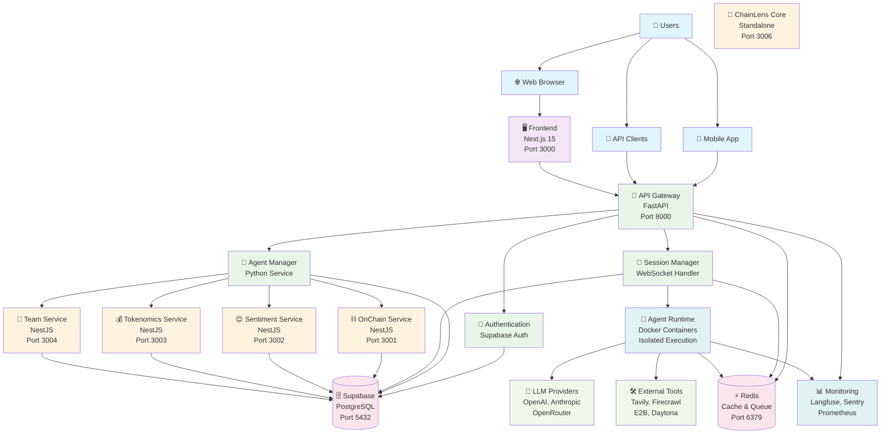
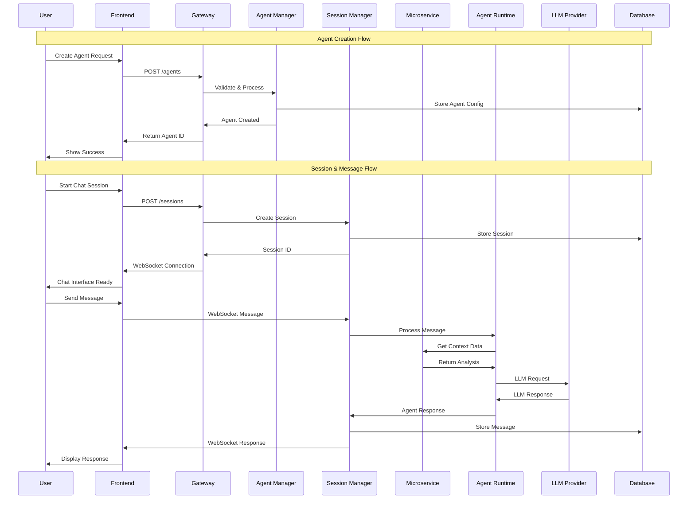
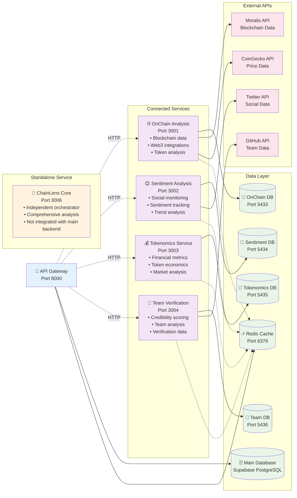
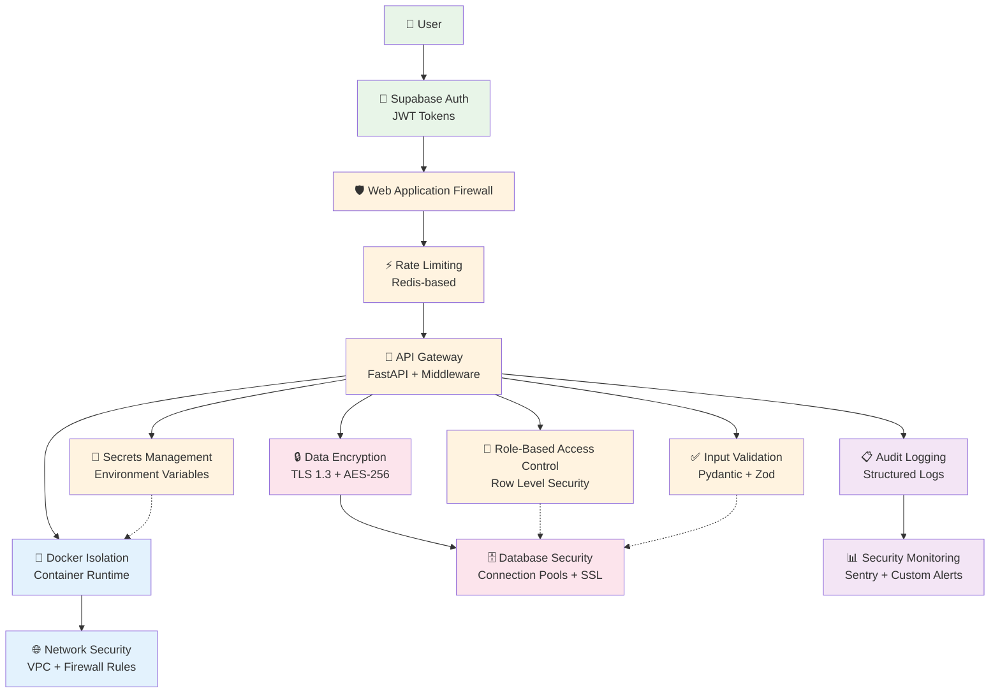
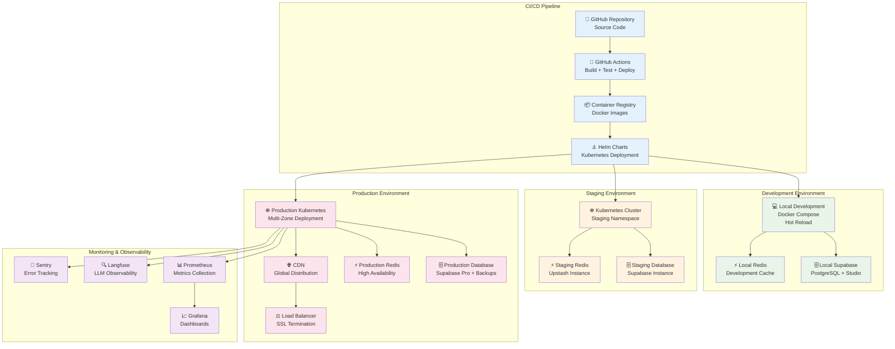
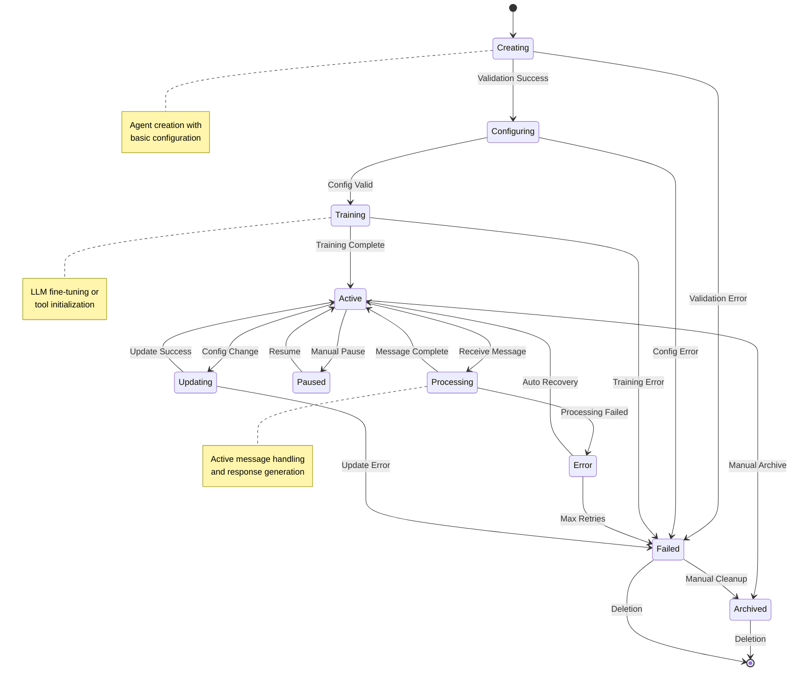
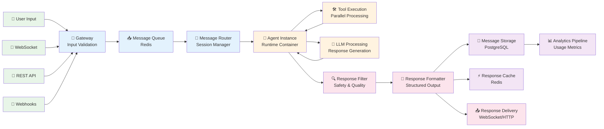
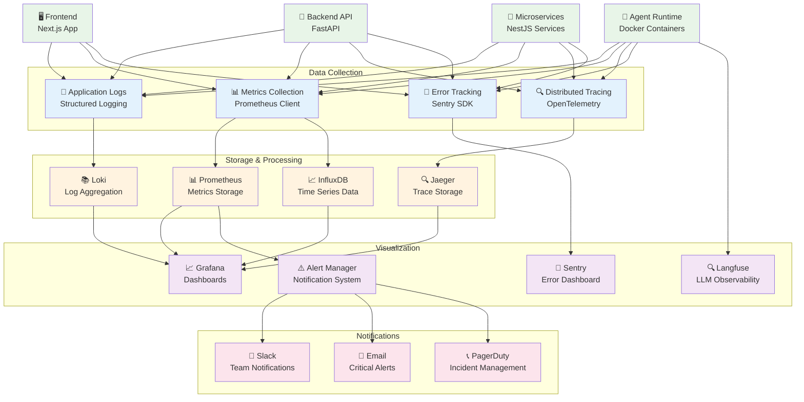

# 🏗️ System Architecture Diagrams

*Visual representation of the Suna AI Agent Platform architecture*

---

## 🎯 Overview

This document contains comprehensive architectural diagrams for the Suna AI Agent Platform, rendered using Mermaid syntax for GitHub compatibility and interactive documentation.

---

## 🏢 High-Level System Architecture

---

## 🔄 Data Flow Architecture

---

## 🏗️ Microservices Architecture

---

## 🔐 Security Architecture

---

## 🚀 Deployment Architecture

---

## 🔄 Agent Lifecycle Management

---

## 📊 Data Flow Patterns

---

## 🛠️ Tool Integration Architecture

```mermaid
graph TD
    %% Agent Core
    Agent[🤖 Agent Instance]
    ToolManager[🔧 Tool Manager<br/>Plugin System]
    
    %% Built-in Tools
    subgraph "Built-in Tools"
        WebSearch[🔍 Web Search<br/>Tavily API]
        WebScrape[🕷️ Web Scraping<br/>Firecrawl]
        CodeExec[💻 Code Execution<br/>E2B Interpreter]
        FileOps[📁 File Operations<br/>Local/Cloud Storage]
    end
    
    %% Blockchain Tools
    subgraph "Blockchain Tools"
        ChainAnalysis[⛓️ Chain Analysis<br/>OnChain Service]
        TokenData[🪙 Token Data<br/>Moralis/CoinGecko]
        DeFiMetrics[📊 DeFi Metrics<br/>Custom APIs]
    end
    
    %% AI/ML Tools
    subgraph "AI/ML Tools"
        ImageGen[🖼️ Image Generation<br/>DALL-E/Midjourney]
        VisionAI[👁️ Computer Vision<br/>OpenAI Vision]
        AudioGen[🔊 Audio Generation<br/>Eleven Labs]
    end
    
    %% Custom Tools
    subgraph "Custom Tools"
        CustomAPI[🔌 Custom APIs<br/>User-defined]
        Webhooks[🎣 Webhook Tools<br/>External Triggers]
        Database[🗄️ Database Tools<br/>SQL/NoSQL Access]
    end
    
    %% Tool Registry
    Registry[📚 Tool Registry<br/>Plugin Discovery]
    Security[🔒 Security Sandbox<br/>Isolated Execution]
    
    %% Connections
    Agent --> ToolManager
    ToolManager --> Registry
    ToolManager --> Security
    
    Security --> WebSearch
    Security --> WebScrape
    Security --> CodeExec
    Security --> FileOps
    
    Security --> ChainAnalysis
    Security --> TokenData
    Security --> DeFiMetrics
    
    Security --> ImageGen
    Security --> VisionAI
    Security --> AudioGen
    
    Security --> CustomAPI
    Security --> Webhooks
    Security --> Database
    
    %% Styling
    classDef core fill:#e3f2fd
    classDef builtin fill:#e8f5e8
    classDef blockchain fill:#fff3e0
    classDef ai fill:#f3e5f5
    classDef custom fill:#fce4ec
    classDef infra fill:#e1f5fe
    
    class Agent,ToolManager core
    class WebSearch,WebScrape,CodeExec,FileOps builtin
    class ChainAnalysis,TokenData,DeFiMetrics blockchain
    class ImageGen,VisionAI,AudioGen ai
    class CustomAPI,Webhooks,Database custom
    class Registry,Security infra
```

---

## 📈 Monitoring & Observability Architecture

---

## 🎯 Usage Instructions

### 📖 **Viewing Diagrams**
These Mermaid diagrams are automatically rendered on GitHub và most modern documentation platforms. For local viewing:

1. **GitHub**: View directly trong repository
2. **VS Code**: Use Mermaid Preview extension
3. **Local Docs**: Use Mermaid CLI or online editor

### 🔧 **Editing Diagrams**
To modify diagrams:
1. Edit the Mermaid syntax directly trong this file
2. Validate syntax using [Mermaid Live Editor](https://mermaid.live/)
3. Test rendering locally before committing

### 📚 **References**
- **[Mermaid Documentation](https://mermaid-js.github.io/mermaid/)**
- **[Technical Specifications](../TECHNICAL_SPECIFICATIONS.md)**
- **[Project Document](../PROJECT_DOCUMENT.md)**

---

*🏗️ Architecture diagrams maintained by BMad Master | Last updated: 2025-01-09 | Version: 1.0*

*For detailed technical specifications, see [TECHNICAL_SPECIFICATIONS.md](../TECHNICAL_SPECIFICATIONS.md)*
