# ChainLens Crypto Services - Technical Architecture Document (TAD)

**Version:** 1.0  
**Date:** 27/01/2025  
**Author:** Winston - System Architect  
**Status:** Approved for Implementation  
**Review Cycle:** Quarterly  

---

## 1. Executive Summary

### 1.1 Architecture Overview
ChainLens Crypto Services implements a microservices architecture extending ChainLens-Automation with 5 specialized services for cryptocurrency analysis. The system prioritizes scalability, reliability, và maintainability while delivering sub-5-second response times.

### 1.2 Key Architectural Decisions

| Decision | Rationale | Impact |
|----------|-----------|--------|
| **Microservices Pattern** | Domain separation, independent scaling | High scalability, operational complexity |
| **NestJS Framework** | Enterprise TypeScript, built-in patterns | Rapid development, consistent codebase |
| **Hybrid Database Strategy** | Balance cost vs isolation | Optimal resource utilization |
| **API Gateway Pattern** | Centralized orchestration | Simplified client integration |
| **Event-Driven Caching** | Performance optimization | Sub-second response times |

### 1.3 Architecture Principles
- **Scalability First:** Design for 10x growth
- **Fault Tolerance:** Graceful degradation over failures
- **Performance:** <5s response time target
- **Security:** Zero-trust architecture
- **Maintainability:** Clear separation of concerns

---

## 2. System Architecture

### 2.1 High-Level Architecture

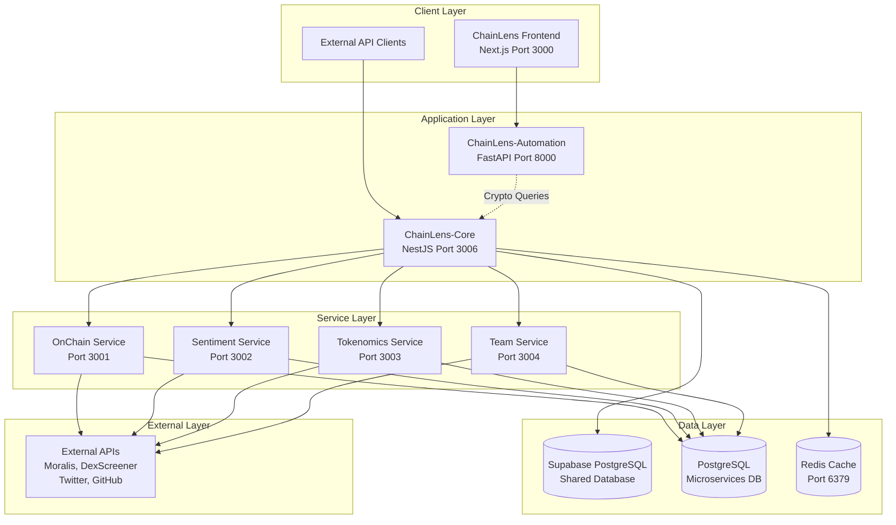

### 2.2 Service Interaction Patterns

#### 2.2.1 Request Flow Pattern
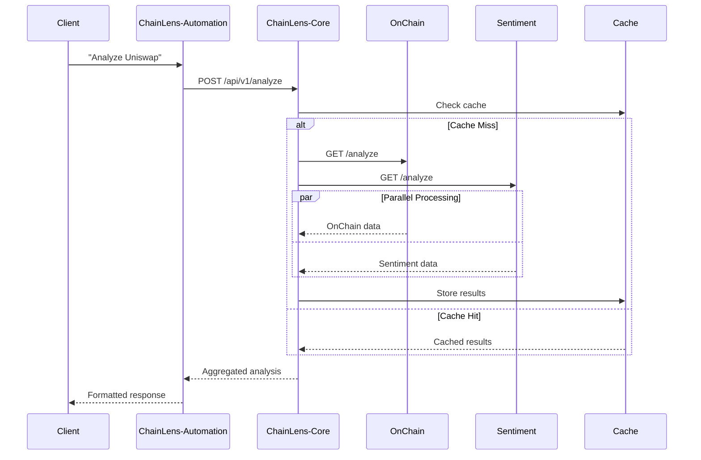

#### 2.2.2 Error Handling Pattern
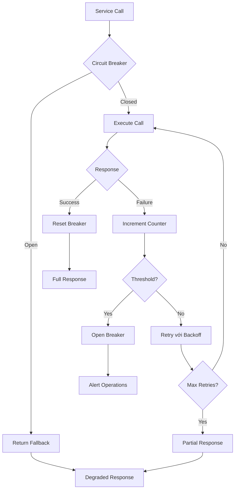

---

## 3. Service Architecture Details

### 3.1 ChainLens-Core (API Gateway)

#### 3.1.1 Architecture Components
```typescript
// Core Service Architecture
src/
├── main.ts                    // Application bootstrap
├── app.module.ts             // Root module
├── config/                   // Configuration management
├── auth/                     // Authentication & authorization
├── orchestration/            // Service orchestration
├── cache/                    // Caching layer
├── metrics/                  // Monitoring & metrics
├── rate-limiting/            // Rate limiting
└── health/                   // Health checks
```

#### 3.1.2 Key Responsibilities
1. **Request Orchestration**
   - Parallel service calls
   - Response aggregation
   - Timeout management
   - Circuit breaker implementation

2. **Authentication & Authorization**
   - JWT token validation
   - User tier verification
   - Rate limit enforcement
   - API key management

3. **Caching Strategy**
   - Redis-based caching
   - TTL management
   - Cache invalidation
   - Performance optimization

4. **Monitoring & Observability**
   - Request tracing
   - Performance metrics
   - Error tracking
   - Business analytics

#### 3.1.3 Configuration Management
```yaml
# config/default.yml
server:
  port: 3006
  timeout: 30000

services:
  onchain:
    url: ${ONCHAIN_SERVICE_URL}
    timeout: 30000
    retries: 3
  sentiment:
    url: ${SENTIMENT_SERVICE_URL}
    timeout: 45000
    retries: 3

cache:
  redis:
    url: ${REDIS_URL}
    ttl:
      high_confidence: 1800    # 30 minutes
      medium_confidence: 900   # 15 minutes
      low_confidence: 300      # 5 minutes

rate_limiting:
  free_tier: 10               # requests per minute
  pro_tier: 100
  enterprise_tier: 1000
```

### 3.2 OnChain Analysis Service

#### 3.2.1 Service Architecture
```typescript
src/
├── analysis/
│   ├── analysis.controller.ts    // HTTP endpoints
│   ├── analysis.service.ts       // Business logic
│   ├── price.service.ts          // Price analysis
│   ├── liquidity.service.ts      // Liquidity analysis
│   └── holders.service.ts        // Holder analysis
├── external/
│   ├── moralis.service.ts        // Moralis API client
│   ├── dexscreener.service.ts    // DexScreener client
│   └── defillama.service.ts      // DeFiLlama client
├── database/
│   ├── entities/                 // TypeORM entities
│   └── repositories/             // Data access layer
└── utils/
    ├── risk-calculator.ts        // Risk scoring
    └── data-validator.ts         // Input validation
```

#### 3.2.2 Data Flow Architecture
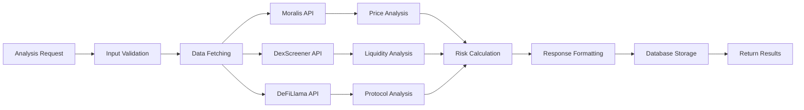

#### 3.2.3 Risk Scoring Algorithm
```typescript
interface RiskFactors {
  liquidityRisk: number;      // 0-100
  volatilityRisk: number;     // 0-100
  concentrationRisk: number;  // 0-100
  volumeRisk: number;         // 0-100
}

class RiskCalculator {
  calculateOverallRisk(factors: RiskFactors): number {
    const weights = {
      liquidity: 0.3,
      volatility: 0.25,
      concentration: 0.25,
      volume: 0.2
    };
    
    return (
      factors.liquidityRisk * weights.liquidity +
      factors.volatilityRisk * weights.volatility +
      factors.concentrationRisk * weights.concentration +
      factors.volumeRisk * weights.volume
    );
  }
}
```

### 3.3 Sentiment Analysis Service

#### 3.3.1 NLP Pipeline Architecture
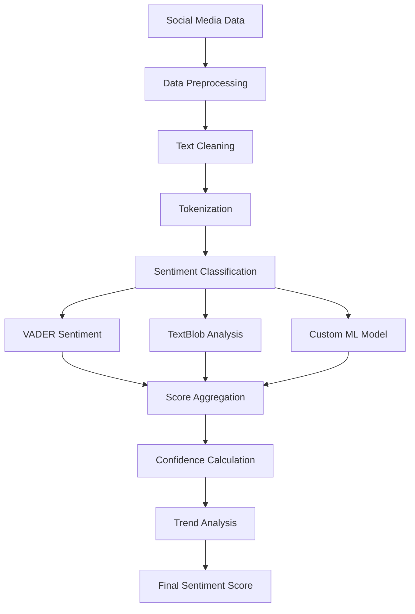

#### 3.3.2 Data Sources Integration
```typescript
interface SentimentSources {
  twitter: TwitterSentiment;
  reddit: RedditSentiment;
  news: NewsSentiment;
}

class SentimentAggregator {
  async aggregateSentiment(
    sources: SentimentSources
  ): Promise<OverallSentiment> {
    const weights = {
      twitter: 0.4,    // High real-time impact
      reddit: 0.35,    // Community sentiment
      news: 0.25       // Professional analysis
    };
    
    const weightedScore = 
      sources.twitter.score * weights.twitter +
      sources.reddit.score * weights.reddit +
      sources.news.score * weights.news;
    
    return {
      score: weightedScore,
      confidence: this.calculateConfidence(sources),
      trend: this.calculateTrend(sources)
    };
  }
}
```

### 3.4 Database Architecture

#### 3.4.1 Database Strategy
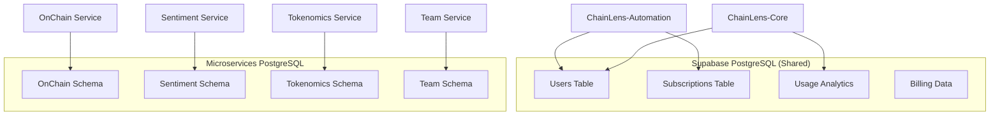

#### 3.4.2 Schema Design
```sql
-- OnChain Analysis Schema
CREATE SCHEMA onchain_analysis;

CREATE TABLE onchain_analysis.project_analyses (
    id UUID PRIMARY KEY DEFAULT gen_random_uuid(),
    project_id VARCHAR(100) NOT NULL,
    token_address VARCHAR(42),
    chain_id INTEGER,
    price_data JSONB,
    liquidity_data JSONB,
    holder_data JSONB,
    risk_score DECIMAL(5,2),
    confidence DECIMAL(3,2),
    created_at TIMESTAMP DEFAULT NOW(),
    updated_at TIMESTAMP DEFAULT NOW()
);

CREATE INDEX idx_project_analyses_project_id 
ON onchain_analysis.project_analyses(project_id);

CREATE INDEX idx_project_analyses_created_at 
ON onchain_analysis.project_analyses(created_at);
```

---

## 4. Infrastructure Architecture

### 4.1 Deployment Architecture

#### 4.1.1 Kubernetes Deployment
```yaml
# Production Deployment Strategy
apiVersion: v1
kind: Namespace
metadata:
  name: chainlens-crypto
  labels:
    environment: production
    
---
# Resource Quotas
apiVersion: v1
kind: ResourceQuota
metadata:
  name: chainlens-quota
  namespace: chainlens-crypto
spec:
  hard:
    requests.cpu: "10"
    requests.memory: 20Gi
    limits.cpu: "20"
    limits.memory: 40Gi
    persistentvolumeclaims: "10"
```

#### 4.1.2 Service Mesh Architecture
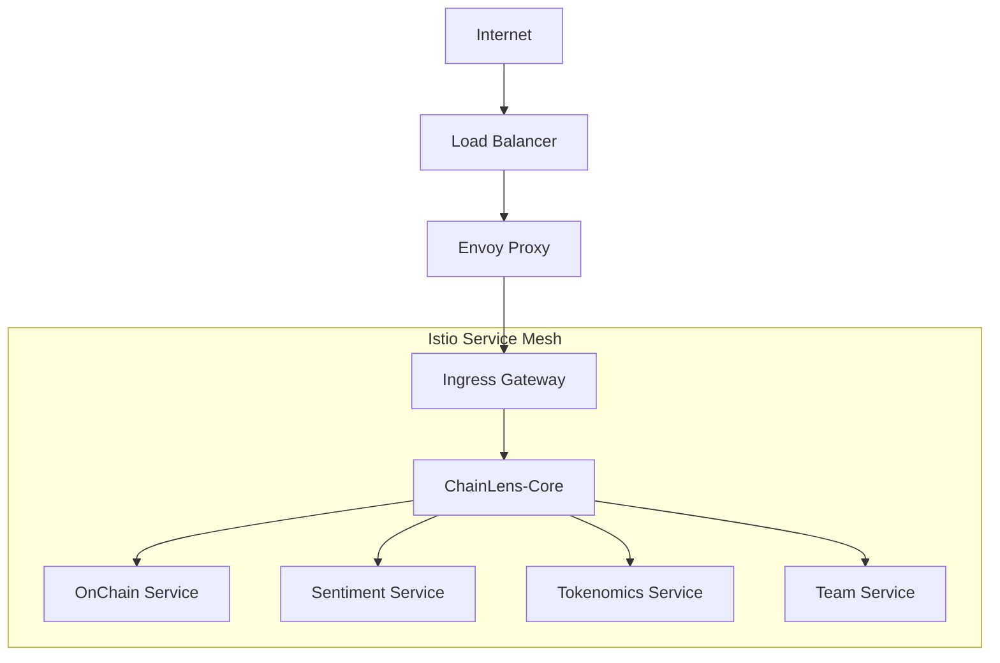

### 4.2 Monitoring Architecture

#### 4.2.1 Observability Stack
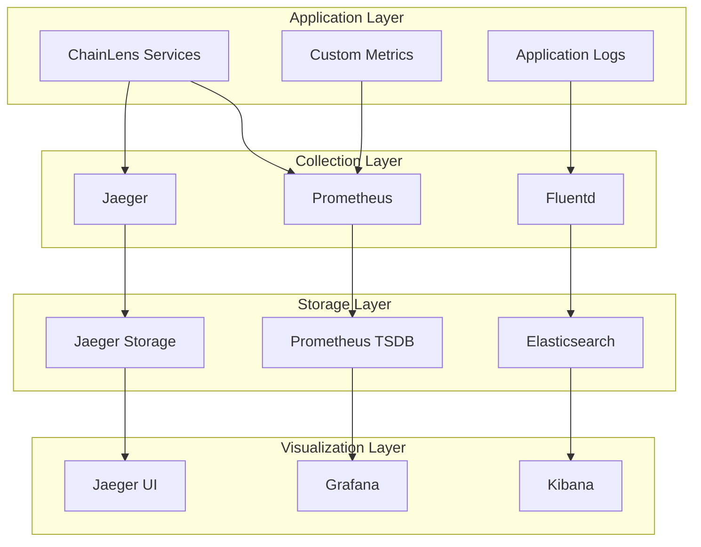

#### 4.2.2 Alerting Strategy
```yaml
# Prometheus Alerting Rules
groups:
- name: chainlens-crypto
  rules:
  - alert: HighResponseTime
    expr: histogram_quantile(0.95, http_request_duration_seconds) > 5
    for: 2m
    labels:
      severity: warning
    annotations:
      summary: "High response time detected"
      
  - alert: ServiceDown
    expr: up == 0
    for: 1m
    labels:
      severity: critical
    annotations:
      summary: "Service is down"
```

---

## 5. Security Architecture

### 5.1 Security Layers

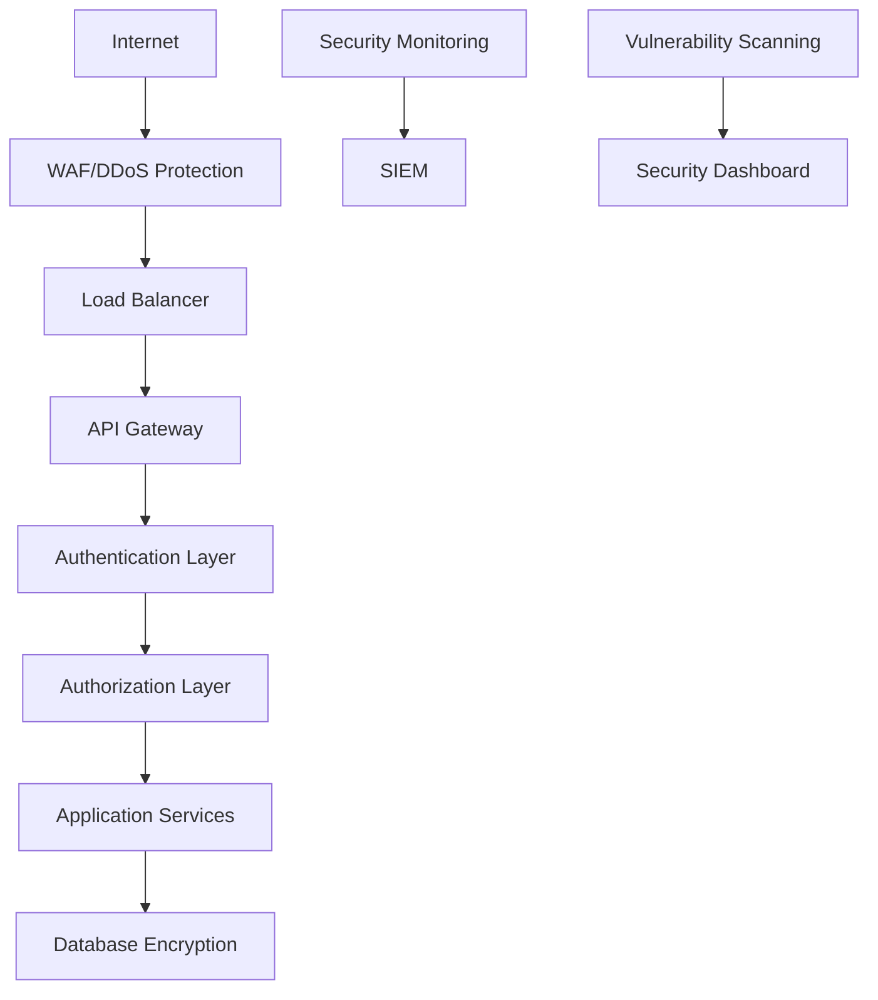

### 5.2 Authentication & Authorization

#### 5.2.1 JWT Token Flow
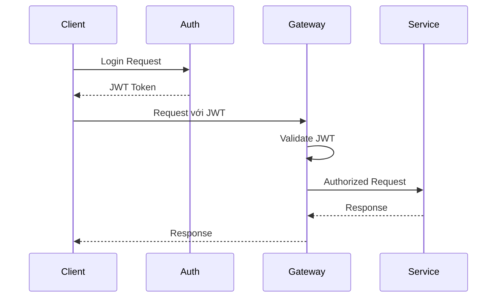

#### 5.2.2 API Security
```typescript
// Security Middleware
@Injectable()
export class SecurityMiddleware implements NestMiddleware {
  use(req: Request, res: Response, next: NextFunction) {
    // Rate limiting
    this.rateLimiter.check(req.ip);
    
    // Input validation
    this.validator.validate(req.body);
    
    // SQL injection prevention
    this.sqlInjectionGuard.check(req.query);
    
    // XSS protection
    this.xssGuard.sanitize(req.body);
    
    next();
  }
}
```

---

## 6. Performance Architecture

### 6.1 Caching Strategy

#### 6.1.1 Multi-Level Caching
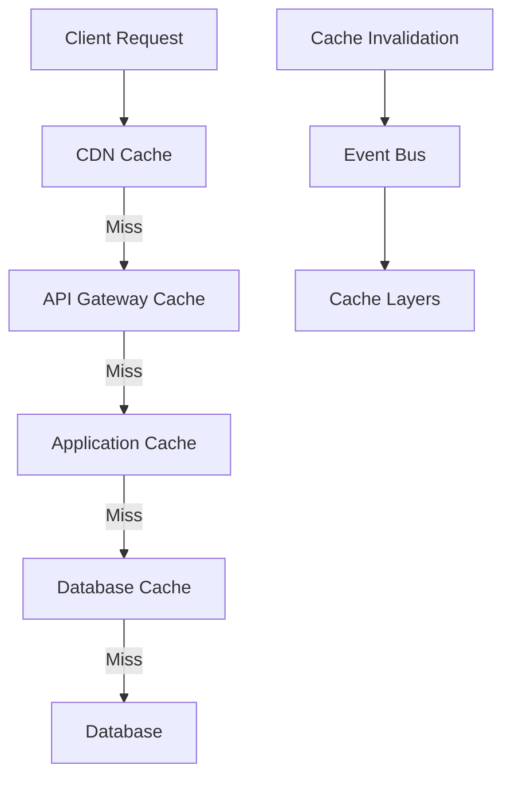

#### 6.1.2 Cache Configuration
```typescript
interface CacheConfig {
  layers: {
    cdn: {
      ttl: 3600;        // 1 hour for static content
      provider: 'cloudflare';
    };
    application: {
      ttl: 300;         // 5 minutes for analysis results
      provider: 'redis';
    };
    database: {
      ttl: 60;          // 1 minute for query results
      provider: 'postgresql';
    };
  };
}
```

### 6.2 Scalability Patterns

#### 6.2.1 Auto-Scaling Configuration
```yaml
apiVersion: autoscaling/v2
kind: HorizontalPodAutoscaler
metadata:
  name: chainlens-core-hpa
spec:
  scaleTargetRef:
    apiVersion: apps/v1
    kind: Deployment
    name: chainlens-core
  minReplicas: 2
  maxReplicas: 20
  metrics:
  - type: Resource
    resource:
      name: cpu
      target:
        type: Utilization
        averageUtilization: 70
  - type: Resource
    resource:
      name: memory
      target:
        type: Utilization
        averageUtilization: 80
```

---

## 7. Data Architecture

### 7.1 Data Flow Architecture

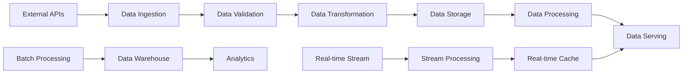

### 7.2 Data Consistency Strategy

#### 7.2.1 Eventual Consistency Model
```typescript
class DataConsistencyManager {
  async updateWithEventualConsistency(
    primaryData: any,
    secondaryData: any[]
  ): Promise<void> {
    // Update primary data first
    await this.primaryStore.update(primaryData);
    
    // Publish event for secondary updates
    await this.eventBus.publish('data.updated', {
      primaryId: primaryData.id,
      secondaryUpdates: secondaryData
    });
    
    // Secondary systems will eventually sync
  }
}
```

---

## 8. Integration Architecture

### 8.1 External API Integration

#### 8.1.1 API Client Architecture
```typescript
abstract class ExternalAPIClient {
  protected circuitBreaker: CircuitBreaker;
  protected rateLimiter: RateLimiter;
  protected cache: Cache;
  
  async makeRequest<T>(
    endpoint: string,
    params: any
  ): Promise<T> {
    // Check circuit breaker
    if (this.circuitBreaker.isOpen()) {
      throw new ServiceUnavailableError();
    }
    
    // Check rate limits
    await this.rateLimiter.checkLimit();
    
    // Check cache
    const cached = await this.cache.get(endpoint, params);
    if (cached) return cached;
    
    // Make request với retry logic
    const result = await this.executeWithRetry(endpoint, params);
    
    // Cache result
    await this.cache.set(endpoint, params, result);
    
    return result;
  }
}
```

### 8.2 Event-Driven Architecture

#### 8.2.1 Event Bus Pattern
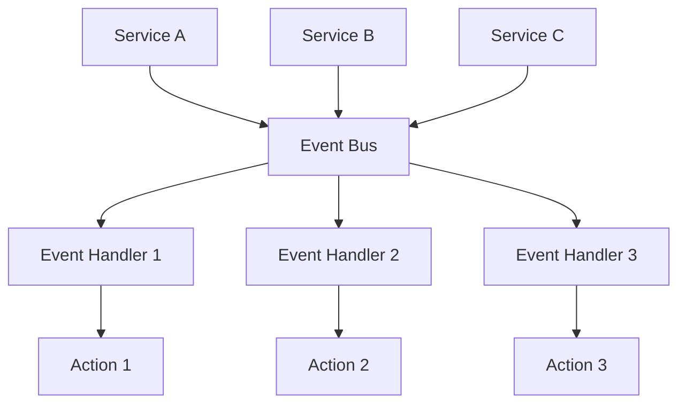

---

**Technical Architecture Status:** ✅ Complete Foundation Document

**Next Steps:**
1. Detailed service implementation guides
2. Database migration scripts
3. Infrastructure as Code templates
4. Security implementation guidelines
5. Performance optimization playbooks
