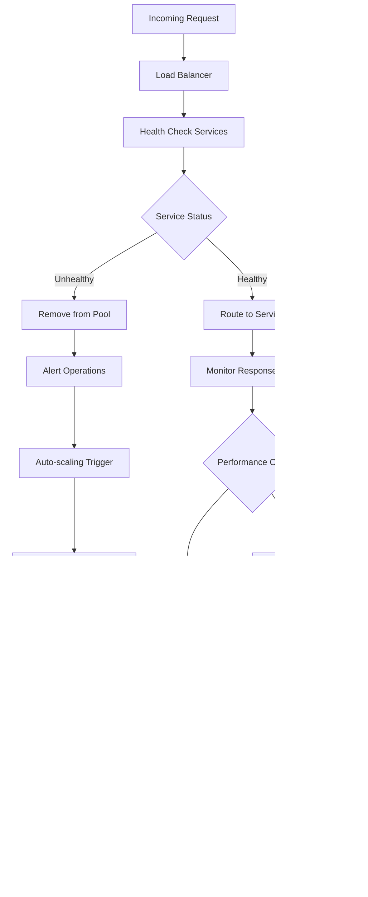

# ChainLens Crypto Services - Business Process Flows

**Version:** 1.0  
**Date:** 27/01/2025  
**Author:** Business Analyst  
**Status:** Approved  

---

## 1. Overview

This document outlines the key business processes for ChainLens Crypto Services, detailing user journeys, system interactions, và decision points throughout the platform.

---

## 2. Core Business Processes

### 2.1 User Onboarding Process

**Process Details:**
1. **User Registration/Login** (2-3 minutes)
   - Leverage existing ChainLens-Automation accounts
   - New users complete standard registration
   - Email verification required

2. **Feature Introduction** (1-2 minutes)
   - Interactive tour for first-time crypto users
   - Explanation of 4 analysis dimensions
   - Demo analysis với popular project (e.g., Bitcoin)

3. **Tier Assignment** (Immediate)
   - Free tier activated by default
   - Existing paid users maintain their tier
   - Clear explanation of tier benefits

---

### 2.2 Crypto Analysis Request Process

**Process Timing:**
- Input validation: <100ms
- Cache check: <200ms
- Service orchestration: 2-4 seconds
- Result aggregation: <500ms
- **Total: <5 seconds target**

**Error Handling:**
- Invalid input: Immediate feedback với suggestions
- Rate limit: Clear upgrade path
- Service failures: Partial results với warnings
- Timeout: Retry option với status updates

---

### 2.3 Subscription Management Process

**Payment Processing:**
1. **Stripe Integration** (30-60 seconds)
   - Secure payment form
   - Real-time validation
   - Multiple payment methods

2. **Tier Activation** (Immediate)
   - Database update
   - Cache invalidation
   - Feature flag updates

3. **Confirmation** (1-2 minutes)
   - Email confirmation
   - Dashboard update
   - Feature access verification

---

### 2.4 Daily Analytics Report Process

**Report Content:**
- **Free Tier:** 5 trending projects, basic metrics
- **Pro Tier:** 20 projects, detailed analysis, export option
- **Enterprise:** Custom reports, API data, priority insights

---

### 2.5 API Access Process (Enterprise)

**API Management:**
- Key generation: Immediate
- Documentation access: Real-time
- Rate limiting: Per-key basis
- Usage monitoring: Continuous
- Support escalation: Automated triggers

---

## 3. Error Handling Processes

### 3.1 Service Failure Recovery

**Recovery Strategies:**
- Circuit breaker: 5 failures trigger open state
- Retry logic: Exponential backoff (1s, 2s, 4s)
- Fallback data: Cached results up to 1 hour old
- Partial results: Continue với available services

---

### 3.2 Payment Failure Handling

**Payment Error Types:**
- Card declined: Immediate retry option
- Insufficient funds: Alternative payment methods
- Technical errors: Support escalation
- Fraud detection: Manual review process

---

## 4. Performance Optimization Processes

### 4.1 Cache Management Process

**Cache Strategy:**
- High confidence (>0.8): 30-minute TTL
- Medium confidence (0.5-0.8): 15-minute TTL
- Low confidence (<0.5): 5-minute TTL
- Background refresh: 80% of TTL

---

### 4.2 Load Balancing Process

**Load Balancing Rules:**
- Round-robin distribution
- Health checks every 30 seconds
- Auto-scaling triggers at 70% CPU
- Graceful instance removal

---

## 5. Monitoring và Alerting Processes

### 5.1 System Health Monitoring

**Alert Thresholds:**
- Response time >10 seconds: Critical
- Error rate >5%: Critical
- CPU usage >90%: Warning
- Memory usage >85%: Warning
- External API failures >50%: Warning

---

## 6. Business Intelligence Processes

### 6.1 User Behavior Analysis

**Key Metrics Tracked:**
- User acquisition và activation
- Feature adoption rates
- Conversion funnel performance
- Churn prediction indicators
- Revenue attribution

---

**Process Documentation Status:** ✅ Complete

**Next Steps:**
1. Process automation implementation
2. Monitoring dashboard setup
3. Alert configuration
4. Performance baseline establishment
5. Business intelligence tool integration
