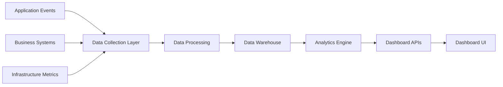

# ChainLens Crypto Services - Success Metrics & KPI Dashboard Specification

**Version:** 1.0  
**Date:** 27/01/2025  
**Author:** Business Analyst  
**Status:** Approved for Implementation  

---

## 1. Executive Summary

This document defines the comprehensive success metrics, KPIs, và dashboard specifications for ChainLens Crypto Services. The metrics framework enables data-driven decision making và tracks progress toward business objectives.

### 1.1 Success Framework Overview

**Primary Success Metrics:**
- Revenue Growth: $888 → $30,000 MRR (3 months)
- User Growth: 100 → 1,000 active users (3 months)
- Product-Market Fit: >4.5/5 user satisfaction
- Technical Excellence: 99.5% uptime, <5s response time

---

## 2. Business KPIs

### 2.1 Revenue Metrics

#### 2.1.1 Monthly Recurring Revenue (MRR)
**Definition:** Predictable monthly revenue from subscriptions  
**Target Progression:**
| Month | Target MRR | Growth Rate |
|-------|------------|-------------|
| Month 0 | $888 | Baseline |
| Month 1 | $5,000 | +463% |
| Month 2 | $15,000 | +200% |
| Month 3 | $30,000 | +100% |
| Month 6 | $100,000 | +233% |

**Calculation:** Sum of all active subscription values per month  
**Data Source:** Stripe subscription data  
**Update Frequency:** Daily  
**Dashboard Location:** Executive Summary (Top KPI)

#### 2.1.2 Average Revenue Per User (ARPU)
**Definition:** Average monthly revenue per active user  
**Target:** $30 by Month 3  
**Calculation:** MRR ÷ Total Active Users  
**Benchmark:** Industry average $25-50 for SaaS tools

#### 2.1.3 Customer Lifetime Value (LTV)
**Definition:** Predicted revenue from customer relationship  
**Target:** $500 by Month 6  
**Calculation:** ARPU × Average Customer Lifespan ÷ Churn Rate  
**Strategic Importance:** Must exceed Customer Acquisition Cost (CAC) by 3:1

### 2.2 User Acquisition Metrics

#### 2.2.1 Total Active Users
**Definition:** Users who performed at least 1 analysis in last 30 days  
**Target Progression:**
| Month | Target Users | Growth Rate |
|-------|-------------|-------------|
| Month 0 | 100 | Baseline |
| Month 1 | 500 | +400% |
| Month 2 | 750 | +50% |
| Month 3 | 1,000 | +33% |
| Month 6 | 5,000 | +400% |

#### 2.2.2 User Acquisition Rate
**Definition:** New users acquired per month  
**Target:** 300+ new users/month by Month 3  
**Segmentation:** Organic vs Paid vs Referral  
**Cost Tracking:** Customer Acquisition Cost (CAC) per channel

#### 2.2.3 Conversion Funnel
**Stages:**
1. **Visitor → Sign-up:** Target 15%
2. **Sign-up → First Analysis:** Target 80%
3. **Free → Paid:** Target 20%
4. **Trial → Subscription:** Target 60%

### 2.3 Subscription Metrics

#### 2.3.1 Conversion Rate by Tier
| Tier | Target Conversion | Current Baseline |
|------|------------------|------------------|
| Free → Pro | 20% | 8% |
| Pro → Enterprise | 5% | 2% |
| Free → Enterprise | 1% | 0.5% |

#### 2.3.2 Churn Rate
**Definition:** Percentage of customers who cancel subscriptions  
**Target:** <10% monthly churn  
**Calculation:** Cancelled Subscriptions ÷ Total Subscriptions  
**Cohort Analysis:** Track churn by acquisition month

---

## 3. Product KPIs

### 3.1 Feature Adoption Metrics

#### 3.1.1 Analysis Type Usage
**Tracking:** Percentage of users using each analysis type  
**Targets:**
- OnChain Analysis: 90% adoption
- Sentiment Analysis: 70% adoption  
- Tokenomics Analysis: 80% adoption
- Team Verification: 60% adoption
- Full Analysis: 85% adoption

#### 3.1.2 Feature Engagement
**Daily Active Users (DAU):** Target 30% of total users  
**Weekly Active Users (WAU):** Target 60% of total users  
**Monthly Active Users (MAU):** Target 80% of total users  
**Session Duration:** Target 8+ minutes average

### 3.2 User Experience Metrics

#### 3.2.1 User Satisfaction Score
**Method:** In-app NPS surveys + post-analysis ratings  
**Target:** >4.5/5 average rating  
**Frequency:** Monthly NPS, per-analysis ratings  
**Segmentation:** By user tier và feature usage

#### 3.2.2 Support Metrics
**Support Ticket Volume:** <5% of users/month  
**First Response Time:** <2 hours  
**Resolution Time:** <24 hours average  
**Customer Satisfaction:** >90% positive ratings

---

## 4. Technical KPIs

### 4.1 Performance Metrics

#### 4.1.1 Response Time
**Target:** <5 seconds for 95% of requests  
**Measurement:** P50, P95, P99 percentiles  
**Breakdown:** By service và analysis type  
**Alert Threshold:** >10 seconds

#### 4.1.2 System Availability
**Target:** 99.5% uptime (3.6 hours downtime/month)  
**Measurement:** Service-level monitoring  
**Calculation:** (Total Time - Downtime) ÷ Total Time  
**SLA:** 99% minimum for paid users

#### 4.1.3 Error Rates
**Target:** <1% error rate  
**Tracking:** 4xx và 5xx HTTP errors  
**Breakdown:** By service, endpoint, và user tier  
**Alert Threshold:** >5% error rate

### 4.2 Infrastructure Metrics

#### 4.2.1 Cache Performance
**Cache Hit Rate:** >60% target  
**Cache Response Time:** <100ms  
**Cache Efficiency:** Reduction in external API calls  
**Cost Impact:** Infrastructure cost savings

#### 4.2.2 External API Health
**API Availability:** Monitor all integrated APIs  
**Response Times:** Track API performance  
**Rate Limit Usage:** Monitor quota consumption  
**Fallback Activation:** Track circuit breaker events

---

## 5. Dashboard Specifications

### 5.1 Executive Dashboard

**Purpose:** High-level business metrics for leadership  
**Update Frequency:** Real-time với daily summaries  
**Access:** C-level executives, investors

**Key Widgets:**
1. **Revenue Overview**
   - MRR trend chart (6-month view)
   - Revenue by tier breakdown
   - Growth rate indicators

2. **User Growth**
   - Total users trend
   - New user acquisition
   - Conversion funnel visualization

3. **Key Metrics Summary**
   - Current MRR vs target
   - User count vs target  
   - System uptime status
   - Customer satisfaction score

### 5.2 Product Dashboard

**Purpose:** Product performance và user behavior analysis  
**Update Frequency:** Real-time  
**Access:** Product team, marketing team

**Key Widgets:**
1. **Feature Usage Analytics**
   - Analysis type popularity
   - Feature adoption rates
   - User journey flow

2. **User Engagement**
   - DAU/WAU/MAU trends
   - Session duration distribution
   - Retention cohort analysis

3. **Conversion Analysis**
   - Funnel conversion rates
   - A/B testing results
   - Churn analysis

### 5.3 Technical Dashboard

**Purpose:** System performance và operational health  
**Update Frequency:** Real-time  
**Access:** Development team, DevOps team

**Key Widgets:**
1. **Performance Metrics**
   - Response time trends
   - Error rate monitoring
   - Throughput analysis

2. **Infrastructure Health**
   - Service availability status
   - Resource utilization
   - Cache performance

3. **External Dependencies**
   - API health status
   - Rate limit consumption
   - Circuit breaker status

### 5.4 Customer Success Dashboard

**Purpose:** User satisfaction và support metrics  
**Update Frequency:** Daily  
**Access:** Customer success team, support team

**Key Widgets:**
1. **User Health Scores**
   - User engagement levels
   - Feature adoption progress
   - Churn risk indicators

2. **Support Metrics**
   - Ticket volume trends
   - Response time performance
   - Customer satisfaction ratings

3. **Success Metrics**
   - User onboarding completion
   - Feature discovery rates
   - Upgrade conversion tracking

---

## 6. Alerting và Monitoring

### 6.1 Critical Alerts (Immediate Response)

| Metric | Threshold | Response Time | Escalation |
|--------|-----------|---------------|------------|
| System Downtime | >5 minutes | Immediate | On-call engineer |
| Error Rate | >10% | 5 minutes | Development team |
| Response Time | >15 seconds | 10 minutes | DevOps team |
| Payment Failures | >5% | 15 minutes | Business team |

### 6.2 Warning Alerts (1-Hour Response)

| Metric | Threshold | Response Time | Action Required |
|--------|-----------|---------------|-----------------|
| Response Time | >8 seconds | 1 hour | Performance review |
| Error Rate | >3% | 1 hour | Investigation |
| Cache Hit Rate | <40% | 1 hour | Cache optimization |
| API Failures | >20% | 1 hour | Fallback activation |

### 6.3 Business Alerts (Daily Review)

| Metric | Threshold | Review Frequency | Action Required |
|--------|-----------|------------------|-----------------|
| Daily Signups | <10 | Daily | Marketing review |
| Conversion Rate | <15% | Daily | Product optimization |
| Churn Rate | >15% | Daily | Customer success intervention |
| Revenue Target | <80% of goal | Daily | Strategy adjustment |

---

## 7. Data Collection và Integration

### 7.1 Data Sources

**Application Analytics:**
- Custom event tracking in ChainLens-Automation
- Service-level metrics from ChainLens-Core
- User interaction data from frontend

**Business Data:**
- Stripe for subscription và payment data
- Supabase for user và usage data
- Support system for customer service metrics

**Technical Data:**
- Application logs và metrics
- Infrastructure monitoring (CPU, memory, network)
- External API monitoring

### 7.2 Data Pipeline

**Real-time Processing:**
- Stream processing for critical metrics
- Event-driven updates for dashboards
- Immediate alerting for threshold breaches

**Batch Processing:**
- Daily aggregations for trends
- Weekly cohort analysis
- Monthly business reports

---

## 8. Success Criteria và Milestones

### 8.1 MVP Success Criteria (Month 1)

**Must Achieve:**
- [ ] 500+ total users
- [ ] $5,000+ MRR
- [ ] 99% system uptime
- [ ] <5s average response time
- [ ] 15%+ free-to-paid conversion

**Should Achieve:**
- [ ] 4.0+ user satisfaction score
- [ ] 60%+ cache hit rate
- [ ] <2% error rate
- [ ] 80%+ feature adoption

### 8.2 Growth Milestones (Month 3)

**Primary Goals:**
- [ ] 1,000+ active users
- [ ] $30,000+ MRR
- [ ] 20%+ conversion rate
- [ ] 4.5+ user satisfaction

**Secondary Goals:**
- [ ] 50+ Enterprise customers
- [ ] 90%+ OnChain analysis adoption
- [ ] <10% monthly churn rate
- [ ] 99.5%+ system uptime

### 8.3 Scale Milestones (Month 6)

**Business Targets:**
- [ ] 5,000+ active users
- [ ] $100,000+ MRR
- [ ] 25%+ conversion rate
- [ ] $500+ customer LTV

**Technical Targets:**
- [ ] 100+ requests/second capacity
- [ ] <3s average response time
- [ ] 99.9%+ system uptime
- [ ] Multi-region deployment

---

**Dashboard Implementation Timeline:**
- Week 1: Executive dashboard MVP
- Week 2: Technical monitoring setup
- Week 3: Product analytics integration
- Week 4: Customer success metrics
- Month 2: Advanced analytics và AI insights
- Month 3: Predictive analytics và forecasting

**Success Metrics Status:** ✅ Ready for Implementation

**Next Steps:**
1. Dashboard development sprint planning
2. Data collection implementation
3. Alerting system configuration
4. Stakeholder training on dashboard usage
