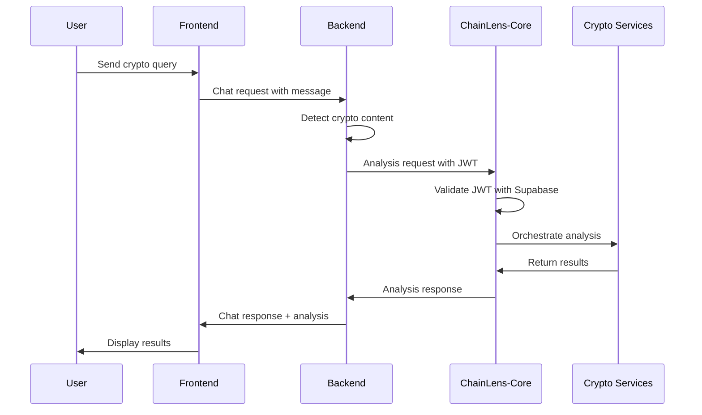

# ChainLens-Automation Integration Guide

## Overview

This document describes how to integrate the new ChainLens Crypto Services with the existing ChainLens-Automation system.

## Architecture Integration

### Current System
- **ChainLens-Automation Frontend**: Next.js (Port 3000)
- **ChainLens-Automation Backend**: FastAPI (Port 8000)
- **Database**: Supabase PostgreSQL
- **Authentication**: Supabase Auth

### New Crypto Services
- **ChainLens-Core**: NestJS API Gateway (Port 3006)
- **OnChain Analysis**: NestJS Service (Port 3001)
- **Sentiment Analysis**: NestJS Service (Port 3002)
- **Tokenomics Analysis**: NestJS Service (Port 3003)
- **Team Verification**: NestJS Service (Port 3004)

## Integration Points

### 1. Frontend Integration

#### Add Crypto Analysis Components

```typescript
// frontend/src/components/thread/crypto-analysis/CryptoAnalysisPanel.tsx
import React, { useState } from 'react';
import { useCryptoAnalysis } from '../../../hooks/useCryptoAnalysis';

interface CryptoAnalysisPanelProps {
  projectId: string;
  onAnalysisComplete: (result: any) => void;
}

export const CryptoAnalysisPanel: React.FC<CryptoAnalysisPanelProps> = ({
  projectId,
  onAnalysisComplete,
}) => {
  const { analyzeProject, loading, error } = useCryptoAnalysis();

  const handleAnalyze = async () => {
    try {
      const result = await analyzeProject(projectId);
      onAnalysisComplete(result);
    } catch (err) {
      console.error('Analysis failed:', err);
    }
  };

  return (
    <div className="crypto-analysis-panel">
      <h3>Crypto Analysis</h3>
      <button 
        onClick={handleAnalyze} 
        disabled={loading}
        className="analyze-button"
      >
        {loading ? 'Analyzing...' : 'Start Analysis'}
      </button>
      {error && <div className="error">{error}</div>}
    </div>
  );
};
```

#### Create Crypto Analysis Hook

```typescript
// frontend/src/hooks/useCryptoAnalysis.ts
import { useState } from 'react';
import { cryptoAnalysisApi } from '../services/cryptoAnalysisApi';

export const useCryptoAnalysis = () => {
  const [loading, setLoading] = useState(false);
  const [error, setError] = useState<string | null>(null);

  const analyzeProject = async (projectId: string) => {
    setLoading(true);
    setError(null);

    try {
      const result = await cryptoAnalysisApi.requestAnalysis({
        projectId,
        analysisType: 'full',
      });
      return result;
    } catch (err) {
      setError(err instanceof Error ? err.message : 'Analysis failed');
      throw err;
    } finally {
      setLoading(false);
    }
  };

  return { analyzeProject, loading, error };
};
```

#### Create API Service

```typescript
// frontend/src/services/cryptoAnalysisApi.ts
import { supabase } from './supabase';

const CRYPTO_API_BASE_URL = process.env.NEXT_PUBLIC_CRYPTO_API_URL || 'http://localhost:3006';

class CryptoAnalysisApi {
  private async getAuthHeaders() {
    const { data: { session } } = await supabase.auth.getSession();
    
    if (!session?.access_token) {
      throw new Error('No authentication token available');
    }

    return {
      'Authorization': `Bearer ${session.access_token}`,
      'Content-Type': 'application/json',
    };
  }

  async requestAnalysis(request: {
    projectId: string;
    analysisType?: string;
    tokenAddress?: string;
    chainId?: string;
  }) {
    const headers = await this.getAuthHeaders();
    
    const response = await fetch(`${CRYPTO_API_BASE_URL}/api/v1/analyze`, {
      method: 'POST',
      headers,
      body: JSON.stringify(request),
    });

    if (!response.ok) {
      throw new Error(`Analysis request failed: ${response.statusText}`);
    }

    return response.json();
  }

  async getAnalysisStatus(analysisId: string) {
    const headers = await this.getAuthHeaders();
    
    const response = await fetch(`${CRYPTO_API_BASE_URL}/api/v1/analyze/${analysisId}/status`, {
      method: 'GET',
      headers,
    });

    if (!response.ok) {
      throw new Error(`Status request failed: ${response.statusText}`);
    }

    return response.json();
  }

  async getAnalysisHistory(params?: {
    limit?: number;
    offset?: number;
    projectId?: string;
  }) {
    const headers = await this.getAuthHeaders();
    const queryParams = new URLSearchParams(params as any).toString();
    
    const response = await fetch(`${CRYPTO_API_BASE_URL}/api/v1/analyze/history?${queryParams}`, {
      method: 'GET',
      headers,
    });

    if (!response.ok) {
      throw new Error(`History request failed: ${response.statusText}`);
    }

    return response.json();
  }
}

export const cryptoAnalysisApi = new CryptoAnalysisApi();
```

### 2. Backend Integration

#### Add Crypto Query Detection

```python
# backend/services/crypto_detection_service.py
import re
from typing import Dict, List, Optional

class CryptoDetectionService:
    def __init__(self):
        self.crypto_patterns = [
            r'\b(?:bitcoin|btc|ethereum|eth|solana|sol|cardano|ada)\b',
            r'\b0x[a-fA-F0-9]{40}\b',  # Ethereum address
            r'\$[A-Z]{2,10}\b',        # Token symbols
            r'\bdefi\b|\byield\b|\bstaking\b|\bliquidity\b',
            r'\brug\s*pull\b|\bscam\b|\bponzi\b',
        ]
        self.compiled_patterns = [re.compile(pattern, re.IGNORECASE) for pattern in self.crypto_patterns]

    def detect_crypto_query(self, message: str) -> Dict:
        """Detect if a message contains crypto-related content"""
        matches = []
        confidence = 0.0
        
        for pattern in self.compiled_patterns:
            pattern_matches = pattern.findall(message)
            if pattern_matches:
                matches.extend(pattern_matches)
                confidence += 0.2
        
        # Extract potential project names or token addresses
        project_id = self.extract_project_id(message)
        token_address = self.extract_token_address(message)
        
        return {
            'is_crypto_query': confidence > 0.3,
            'confidence': min(confidence, 1.0),
            'matches': matches,
            'project_id': project_id,
            'token_address': token_address,
        }

    def extract_project_id(self, message: str) -> Optional[str]:
        """Extract project identifier from message"""
        # Look for common project name patterns
        project_patterns = [
            r'\b([a-zA-Z]+(?:\s+[a-zA-Z]+)*)\s+(?:token|coin|project|protocol)\b',
            r'\$([A-Z]{2,10})\b',
        ]
        
        for pattern in project_patterns:
            match = re.search(pattern, message, re.IGNORECASE)
            if match:
                return match.group(1).lower().replace(' ', '-')
        
        return None

    def extract_token_address(self, message: str) -> Optional[str]:
        """Extract token address from message"""
        eth_address_pattern = r'\b(0x[a-fA-F0-9]{40})\b'
        match = re.search(eth_address_pattern, message)
        return match.group(1) if match else None
```

#### Update Message Handler

```python
# backend/api/chat.py
from services.crypto_detection_service import CryptoDetectionService
from services.crypto_analysis_service import CryptoAnalysisService

crypto_detector = CryptoDetectionService()
crypto_analyzer = CryptoAnalysisService()

@router.post("/chat")
async def chat_endpoint(request: ChatRequest, user: User = Depends(get_current_user)):
    # Existing chat logic...
    
    # Detect crypto queries
    crypto_detection = crypto_detector.detect_crypto_query(request.message)
    
    if crypto_detection['is_crypto_query']:
        # Route to crypto analysis
        try:
            analysis_result = await crypto_analyzer.request_analysis(
                project_id=crypto_detection['project_id'],
                token_address=crypto_detection['token_address'],
                user_id=user.id
            )
            
            # Include crypto analysis in response
            response_data['crypto_analysis'] = analysis_result
            
        except Exception as e:
            logger.error(f"Crypto analysis failed: {e}")
            response_data['crypto_analysis'] = {
                'error': 'Crypto analysis temporarily unavailable'
            }
    
    return response_data
```

#### Create Crypto Analysis Service

```python
# backend/services/crypto_analysis_service.py
import httpx
from typing import Dict, Optional
from config import settings

class CryptoAnalysisService:
    def __init__(self):
        self.base_url = settings.CRYPTO_API_URL or "http://localhost:3006"
        self.timeout = 30.0

    async def request_analysis(
        self,
        project_id: str,
        token_address: Optional[str] = None,
        user_id: str = None,
        analysis_type: str = "full"
    ) -> Dict:
        """Request crypto analysis from ChainLens-Core"""
        
        # Get user's Supabase JWT token
        jwt_token = await self.get_user_jwt_token(user_id)
        
        headers = {
            "Authorization": f"Bearer {jwt_token}",
            "Content-Type": "application/json"
        }
        
        payload = {
            "projectId": project_id,
            "analysisType": analysis_type,
        }
        
        if token_address:
            payload["tokenAddress"] = token_address
        
        async with httpx.AsyncClient(timeout=self.timeout) as client:
            response = await client.post(
                f"{self.base_url}/api/v1/analyze",
                headers=headers,
                json=payload
            )
            
            if response.status_code == 202:
                # Analysis queued
                return await self.handle_queued_analysis(response.json())
            elif response.status_code == 200:
                # Analysis completed immediately
                return response.json()
            else:
                response.raise_for_status()

    async def handle_queued_analysis(self, queue_response: Dict) -> Dict:
        """Handle queued analysis response"""
        analysis_id = queue_response.get('analysisId')
        
        # For now, return the queue response
        # In production, you might want to implement polling or webhooks
        return {
            'status': 'queued',
            'analysisId': analysis_id,
            'message': 'Analysis is being processed. Check back in a few minutes.',
            'estimatedCompletion': queue_response.get('estimatedCompletion', 300)
        }

    async def get_user_jwt_token(self, user_id: str) -> str:
        """Get user's Supabase JWT token"""
        # This would integrate with your existing Supabase auth
        # For now, return a placeholder
        return "user_jwt_token"
```

### 3. Environment Configuration

#### Update Frontend Environment

```bash
# frontend/.env.local
NEXT_PUBLIC_CRYPTO_API_URL=http://localhost:3006
NEXT_PUBLIC_CRYPTO_ANALYSIS_ENABLED=true
```

#### Update Backend Environment

```bash
# backend/.env
CRYPTO_API_URL=http://localhost:3006
CRYPTO_ANALYSIS_ENABLED=true
CRYPTO_API_TIMEOUT=30
```

### 4. Database Integration

#### Shared Database Access

The ChainLens-Core service will share the Supabase PostgreSQL database with ChainLens-Automation for:
- User authentication and authorization
- User tier and quota management
- Analysis history and caching

#### Additional Schema

The crypto services will use a separate PostgreSQL instance for:
- Service-specific data storage
- Performance optimization
- Independent scaling

### 5. Authentication Flow



## Deployment Integration

### Development Environment

1. **Start ChainLens-Automation**:
   ```bash
   cd frontend && npm run dev
   cd backend && uvicorn api:app --reload
   ```

2. **Start Crypto Services**:
   ```bash
   cd services && npm run setup:dev
   npm run dev:all
   ```

### Production Environment

1. **Update Docker Compose** to include crypto services
2. **Configure Load Balancer** to route crypto API requests
3. **Update CI/CD Pipeline** to deploy all services

## Testing Integration

### Unit Tests

```typescript
// frontend/src/components/thread/crypto-analysis/__tests__/CryptoAnalysisPanel.test.tsx
import { render, screen, fireEvent, waitFor } from '@testing-library/react';
import { CryptoAnalysisPanel } from '../CryptoAnalysisPanel';

jest.mock('../../../hooks/useCryptoAnalysis');

describe('CryptoAnalysisPanel', () => {
  it('should trigger analysis when button is clicked', async () => {
    const mockAnalyzeProject = jest.fn().mockResolvedValue({ success: true });
    const mockOnAnalysisComplete = jest.fn();

    render(
      <CryptoAnalysisPanel 
        projectId="bitcoin" 
        onAnalysisComplete={mockOnAnalysisComplete}
      />
    );

    fireEvent.click(screen.getByText('Start Analysis'));

    await waitFor(() => {
      expect(mockAnalyzeProject).toHaveBeenCalledWith('bitcoin');
    });
  });
});
```

### Integration Tests

```python
# backend/tests/test_crypto_integration.py
import pytest
from fastapi.testclient import TestClient
from api import app

client = TestClient(app)

def test_crypto_query_detection():
    response = client.post(
        "/chat",
        json={"message": "What do you think about Bitcoin?"},
        headers={"Authorization": "Bearer test_token"}
    )
    
    assert response.status_code == 200
    data = response.json()
    assert "crypto_analysis" in data

def test_crypto_analysis_integration():
    response = client.post(
        "/chat",
        json={"message": "Analyze 0x1234567890123456789012345678901234567890"},
        headers={"Authorization": "Bearer test_token"}
    )
    
    assert response.status_code == 200
    data = response.json()
    assert data["crypto_analysis"]["status"] in ["completed", "queued"]
```

## Monitoring Integration

### Metrics Collection

- **Frontend**: Track crypto analysis usage
- **Backend**: Monitor crypto query detection accuracy
- **ChainLens-Core**: API gateway metrics
- **Services**: Individual service performance

### Alerting

- **High Error Rates**: Crypto analysis failures
- **Performance Issues**: Slow response times
- **External API Failures**: Third-party service outages

## Security Considerations

1. **JWT Token Validation**: Ensure proper token validation across services
2. **Rate Limiting**: Implement tier-based rate limiting
3. **Input Validation**: Sanitize all crypto-related inputs
4. **API Key Management**: Secure external API key storage
5. **CORS Configuration**: Proper cross-origin request handling

## Rollback Plan

If issues arise with the crypto services integration:

1. **Feature Flag**: Disable crypto analysis in frontend
2. **Backend Fallback**: Return standard responses without crypto analysis
3. **Service Isolation**: Crypto services failure won't affect main system
4. **Database Separation**: Main system database remains unaffected

## Next Steps

1. **Phase 1**: Implement basic integration (Week 1-2)
2. **Phase 2**: Add advanced features and optimization (Week 3-4)
3. **Phase 3**: Production deployment and monitoring (Week 5-6)
4. **Phase 4**: User feedback and iteration (Week 7-8)

This integration maintains the existing ChainLens-Automation functionality while seamlessly adding powerful crypto analysis capabilities.
