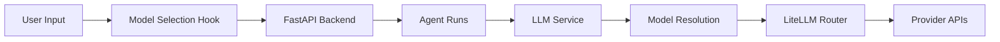
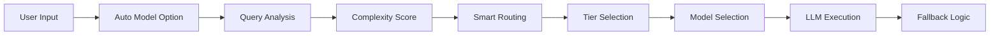

# ChainLens Auto Model Selection - Project Overview

**Status**: 🎯 Ready for Implementation  
**Created**: January 18, 2025  
**Architect**: AI Assistant  
**Priority**: High - Cost Optimization Initiative

---

## 📋 **Project Summary**

This project implements intelligent model selection for ChainLens to achieve **50-70% cost reduction** while maintaining response quality through automated model routing based on query complexity analysis.

### 🎯 **Core Objectives**
- ✅ Add "auto" model selection option
- ✅ Intelligent query complexity analysis
- ✅ 3-tier model routing (ultra_budget → balanced → premium)
- ✅ Zero breaking changes to existing system
- ✅ Comprehensive cost optimization

### 📊 **Expected Impact**
- **💰 Cost Reduction**: 50-70% savings vs single premium model
- **⚡ Performance**: 2-3x faster for simple queries
- **🔄 Reliability**: 99%+ uptime with intelligent fallbacks
- **📈 Scalability**: Handle 10x more queries with same budget

---

## 📚 **Documentation Structure**

### 🔬 **Research & Analysis**
1. **`cost-optimization-research.md`** - Comprehensive solution design
   - Advanced complexity analysis algorithms
   - Multi-tier routing architecture  
   - Semantic caching strategies
   - Performance monitoring systems

2. **`cheap-model-research.md`** - Model performance benchmarks
   - Cost comparison across providers
   - Intelligence vs cost analysis
   - Model specialization mapping

### 🛠️ **Implementation Plans**
1. **`implementation-plan.md`** - **PRIMARY PLAN** ⭐
   - Detailed integration strategy
   - Phase-by-phase implementation
   - Specific code locations & changes
   - Testing & deployment strategy

2. **`simplified-implementation-plan.md`** - Alternative minimal approach
   - Lighter implementation option
   - Reduced feature set
   - Faster deployment timeline

### 📊 **System Architecture**
1. **`../diagram/chainlens-chat-flow.md`** - Visual flow documentation
   - Request-to-response flow diagram
   - Integration points mapping
   - Component interaction overview

---

## 🏗️ **Architecture Overview**

### **Current State Analysis**
Based on comprehensive code review of ChainLens system:



### **Enhanced Architecture**
With auto model selection integration:



---

## 🎯 **Implementation Strategy**

### **🔹 Core Integration Points**

1. **Frontend Model Selection**
   - Location: `frontend/hooks/_use-model-selection.ts`
   - Change: Add "auto" option to model dropdown
   - Impact: Zero breaking changes

2. **Backend Model Resolution**
   - Location: `backend/core/models/model_manager.py`
   - Change: Enhanced `resolve_model_id()` method
   - Impact: Backward compatible enhancement

3. **LLM Service Enhancement**
   - Location: `backend/core/services/llm.py`
   - Change: Add query context parameter
   - Impact: Optional parameter, non-breaking

4. **Auto Selection Service**
   - Location: `backend/core/services/auto_model_selector.py` (NEW)
   - Change: New intelligent routing service
   - Impact: Pure addition, no existing code changes

### **🔹 3-Tier Model Strategy**

| Tier | Models | Usage | Cost Multiplier | Complexity Range |
|------|--------|--------|-----------------|------------------|
| **Ultra Budget** | GPT-4o-mini, DeepSeek | 85% | 0.1x | 0.0 - 0.3 |
| **Balanced** | Claude Haiku, Llama 70B | 12% | 0.3x | 0.4 - 0.7 |
| **Premium** | GPT-4o, Claude Sonnet | 3% | 1.0x | 0.8 - 1.0 |

### **🔹 Query Complexity Heuristics**

```python
# Pattern-based analysis
simple_patterns = ["what is", "who is", "define", "price of"]
moderate_patterns = ["how", "why", "explain", "compare"] 
complex_patterns = ["implement", "create", "strategy", "analyze"]

# Domain-specific detection
crypto_basic = ["price", "bitcoin", "ethereum"] → 0.1
crypto_advanced = ["defi", "yield farming"] → 0.4  
programming = ["code", "function", "debug"] → 0.6
```

---

## 🚀 **Deployment Timeline**

### **📅 Phase 1: Core Implementation (Week 1-2)**
- [ ] Frontend auto mode option
- [ ] AutoModelSelector service  
- [ ] Enhanced model resolution
- [ ] Basic complexity analysis
- [ ] Integration testing

### **📅 Phase 2: Advanced Features (Week 3)**
- [ ] Intelligent fallback logic
- [ ] Usage analytics tracking
- [ ] Cost monitoring dashboard
- [ ] Performance optimization

### **📅 Phase 3: Production Deployment (Week 4)**
- [ ] Staging environment testing
- [ ] Gradual rollout (25% → 50% → 100%)
- [ ] Monitoring & alerting setup
- [ ] Documentation completion

---

## 📊 **Success Metrics**

### **🎯 Technical KPIs**
- **Auto Selection Accuracy**: >85% appropriate model selection
- **System Reliability**: >99% successful responses with fallbacks
- **Response Time**: <2s average for all queries
- **Error Rate**: <1% for auto-selected models

### **💼 Business KPIs**  
- **Cost Reduction**: 50-70% vs baseline
- **User Adoption**: >60% usage of auto mode
- **Query Volume**: 10x increase capacity with same budget
- **Customer Satisfaction**: Maintained or improved response quality

---

## 🔧 **Risk Mitigation**

### **⚠️ Identified Risks**
1. **Model Selection Accuracy**: Complex queries routed to insufficient models
2. **Cost Overruns**: Unexpected routing to premium models
3. **Performance Regression**: Slower response due to analysis overhead
4. **Integration Issues**: Breaking existing functionality

### **✅ Mitigation Strategies**
1. **Conservative Routing**: Prefer higher-tier models when uncertain
2. **Budget Controls**: Hard limits and emergency fallback modes
3. **Lightweight Analysis**: <50ms overhead for complexity analysis
4. **Comprehensive Testing**: Full backward compatibility validation

---

## 📚 **Technical Documentation**

### **🔍 Code Locations**
```bash
# Frontend Changes
frontend/hooks/_use-model-selection.ts           # Add auto option
frontend/components/chat-input.tsx               # UI indicators

# Backend Core
backend/core/services/auto_model_selector.py     # NEW - Main logic
backend/core/models/model_manager.py             # Enhanced resolution  
backend/core/services/llm.py                     # Query context
backend/core/agentpress/thread_manager.py        # Context passing

# Monitoring & Analytics
backend/core/services/model_analytics.py         # NEW - Usage tracking
backend/api.py                                    # Analytics endpoints
```

### **🧪 Test Coverage**
```bash
# Unit Tests
tests/test_auto_model_selector.py               # Core logic testing
tests/test_model_resolution.py                  # Integration testing
tests/test_complexity_analysis.py               # Algorithm validation

# Integration Tests  
tests/integration/test_auto_selection_flow.py   # End-to-end testing
tests/integration/test_fallback_scenarios.py    # Error handling
```

---

## 🎯 **Next Steps**

### **🔥 Immediate Actions**
1. **Review Implementation Plan** - Validate technical approach
2. **Resource Allocation** - Assign development team
3. **Environment Setup** - Prepare dev/staging environments
4. **Stakeholder Approval** - Get final implementation sign-off

### **📋 Development Kickoff**
1. Create feature branch: `feature/auto-model-selection`
2. Setup project tracking in preferred system
3. Begin Phase 1 implementation following detailed plan
4. Establish weekly progress reviews

---

## 📞 **Contacts & Resources**

### **📋 Project Team**
- **Architect**: AI Assistant (documentation & technical design)
- **Lead Developer**: TBD (implementation & testing)
- **DevOps Engineer**: TBD (deployment & monitoring)
- **Product Owner**: TBD (requirements & validation)

### **🔗 Related Resources**
- ChainLens Architecture Documentation
- LiteLLM Provider Documentation  
- Model Pricing & Performance Benchmarks
- Cost Optimization Best Practices

---

**📝 Last Updated**: January 18, 2025  
**🔄 Next Review**: Implementation Phase 1 Completion  
**📊 Success Criteria**: 50-70% cost reduction with maintained quality