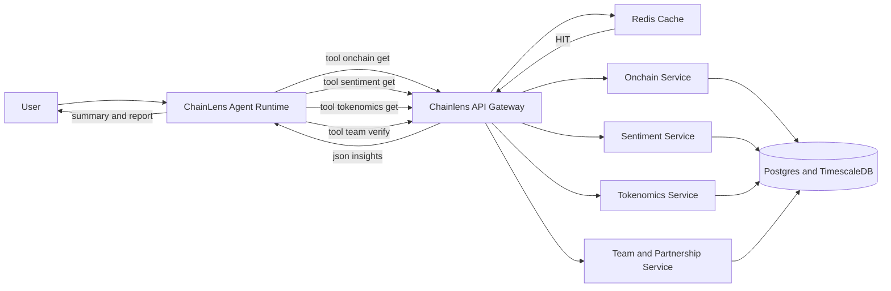

Chainlens MVP sẽ dùng ChainLens như lớp agent-orchestrator và bổ sung các “Chainlens Tools” gọi tới microservice phân tích của Chainlens qua API để ra kết quả nhanh, đúng kỳ vọng người dùng và rút ngắn thời gian kiểm định sản phẩm. [1][2][3]

## Mục tiêu và phạm vi
- Mục tiêu: xuất bản MVP cho phân tích dự án crypto với 5 mô-đun cốt lõi và thời gian phản hồi 5–8 giây bằng cách tận dụng agent runtime, tool system và UI có sẵn của ChainLens. [1][4]
- Không phạm vi: viết lại agent core, thay đổi sâu kiến trúc ChainLens; mọi xử lý tính toán crypto đặt ở dịch vụ Chainlens và truy cập qua API “tools”. [1][3]

## Kiến trúc tổng thể
- Thành phần: ChainLens Agent Runtime (orchestrator + UI), Chainlens API Gateway, các microservice phân tích (On‑chain, Sentiment, Tokenomics, Team/Partnership), Redis Cache, Postgres/Timescale cho dữ liệu dự án. [1][2][3]
- Nguyên tắc: “APIs power agents” – ChainLens chỉ điều phối và tổng hợp, còn tính toán nặng chạy ở dịch vụ Chainlens để đạt tốc độ và khả năng mở rộng ngay từ MVP. [3][1]




## Luồng yêu cầu chi tiết
1) Người dùng nhập yêu cầu phân tích dự án/ticker trong UI của ChainLens; agent lập kế hoạch nhiều bước và chọn tool phù hợp theo playbook đã cấu hình. [1][2]
2) Mỗi tool gọi API Gateway của Chainlens, Gateway kiểm tra Redis TTL trước, nếu miss thì gọi microservice tương ứng, ghi kết quả về Postgres/Timescale và warm cache. [3]
3) ChainLens nhận kết quả JSON từ các tool, hợp nhất theo template tóm tắt + chi tiết và xuất báo cáo Markdown/PDF ngay trong phiên chat. [1][4]

## Thành phần và trách nhiệm
- ChainLens Agent Runtime: điều phối multi‑step reasoning, quản lý tool registry, hiển thị hội thoại và kết quả, có khả năng browser automation khi cần lấy dữ liệu bổ trợ. [1][2]
- Chainlens API Gateway: chuẩn hóa API, thực thi cache‑then‑compute, rate‑limit, retry/backoff, và ủy quyền tới microservice theo tuyến. [3]
- Microservice phân tích: triển khai tối thiểu bốn dịch vụ độc lập để mở rộng nhanh và kiểm định giả thuyết mô‑đun. [3]
  - On‑chain Service: tổng hợp số liệu từ nguồn blockchain và chỉ số thị trường, chuẩn hóa thành các KPI dự án. [3]
  - Sentiment Service: lấy và rút trích cảm xúc từ nguồn xã hội/diễn đàn được cấu hình ban đầu. [3]
  - Tokenomics Service: tính toán phân phối/vesting cơ bản và các chỉ số pha loãng. [3]
  - Team/Partnership Service: xác minh mức độ hiện diện công khai và đối chiếu tuyên bố hợp tác ở mức MVP. [3]

## Cấu hình “Chainlens Tools” trong ChainLens
- Ý tưởng: không sửa lõi, chỉ đăng ký tool mới ánh xạ 1–1 với endpoint Chainlens và mô tả rõ lúc nào nên dùng trong prompt. [1][2]

```python
# chainlens/tools/onchain_api_tool.py
import requests
from chainlens.tools.base import BaseTool  # interface có sẵn trong ChainLens
class OnChainDataTool(BaseTool):
    name = "onchain.get"
    description = "Fetch on-chain KPIs for a given token/project"
    def __init__(self, base_url, api_key):
        self.base = base_url.rstrip("/")
        self.headers = {"Authorization": f"Bearer {api_key}"}
    def run(self, token: str) -> dict:
        r = requests.get(f"{self.base}/v1/onchain/{token}", headers=self.headers, timeout=3)
        r.raise_for_status()
        return r.json()
```


```yaml
# agent_config.yaml
tools:
  - name: onchain.get
    module: chainlens.tools.onchain_api_tool
    class: OnChainDataTool
    params: { base_url: "https://api.chainlens.local", api_key: "${CHAINLENS_API_KEY}" }
  - name: sentiment.get
    module: chainlens.tools.sentiment_api_tool
  - name: tokenomics.get
    module: chainlens.tools.tokenomics_api_tool
  - name: team.verify
    module: chainlens.tools.team_api_tool
```


## Playbook phân tích nhiều bước trong ChainLens
- Tận dụng “multi‑step reasoning” để định tuyến sang tool phù hợp theo hạng mục, đồng thời gộp kết quả thành một báo cáo nhất quán với trọng số tin cậy. [2][1]

```text
System Prompt (rút gọn):
- Khi người dùng yêu cầu phân tích dự án, thực hiện tuần tự:
  1) onchain.get(symbol) → thu thập KPIs cốt lõi
  2) sentiment.get(symbol) → snapshot sentiment trong 24–72h
  3) tokenomics.get(symbol) → phân phối, vesting, FDV
  4) team.verify(project) → dấu vết đội ngũ/đối tác
- Hợp nhất kết quả, tính risk score MVP, tạo 5 key insights + nguồn dữ liệu.
- Nếu cache hit < 50% trường dữ liệu, yêu cầu Gateway refresh delta trước khi tổng hợp.
```


## Định nghĩa API Gateway (MVP)
- Nguyên tắc API‑first: chuẩn OpenAPI/JSON, idempotent GET cho truy vấn, POST cho tổng hợp/refresh, gắn rate‑limit theo API key. [3]

```http
GET /v1/onchain/{symbol}        # KPI on-chain
GET /v1/sentiment/{symbol}      # Snapshot sentiment
GET /v1/tokenomics/{symbol}     # Cấu trúc token cơ bản
GET /v1/team/{project_id}       # Dấu vết đội ngũ/đối tác
POST /v1/refresh/{symbol}       # Làm mới dữ liệu theo delta
```


## Lược đồ dữ liệu tối thiểu
- Bảng projects(id, symbol, chain, name) để định danh. [3]
- Bảng metrics(project_id, kpi, value, asof, source, ttl) cho KPI on‑chain/sentiment/tokenomics. [3]
- Bảng analyses(project_id, kind, payload_json, created_at) lưu ảnh chụp kết quả hợp nhất để audit. [3]
- Redis: cache theo key “kpi:{symbol}:{kpi}” TTL 5–15 phút và “sent:{symbol}” TTL 15–30 phút cho trải nghiệm nhanh. [3]

## Yêu cầu phi chức năng (MVP)
- Hiệu năng: 5–8 giây cho phân tích đã cache; 8–12 giây khi refresh delta. [3]
- Quan sát: log vào Gateway mọi request/latency/TTL‑hit để tinh chỉnh playbook và cache policy. [3]
- Tin cậy: retry/backoff ở Gateway và trong tool ChainLens để chống lỗi tạm thời nguồn dữ liệu. [3]
- Triển khai: dùng mẫu triển khai có sẵn để đưa ChainLens lên môi trường nhanh, còn Gateway và dịch vụ Chainlens đóng gói container độc lập. [5][1]

## Bảo mật và quản trị
- API key cho Gateway, phân tách khóa nguồn dữ liệu theo service account và hạn mức; bật rate‑limit và circuit‑breaker ở Gateway. [3]
- Không lưu khóa trong cấu hình ChainLens; nạp từ biến môi trường/secret manager và chuyển vào tool params khi init. [1]
- Nhật ký truy cập ẩn danh và kiểm sốt CORS từ domain ChainLens UI về Gateway. [3]

## Kế hoạch triển khai 2–4 tuần
- Tuần 1: Fork chạy ChainLens, cấu hình LLM; viết 3 tool đầu (onchain, sentiment, tokenomics) và Gateway skeleton + Redis. [1][2]
- Tuần 2: Hoàn tất playbook, thêm team.verify, xuất báo cáo Markdown/PDF ngay trong UI ChainLens, bật cache TTL và retry/backoff. [1][4]
- Tuần 3: Thử nghiệm với 20–50 người dùng; log hiệu năng, nâng TTL phù hợp và tối ưu truy vấn nóng; bổ sung POST /refresh. [4][3]
- Tuần 4: Cứng hóa bảo mật, rate‑limit, audit log; đóng gói Helm/k8s cơ bản và script triển khai nhanh cho ChainLens + Gateway. [5][1]

## Tiêu chí chấp nhận (Acceptance)
- Một lệnh “Analyze <symbol>” trả về: risk score MVP, 5 key insights, nguồn dữ liệu, link mở sâu sang trang Chainlens chi tiết. [1][4]
- Cache‑hit ≥ 70% cho token phổ biến trong giờ bận; p95 latency ≤ 8 giây; lỗi tạm thời ≤ 1% nhờ retry/backoff. [3]
- Thêm/bớt một mô‑đun phân tích chỉ cần đăng ký tool mới, không sửa lõi ChainLens. [1]

## Rủi ro và giảm thiểu
- Rủi ro hiệu năng nếu để ChainLens làm thay phần tính toán: luôn để tool gọi Gateway làm nơi xử lý và cache kết quả. [3][1]
- Rủi ro lệ thuộc nhánh fork: hạn chế chỉnh core, giữ tool adapter ở module riêng và theo dõi upstream để cập nhật. [1][6]

## Lộ trình thoát MVP
- Khi xác thực nhu cầu: tách dần orchestration logic sang Gateway và dùng ChainLens như giao diện/agent layer, hoặc thay thế bằng orchestrator nội bộ nếu cần tối ưu sâu. [3][4]

Tài liệu này mô tả cách tận dụng ChainLens làm agent‑orchestrator, đăng ký “Chainlens Tools” bản mỏng, và đặt năng lực phân tích crypto vào dịch vụ Chainlens phía sau API để ra MVP nhanh, đo lường được và mở rộng an toàn theo thời gian. [1][2][3]
