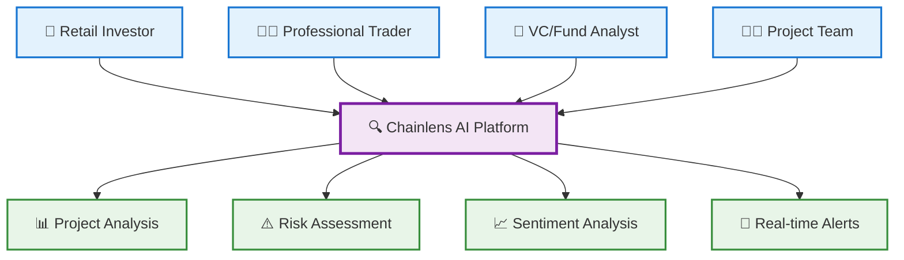
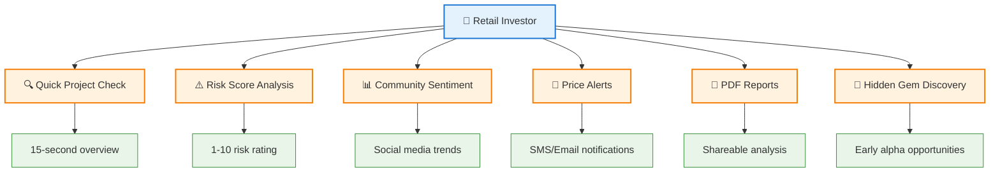
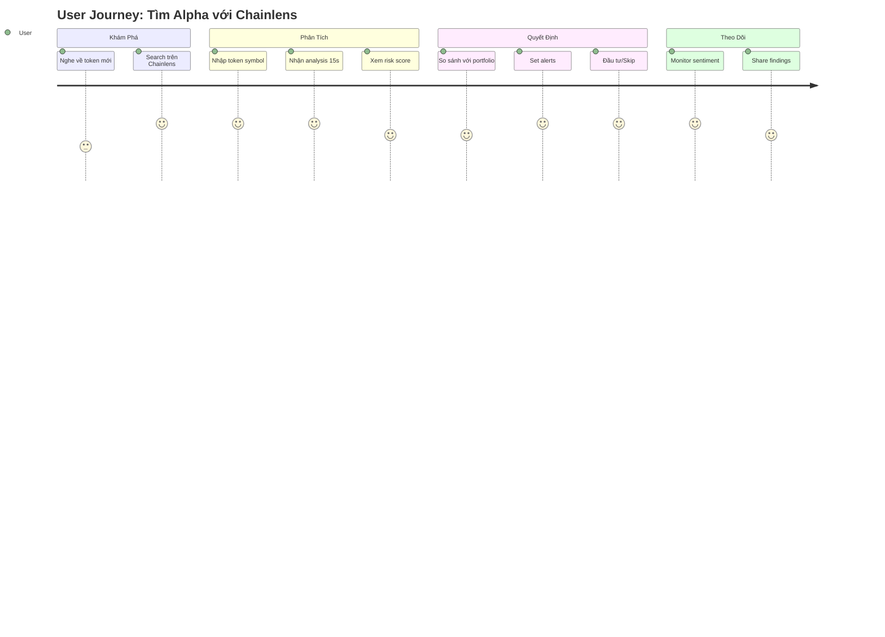

Bạn đúng! Diagram quá rộng. Hãy chia nhỏ thành các diagram dọc dễ nhìn hơn:

## 🎯 **Core Use Cases - Main Flow**

## 🔍 **Retail Investor Use Cases**

## 💼 **Professional/Enterprise Use Cases**

```mermaid
flowchart TD
    PT[👨‍💼 Pro Trader]
    VC[🏢 VC Fund]
    EX[🏦 Exchange]
    
    %% Pro Trader Features
    PT --> T1[🐋 Whale Tracking]
    PT --> T2[📈 Price Prediction]
    PT --> T3[⚡ MEV Analysis]
    
    %% VC Fund Features  
    VC --> V1[📋 Due Diligence Auto]
    VC --> V2[👥 Team Verification]
    VC --> V3[🔄 Portfolio Comparison]
    
    %% Exchange Features
    EX --> E1[📝 Listing Evaluation]
    EX --> E2[🔒 Security Assessment]
    EX --> E3[📊 Market Impact Analysis]
    
    %% Results
    T1 --> TR1[Large holder movements]
    T2 --> TR2[24h price forecasts]
    T3 --> TR3[Sandwich attack risks]
    
    V1 --> VR1[Comprehensive reports]
    V2 --> VR2[LinkedIn/GitHub checks]
    V3 --> VR3[Sector benchmarking]
    
    E1 --> ER1[Listing recommendations]
    E2 --> ER2[Smart contract audit]
    E3 --> ER3[Liquidity impact scores]
    
    classDef user fill:#e3f2fd,stroke:#1976d2,stroke-width:2px
    classDef feature fill:#fff3e0,stroke:#f57c00,stroke-width:2px
    classDef result fill:#e8f5e8,stroke:#388e3c,stroke-width:1px
    
    class PT,VC,EX user
    class T1,T2,T3,V1,V2,V3,E1,E2,E3 feature
    class TR1,TR2,TR3,VR1,VR2,VR3,ER1,ER2,ER3 result
```

## 🔌 **API & Integration Use Cases**

```mermaid
flowchart TD
    API[🔌 Chainlens API]
    
    %% Integration Partners
    API --> I1[📱 Portfolio Trackers]
    API --> I2[📰 Crypto Media]
    API --> I3[🔗 DeFi Platforms]
    API --> I4[🏛️ Compliance Tools]
    
    %% Specific Integrations
    I1 --> P1[DeBank Integration]
    I1 --> P2[Zerion Integration]
    I1 --> P3[CoinTracker Integration]
    
    I2 --> M1[CoinDesk API]
    I2 --> M2[CoinTelegraph Feed]
    I2 --> M3[Crypto Influencer Tools]
    
    I3 --> D1[Aave Risk Models]
    I3 --> D2[Compound Analytics]
    I3 --> D3[Uniswap Intelligence]
    
    I4 --> C1[AML Screening]
    I4 --> C2[Regulatory Reports]
    I4 --> C3[Tax Compliance]
    
    classDef api fill:#f3e5f5,stroke:#7b1fa2,stroke-width:3px
    classDef integration fill:#fff3e0,stroke:#f57c00,stroke-width:2px
    classDef specific fill:#e8f5e8,stroke:#388e3c,stroke-width:1px
    
    class API api
    class I1,I2,I3,I4 integration
    class P1,P2,P3,M1,M2,M3,D1,D2,D3,C1,C2,C3 specific
```

## 📱 **User Journey Simplified**

