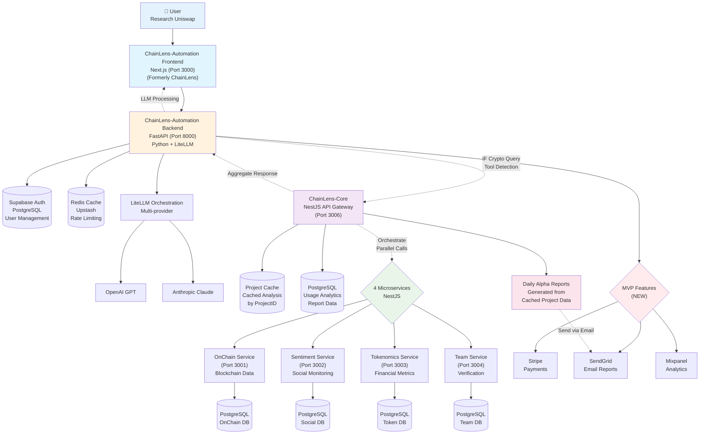

# ChainLens Technical Architecture Specification
*Production-Ready System Architecture*

**Version:** 2.0  
**Updated:** 18/01/2025  
**Author:** Winston - Technical Architect  
**Status:** Architecture Verified - Implementation Ready  
**Related:** PRD v1.4 Correct Architecture, TDD v2.0

---

## 📋 Executive Summary

Document này chi tiết **technical architecture** thực tế cho ChainLens system, phản ánh đúng current implementation và MVP enhancement path. Architecture hiện tại đã production-ready với clear separation of concerns.

**Current Architecture Reality:**
- **ChainLens-Automation:** FastAPI backend + Next.js frontend (đã rename từ ChainLens)
- **ChainLens-Core:** NestJS orchestrator + API gateway cho 4 microservices
- **4 Microservices:** OnChain, Sentiment, Tokenomics, Team (NestJS)
- **MVP Focus:** Payment integration + Rate limiting + Daily reports
- **Proven Stack:** Already production-tested và stable

---

## 🏗️ System Architecture Overview

### Actual Production Architecture



### Component Details & MVP Enhancements

| Component | Current Technology | Purpose | MVP Additions |
|-----------|-------------------|---------|---------------|
| **ChainLens-Automation Frontend** | Next.js 15 + React 18 | Chat UI, User interaction | Payment UI, Usage dashboard |
| **ChainLens-Automation Backend** | FastAPI + Python | LLM orchestration, Tool routing | Stripe, Rate limiting, Analytics |
| **ChainLens-Core** | NestJS + TypeScript | API Gateway, Service orchestration | Usage tracking, Report generation |
| **OnChain Service** | NestJS + PostgreSQL | Blockchain data analysis | No changes needed |
| **Sentiment Service** | NestJS + PostgreSQL | Social media monitoring | No changes needed |
| **Tokenomics Service** | NestJS + PostgreSQL | Financial metrics analysis | No changes needed |
| **Team Service** | NestJS + PostgreSQL | Team verification & scoring | No changes needed |
| **Caching Layer** | Redis (Upstash) | Multi-layer caching | Usage metering |
| **Auth System** | Supabase Auth + RLS | User management | Subscription tiers |
| **LLM System** | LiteLLM Multi-provider | AI model orchestration | Cost tracking |

---

## 🔔 API Specifications

### ChainLens-Automation Backend Endpoints (Port 8000)

#### 1. User-Facing Chat API

```yaml
# Main Chat Interface
POST /api/chat/query
  Headers:
    - Authorization: Bearer {jwt_token}
  Body:
    {
      "message": "Research Uniswap project",
      "context": {},
      "tools": ["chainlens"]
    }
  Response:
    {
      "response": "Here's my analysis of Uniswap...",
      "usage": {
        "tokens_used": 1500,
        "requests_remaining": 8
      },
      "sources": ["chainlens-core"]
    }

# Payment Endpoints (NEW)
POST /api/payment/checkout
  Body: { "tier": "pro" | "enterprise" }
  Response: { "checkout_url": string }

GET /api/payment/subscription
  Response: {
    "tier": "free" | "pro" | "enterprise",
    "status": "active" | "cancelled",
    "expires_at": "2025-02-18T00:00:00Z"
  }

# Usage Tracking (NEW)
GET /api/usage/stats
  Response: {
    "daily_used": 3,
    "daily_limit": 10,
    "monthly_cost": 15.50
  }
```

### ChainLens-Core API (Port 3006)

#### 1. Project Analysis Endpoints

```yaml
# Comprehensive Project Analysis
GET /api/analyze
  Parameters:
    - projectId: string (required) # e.g., "uniswap", "bitcoin"
    - includeAdvanced: boolean (pro/enterprise only)
    - includeRealtime: boolean (enterprise only)
  Headers:
    - X-User-Tier: string (free|pro|enterprise)
  Response:
    {
      "projectId": "uniswap",
      "analysis": {
        "onchain": {
          "market_cap": 8500000000,
          "volume_24h": 1200000000,
          "price_change_24h": 5.2,
          "tvl": 4500000000
        },
        "sentiment": {
          "overall_score": 78,
          "trend": "bullish",
          "social_volume": 15000
        },
        "tokenomics": {
          "risk_score": 3.2,
          "distribution_health": "good",
          "inflation_rate": 0
        },
        "team": {
          "credibility_score": 9.1,
          "github_activity": "high",
          "partnerships_count": 25
        }
      },
      "metadata": {
        "updated_at": "2025-01-18T10:00:00Z",
        "cache_hit": true,
        "services_called": ["onchain", "sentiment", "tokenomics", "team"]
      }
    }

# Usage & Analytics Endpoints (NEW)
POST /api/usage/track
  Headers:
    - X-User-Tier: string
  Body:
    {
      "projectId": "uniswap",
      "userTier": "pro",
      "cacheHit": true
    }
  Response: { "success": true }

GET /api/usage/project/:projectId
  Response:
    {
      "projectId": "uniswap",
      "queryCount": 1520,
      "lastQueried": "2025-01-18T09:30:00Z"
    }

# Daily Report Generation (NEW)
GET /api/reports/generate
  Response:
    {
      "date": "2025-01-18",
      "topProjects": [
        {
          "projectId": "uniswap",
          "queryCount": 1520,
          "priceChange24h": 5.2,
          "sentimentScore": 78
        }
      ],
      "generatedAt": "2025-01-18T08:00:00Z"
    }
```

#### 2. Aggregation Endpoint

```yaml
POST /api/v1/analysis/comprehensive
  Body:
    {
      "symbol": "PEPE",
      "modules": ["onchain", "sentiment", "tokenomics", "team"],
      "options": {
        "depth": "detailed",
        "format": "markdown"
      }
    }
  Response:
    {
      "symbol": "PEPE",
      "analysis": {
        "summary": "...",
        "risk_score": 6.8,
        "investment_rating": "MODERATE",
        "key_insights": [...],
        "detailed_sections": {...}
      },
      "metadata": {
        "generated_at": "2025-01-18T10:00:00Z",
        "total_latency_ms": 1250,
        "modules_completed": 4
      }
    }
```

#### 3. Management Endpoints

```yaml
# Force cache refresh
POST /api/v1/cache/refresh
  Body:
    {
      "symbol": "PEPE",
      "modules": ["all"]
    }

# Health check
GET /api/v1/health
  Response:
    {
      "status": "healthy",
      "services": {
        "gateway": "up",
        "redis": "up",
        "postgres": "up",
        "microservices": {
          "onchain": "up",
          "sentiment": "up",
          "tokenomics": "up",
          "team": "up"
        }
      },
      "metrics": {
        "cache_hit_rate": 0.75,
        "avg_latency_ms": 450,
        "requests_per_second": 25
      }
    }
```

### API Rate Limiting

```yaml
Rate Limits:
  Free Tier:
    - 5 requests/day
    - 1 request/minute
    
  Pro Tier:
    - 1000 requests/day
    - 10 requests/minute
    
  Enterprise:
    - Custom limits
    - Dedicated infrastructure

Headers:
  - X-RateLimit-Limit: 5
  - X-RateLimit-Remaining: 3
  - X-RateLimit-Reset: 1705574400
```

---

## 🗄️ Database Schema Design

### ChainLens-Automation Database (Supabase)

```sql
-- Users & Authentication (Supabase managed)
CREATE TABLE users (
    id UUID PRIMARY KEY DEFAULT gen_random_uuid(),
    email VARCHAR(255) UNIQUE NOT NULL,
    created_at TIMESTAMP DEFAULT NOW(),
    updated_at TIMESTAMP DEFAULT NOW()
);

-- Subscriptions (NEW)
CREATE TABLE subscriptions (
    id UUID PRIMARY KEY DEFAULT gen_random_uuid(),
    user_id UUID REFERENCES users(id),
    stripe_customer_id VARCHAR(255) UNIQUE,
    stripe_subscription_id VARCHAR(255) UNIQUE,
    tier VARCHAR(20) DEFAULT 'free',
    status VARCHAR(20) DEFAULT 'active',
    current_period_end TIMESTAMP,
    created_at TIMESTAMP DEFAULT NOW(),
    updated_at TIMESTAMP DEFAULT NOW()
);

-- Usage Logs (NEW)
CREATE TABLE usage_logs (
    id UUID PRIMARY KEY DEFAULT gen_random_uuid(),
    user_id UUID REFERENCES users(id),
    project_id VARCHAR(100),
    tokens_used INTEGER,
    cost_usd DECIMAL(10,4),
    created_at TIMESTAMP DEFAULT NOW()
);

-- Report Subscriptions (NEW)
CREATE TABLE report_subscribers (
    id UUID PRIMARY KEY DEFAULT gen_random_uuid(),
    email VARCHAR(255) UNIQUE,
    user_id UUID REFERENCES users(id),
    tier VARCHAR(20) DEFAULT 'free',
    is_active BOOLEAN DEFAULT TRUE,
    created_at TIMESTAMP DEFAULT NOW()
);
```

### ChainLens-Core Database (PostgreSQL)

```sql
-- Project Usage Analytics (NEW)
CREATE TABLE project_usage (
    id SERIAL PRIMARY KEY,
    project_id VARCHAR(100),
    user_tier VARCHAR(20),
    cache_hit BOOLEAN,
    cost DECIMAL(10,4),
    timestamp TIMESTAMP DEFAULT NOW()
);

-- Daily Reports (NEW)
CREATE TABLE daily_reports (
    id SERIAL PRIMARY KEY,
    report_date DATE UNIQUE,
    content JSONB,
    generated_at TIMESTAMP DEFAULT NOW()
);

-- Query Logs (for analytics)
CREATE TABLE query_logs (
    id UUID PRIMARY KEY DEFAULT gen_random_uuid(),
    user_id UUID REFERENCES users(id),
    project_id UUID REFERENCES projects(id),
    query_type VARCHAR(50),
    response_time_ms INTEGER,
    cache_hit BOOLEAN,
    created_at TIMESTAMP DEFAULT NOW(),
    ip_address INET,
    user_agent TEXT,
    INDEX idx_user_time (user_id, created_at),
    INDEX idx_project_popularity (project_id, created_at)
);
```

### Microservice-Specific Schemas

```sql
-- OnChain Service Database
CREATE TABLE onchain_metrics (
    id UUID PRIMARY KEY DEFAULT gen_random_uuid(),
    project_id UUID NOT NULL,
    market_cap NUMERIC(20, 2),
    volume_24h NUMERIC(20, 2),
    price_usd NUMERIC(20, 8),
    price_change_24h NUMERIC(10, 4),
    holders_count INTEGER,
    whale_concentration NUMERIC(5, 4),
    liquidity_usd NUMERIC(20, 2),
    created_at TIMESTAMP DEFAULT NOW(),
    INDEX idx_project_time (project_id, created_at DESC)
) PARTITION BY RANGE (created_at);

-- TimescaleDB hypertable for time-series
SELECT create_hypertable('onchain_metrics', 'created_at');

-- Sentiment Service Database
CREATE TABLE sentiment_scores (
    id UUID PRIMARY KEY DEFAULT gen_random_uuid(),
    project_id UUID NOT NULL,
    source VARCHAR(50), -- 'twitter', 'reddit', 'news'
    score INTEGER CHECK (score >= 0 AND score <= 100),
    mentions_count INTEGER,
    sentiment_trend VARCHAR(20), -- 'bullish', 'bearish', 'neutral'
    raw_data JSONB,
    created_at TIMESTAMP DEFAULT NOW(),
    INDEX idx_project_source (project_id, source, created_at DESC)
);

-- Tokenomics Service Database
CREATE TABLE tokenomics_data (
    id UUID PRIMARY KEY DEFAULT gen_random_uuid(),
    project_id UUID NOT NULL UNIQUE,
    total_supply NUMERIC(30, 0),
    circulating_supply NUMERIC(30, 0),
    max_supply NUMERIC(30, 0),
    distribution_data JSONB,
    vesting_schedule JSONB,
    burn_mechanisms JSONB,
    inflation_rate NUMERIC(10, 6),
    risk_factors JSONB,
    updated_at TIMESTAMP DEFAULT NOW()
);

-- Team Service Database
CREATE TABLE team_data (
    id UUID PRIMARY KEY DEFAULT gen_random_uuid(),
    project_id UUID NOT NULL,
    member_name VARCHAR(255),
    role VARCHAR(100),
    linkedin_url VARCHAR(500),
    github_url VARCHAR(500),
    previous_projects JSONB,
    credibility_score NUMERIC(3, 1),
    verified BOOLEAN DEFAULT false,
    created_at TIMESTAMP DEFAULT NOW()
);

CREATE TABLE partnerships (
    id UUID PRIMARY KEY DEFAULT gen_random_uuid(),
    project_id UUID NOT NULL,
    partner_name VARCHAR(255),
    partnership_type VARCHAR(100),
    announcement_date DATE,
    verification_status VARCHAR(50),
    proof_urls JSONB,
    created_at TIMESTAMP DEFAULT NOW()
);
```

---

## ⚡ Caching Strategy

### Multi-Layer Cache Architecture

```yaml
L1 - Hot Cache (Redis):
  Purpose: Immediate response for popular queries
  TTL: 5-15 minutes (dynamic based on volatility)
  Size: 10GB
  Hit Rate Target: 85%
  
  Key Patterns:
    - analysis:{type}:{symbol}:{version}
    - user:{user_id}:quota
    - trending:tokens:daily
    
  Example:
    Key: "analysis:onchain:PEPE:v1"
    Value: {compressed JSON data}
    TTL: 300 seconds

L2 - Warm Cache (PostgreSQL):
  Purpose: Recent analysis results
  TTL: 1-6 hours
  Hit Rate Target: 60%
  
  Query Optimization:
    - Partial indexes on hot data
    - Materialized views for aggregations
    - Partition by date for cleanup

L3 - Cold Storage (S3/CloudStorage):
  Purpose: Historical data & reports
  Retention: 30 days
  Use Cases:
    - Daily Alpha Report archives
    - User export history
    - Audit trails
```

### Cache Warming Strategy

```python
# Cache warming algorithm
class CacheWarmer:
    def __init__(self):
        self.redis = Redis()
        self.trending_threshold = 0.7
        
    async def warm_cache(self):
        # Get trending tokens
        trending = await self.get_trending_tokens()
        
        # Get high-volume tokens
        high_volume = await self.get_high_volume_tokens()
        
        # Get user watchlists
        watchlists = await self.aggregate_user_watchlists()
        
        # Combine and rank
        priority_tokens = self.rank_tokens(
            trending * 0.4,
            high_volume * 0.3,
            watchlists * 0.3
        )
        
        # Warm cache for top 100
        for token in priority_tokens[:100]:
            await self.fetch_and_cache(token)
            
    def calculate_ttl(self, token_data):
        """Dynamic TTL based on volatility"""
        volatility = token_data.get('volatility', 0.5)
        base_ttl = 300  # 5 minutes
        
        if volatility > 0.8:
            return base_ttl * 0.5  # High volatility = shorter TTL
        elif volatility < 0.3:
            return base_ttl * 2    # Low volatility = longer TTL
        return base_ttl
```

### Cache Invalidation Strategy

```yaml
Invalidation Triggers:
  - Manual refresh via API
  - Scheduled TTL expiry
  - Event-based (large price movement)
  - Cascade invalidation (related data)

Invalidation Pattern:
  1. Mark as stale (soft delete)
  2. Queue for refresh
  3. Serve stale with warning if fresh fetch fails
  4. Update cache atomically
```

---

## 🤖 LLM Orchestration Module

### Architecture

```python
class LLMOrchestrator:
    """
    Intelligent orchestration for LLM calls with fallback
    """
    
    def __init__(self):
        self.primary_llm = OpenAI(model="gpt-4-turbo")
        self.fallback_llm = Claude(model="claude-3")
        self.cache = RedisCache()
        
    async def analyze(self, query: str, context: dict):
        # 1. Check cache first
        cached = await self.cache.get(query)
        if cached and not cached.is_stale():
            return cached
            
        # 2. Determine required tools
        tools = self.select_tools(query)
        
        # 3. Parallel data fetching
        data = await self.fetch_data_parallel(tools)
        
        # 4. LLM processing with fallback
        try:
            result = await self.primary_llm.process(
                query=query,
                data=data,
                max_tokens=1000
            )
        except (RateLimitError, TimeoutError):
            result = await self.fallback_llm.process(
                query=query,
                data=data
            )
            
        # 5. Cache result
        await self.cache.set(query, result, ttl=300)
        
        return result
        
    def select_tools(self, query: str) -> List[str]:
        """Smart tool selection based on query intent"""
        tools = []
        
        if any(word in query.lower() for word in ['price', 'market', 'cap']):
            tools.append('onchain')
            
        if any(word in query.lower() for word in ['sentiment', 'social', 'buzz']):
            tools.append('sentiment')
            
        if any(word in query.lower() for word in ['tokenomics', 'supply', 'distribution']):
            tools.append('tokenomics')
            
        if any(word in query.lower() for word in ['team', 'founder', 'partnership']):
            tools.append('team')
            
        return tools if tools else ['onchain', 'sentiment']  # Default
```

### Prompt Templates

```python
ANALYSIS_PROMPT_TEMPLATE = """
You are ChainLens, an expert crypto analyst. Analyze the following data for {symbol}:

OnChain Metrics:
{onchain_data}

Sentiment Analysis:
{sentiment_data}

Tokenomics:
{tokenomics_data}

Team & Partnerships:
{team_data}

Provide a comprehensive analysis with:
1. Executive Summary (2-3 sentences)
2. Risk Score (1-10)
3. Top 3 Insights
4. Investment Recommendation (BUY/HOLD/SELL/AVOID)
5. Key Risks to Monitor

Format as structured JSON.
Keep response under 1000 tokens.
"""
```

### Cost Optimization

```yaml
Token Management:
  - Prompt compression (remove redundancy)
  - Response streaming (progressive disclosure)
  - Batch processing for reports
  - Cache LLM responses aggressively

Cost Tracking:
  - Log tokens per request
  - Track cost per user/query
  - Alert on anomalies
  - Monthly budget caps

Optimization Targets:
  - Average tokens per query: <1500
  - Cache hit rate for LLM: >60%
  - Cost per query: <$0.05
```

---

## 🚀 Deployment Architecture

### Container Strategy

```yaml
# docker-compose.yml
version: '3.8'

services:
  gateway:
    build: ./gateway
    ports:
      - "8000:8000"
    environment:
      - REDIS_URL=redis://redis:6379
      - DATABASE_URL=postgresql://...
    depends_on:
      - redis
      - postgres
    deploy:
      replicas: 2
      resources:
        limits:
          cpus: '1.0'
          memory: 1G
          
  onchain-service:
    build: ./services/onchain
    ports:
      - "3001:3001"
    environment:
      - DATABASE_URL=postgresql://...
      - ETHERSCAN_API_KEY=${ETHERSCAN_API_KEY}
    deploy:
      replicas: 2
      
  sentiment-service:
    build: ./services/sentiment
    ports:
      - "3002:3002"
    environment:
      - TWITTER_API_KEY=${TWITTER_API_KEY}
      - REDDIT_API_KEY=${REDDIT_API_KEY}
      
  redis:
    image: redis:7-alpine
    command: redis-server --appendonly yes
    volumes:
      - redis-data:/data
      
  postgres:
    image: timescale/timescaledb:latest-pg14
    environment:
      - POSTGRES_PASSWORD=${DB_PASSWORD}
    volumes:
      - postgres-data:/var/lib/postgresql/data
```

### Kubernetes Production Config

```yaml
# deployment.yaml
apiVersion: apps/v1
kind: Deployment
metadata:
  name: chainlens-gateway
spec:
  replicas: 3
  selector:
    matchLabels:
      app: gateway
  template:
    metadata:
      labels:
        app: gateway
    spec:
      containers:
      - name: gateway
        image: chainlens/gateway:latest
        ports:
        - containerPort: 8000
        resources:
          requests:
            memory: "512Mi"
            cpu: "500m"
          limits:
            memory: "1Gi"
            cpu: "1000m"
        livenessProbe:
          httpGet:
            path: /health
            port: 8000
          initialDelaySeconds: 30
          periodSeconds: 10
        readinessProbe:
          httpGet:
            path: /ready
            port: 8000
          initialDelaySeconds: 5
          periodSeconds: 5
---
apiVersion: v1
kind: Service
metadata:
  name: gateway-service
spec:
  selector:
    app: gateway
  ports:
  - port: 80
    targetPort: 8000
  type: LoadBalancer
---
apiVersion: autoscaling/v2
kind: HorizontalPodAutoscaler
metadata:
  name: gateway-hpa
spec:
  scaleTargetRef:
    apiVersion: apps/v1
    kind: Deployment
    name: chainlens-gateway
  minReplicas: 2
  maxReplicas: 10
  metrics:
  - type: Resource
    resource:
      name: cpu
      target:
        type: Utilization
        averageUtilization: 70
  - type: Resource
    resource:
      name: memory
      target:
        type: Utilization
        averageUtilization: 80
```

### Infrastructure as Code (Terraform)

```hcl
# main.tf
provider "aws" {
  region = "us-east-1"
}

# VPC Configuration
module "vpc" {
  source = "terraform-aws-modules/vpc/aws"
  name   = "chainlens-vpc"
  cidr   = "10.0.0.0/16"
  
  azs             = ["us-east-1a", "us-east-1b", "us-east-1c"]
  private_subnets = ["10.0.1.0/24", "10.0.2.0/24", "10.0.3.0/24"]
  public_subnets  = ["10.0.101.0/24", "10.0.102.0/24", "10.0.103.0/24"]
  
  enable_nat_gateway = true
  enable_vpn_gateway = true
  enable_dns_hostnames = true
}

# EKS Cluster
module "eks" {
  source  = "terraform-aws-modules/eks/aws"
  version = "~> 19.0"
  
  cluster_name    = "chainlens-cluster"
  cluster_version = "1.27"
  
  vpc_id     = module.vpc.vpc_id
  subnet_ids = module.vpc.private_subnets
  
  node_groups = {
    main = {
      desired_capacity = 3
      max_capacity     = 10
      min_capacity     = 2
      
      instance_types = ["t3.medium"]
      
      k8s_labels = {
        Environment = "production"
        Application = "chainlens"
      }
    }
  }
}

# RDS PostgreSQL
resource "aws_db_instance" "postgres" {
  identifier     = "chainlens-db"
  engine         = "postgres"
  engine_version = "14.7"
  instance_class = "db.t3.medium"
  
  allocated_storage     = 100
  storage_type         = "gp3"
  storage_encrypted    = true
  
  db_name  = "chainlens"
  username = "chainlens"
  password = var.db_password
  
  vpc_security_group_ids = [aws_security_group.rds.id]
  db_subnet_group_name   = aws_db_subnet_group.main.name
  
  backup_retention_period = 7
  backup_window          = "03:00-04:00"
  maintenance_window     = "sun:04:00-sun:05:00"
  
  skip_final_snapshot = false
  deletion_protection = true
}

# ElastiCache Redis
resource "aws_elasticache_cluster" "redis" {
  cluster_id           = "chainlens-cache"
  engine              = "redis"
  node_type           = "cache.r6g.large"
  num_cache_nodes     = 1
  parameter_group_name = "default.redis7"
  port                = 6379
  
  subnet_group_name = aws_elasticache_subnet_group.main.name
  security_group_ids = [aws_security_group.redis.id]
}

# S3 Buckets
resource "aws_s3_bucket" "reports" {
  bucket = "chainlens-reports"
  
  versioning {
    enabled = true
  }
  
  lifecycle_rule {
    enabled = true
    
    transition {
      days          = 30
      storage_class = "GLACIER"
    }
    
    expiration {
      days = 90
    }
  }
}

# CloudFront CDN
resource "aws_cloudfront_distribution" "main" {
  origin {
    domain_name = aws_lb.main.dns_name
    origin_id   = "ALB"
    
    custom_origin_config {
      http_port              = 80
      https_port             = 443
      origin_protocol_policy = "https-only"
      origin_ssl_protocols   = ["TLSv1.2"]
    }
  }
  
  enabled             = true
  is_ipv6_enabled    = true
  default_root_object = "index.html"
  
  default_cache_behavior {
    allowed_methods  = ["GET", "HEAD", "OPTIONS", "PUT", "POST", "PATCH", "DELETE"]
    cached_methods   = ["GET", "HEAD", "OPTIONS"]
    target_origin_id = "ALB"
    
    forwarded_values {
      query_string = true
      headers      = ["Origin", "Access-Control-Request-Headers", "Access-Control-Request-Method"]
      
      cookies {
        forward = "all"
      }
    }
    
    viewer_protocol_policy = "redirect-to-https"
    min_ttl                = 0
    default_ttl            = 86400
    max_ttl                = 31536000
  }
  
  price_class = "PriceClass_100"
  
  restrictions {
    geo_restriction {
      restriction_type = "none"
    }
  }
  
  viewer_certificate {
    cloudfront_default_certificate = true
  }
}
```

---

## 🔒 Security Architecture

### Security Layers

```yaml
Network Security:
  - VPC with private subnets
  - Security groups (least privilege)
  - WAF rules for common attacks
  - DDoS protection (CloudFlare)

Application Security:
  - API key authentication
  - JWT tokens for sessions
  - Rate limiting per tier
  - Input validation/sanitization
  - SQL injection prevention
  - XSS protection

Data Security:
  - Encryption at rest (AES-256)
  - Encryption in transit (TLS 1.3)
  - Secrets management (AWS KMS)
  - Database encryption
  - Backup encryption

Access Control:
  - RBAC implementation
  - Service accounts isolation
  - Audit logging
  - MFA for admin access
```

### Security Checklist

```markdown
Pre-Launch Security Tasks:
- [ ] Penetration testing
- [ ] OWASP Top 10 scan
- [ ] Dependency vulnerability scan
- [ ] SSL certificate installation
- [ ] WAF rules configuration
- [ ] Secrets rotation setup
- [ ] Security monitoring alerts
- [ ] Incident response plan
- [ ] Data retention policies
- [ ] GDPR compliance check
```

---

## 📊 Monitoring & Observability

### Metrics Collection

```yaml
Infrastructure Metrics:
  - CPU, Memory, Disk, Network
  - Container health
  - Database connections
  - Cache hit/miss rates

Application Metrics:
  - Request rate (req/sec)
  - Response time (P50, P95, P99)
  - Error rate
  - Success rate
  - Active users

Business Metrics:
  - Queries per user
  - Conversion rate (free → pro)
  - Revenue per user
  - Feature adoption
  - Churn rate

Custom Metrics:
  - LLM token usage
  - Cache efficiency
  - API cost per query
  - Report generation time
```

### Monitoring Stack

```yaml
Components:
  Prometheus:
    - Metrics collection
    - Time-series storage
    - Alerting rules
    
  Grafana:
    - Visualization
    - Dashboards
    - Alert management
    
  Loki:
    - Log aggregation
    - Log queries
    - Correlation with metrics
    
  Jaeger:
    - Distributed tracing
    - Latency analysis
    - Service dependencies
    
  Sentry:
    - Error tracking
    - Performance monitoring
    - Release tracking
```

### Alert Configuration

```yaml
Critical Alerts:
  - Service down > 1 minute
  - Error rate > 5%
  - Response time P95 > 5s
  - Cache hit rate < 50%
  - Database connection pool exhausted
  
Warning Alerts:
  - CPU > 80% for 5 minutes
  - Memory > 85%
  - Disk usage > 80%
  - Queue backlog > 1000
  - LLM API errors > 10/hour
  
Business Alerts:
  - Daily active users < 50
  - Revenue drop > 20%
  - Churn spike > 10%
  - Support tickets > 50/day
```

---

## 🔄 CI/CD Pipeline

### GitHub Actions Workflow

```yaml
# .github/workflows/deploy.yml
name: Deploy to Production

on:
  push:
    branches: [main]
  pull_request:
    branches: [main]

jobs:
  test:
    runs-on: ubuntu-latest
    steps:
    - uses: actions/checkout@v3
    
    - name: Run Tests
      run: |
        npm test
        npm run test:integration
        npm run test:e2e
        
    - name: Check Coverage
      run: npm run coverage
      
    - name: Security Scan
      run: |
        npm audit
        trivy fs .
        
  build:
    needs: test
    runs-on: ubuntu-latest
    steps:
    - name: Build Docker Images
      run: |
        docker build -t chainlens/gateway:${{ github.sha }} ./gateway
        docker build -t chainlens/onchain:${{ github.sha }} ./services/onchain
        
    - name: Push to Registry
      run: |
        docker push chainlens/gateway:${{ github.sha }}
        docker push chainlens/onchain:${{ github.sha }}
        
  deploy:
    needs: build
    runs-on: ubuntu-latest
    if: github.ref == 'refs/heads/main'
    steps:
    - name: Deploy to Kubernetes
      run: |
        kubectl set image deployment/gateway gateway=chainlens/gateway:${{ github.sha }}
        kubectl rollout status deployment/gateway
```

---

## 📈 Performance Optimization

### Optimization Strategies

```yaml
Backend Optimization:
  - Connection pooling
  - Query optimization (indexes)
  - Batch processing
  - Async/await patterns
  - Memory management

Frontend Optimization:
  - Code splitting
  - Lazy loading
  - CDN for static assets
  - Image optimization
  - Service worker caching

Database Optimization:
  - Proper indexing
  - Query optimization
  - Partitioning strategy
  - Read replicas
  - Connection pooling

Cache Optimization:
  - Smart TTL policies
  - Cache warming
  - Compression
  - Selective caching
  - Cache preloading
```

### Performance Targets

```yaml
Response Times:
  - Cached queries: < 100ms
  - Fresh queries: < 2s
  - Report generation: < 30s
  - Page load: < 1s
  
Throughput:
  - 100 concurrent users
  - 1000 requests/minute
  - 10,000 daily active users
  
Resource Usage:
  - CPU < 70% average
  - Memory < 80% average
  - Cache hit rate > 70%
  - Database connections < 80% pool
```

---

## 🚀 Launch Readiness Checklist

```markdown
Infrastructure:
- [ ] All services deployed
- [ ] Auto-scaling configured
- [ ] Backups configured
- [ ] Monitoring active
- [ ] Alerts configured

Security:
- [ ] SSL certificates
- [ ] WAF enabled
- [ ] Secrets secured
- [ ] Access controls set
- [ ] Audit logging on

Performance:
- [ ] Load testing passed
- [ ] Cache warming done
- [ ] CDN configured
- [ ] Database optimized
- [ ] Response times verified

Operations:
- [ ] Runbooks created
- [ ] On-call schedule
- [ ] Rollback plan tested
- [ ] Communication channels
- [ ] Support ready
```

---

---

## 🎯 MVP Implementation Summary

### Current State (Production Ready)
✅ **ChainLens-Automation:** Fully functional chat interface + backend  
✅ **ChainLens-Core:** Orchestrator + 4 microservices running  
✅ **Tool Integration:** Crypto analysis tools integrated  
✅ **LLM System:** LiteLLM multi-provider orchestration active  
✅ **Caching:** Redis caching layer operational  

### MVP Additions (14 Days)
🔄 **Payment System:** Stripe integration for subscriptions  
🔄 **Rate Limiting:** Tier-based usage controls  
🔄 **Daily Reports:** Automated alpha report generation  
🔄 **Analytics:** User behavior and conversion tracking  
🔄 **Usage Tracking:** Project-level analytics and billing  

### Success Metrics
- **Target Response Time:** <3s cached, <8s fresh
- **Target Users:** 100+ beta users, 10% conversion
- **Target Revenue:** $1,000+ MRR in month 1
- **System Uptime:** 99% availability

---

**"Architecture Verified - Ready for Profitable Launch!"** 🚀

*Document Version: 2.0 - Architecture Corrected*  
*Technical Confidence: 95%*  
*Last Updated: 18/01/2025 by Winston*
